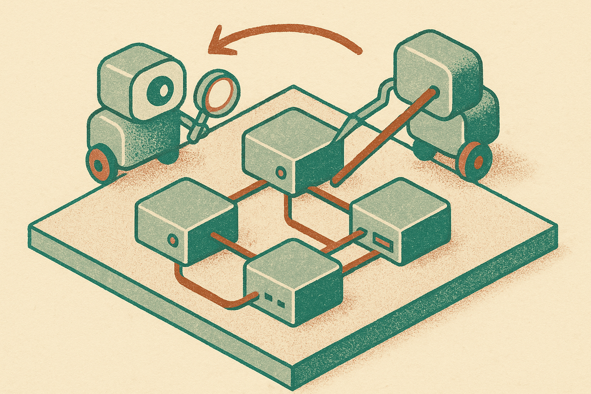

## The interesting part is the split-brain agent design

VEXAIoT is a useful signal because it is not trying to make one giant “hacker agent” do everything.

The researchers built a multi-agent setup for IoT vulnerability exploitation. One agent handles vulnerability detection. Another handles attack execution. Together they do reconnaissance, plan attack sequences, and run offensive security tools against vulnerable IoT services.

That split matters. A lot of agent demos fail because the model is asked to be analyst, planner, operator, debugger, and judge at the same time. VEXAIoT narrows the jobs. Find the likely weakness. Pick an exploit path. Execute. Observe. Continue.

The paper reports results across IoTGoat and Metasploitable environments, using ten attack scenarios mapped to OWASP IoT vulnerabilities. Across 260 attack executions, VEXAIoT hit a 95.0% overall success rate, with 94.5% in IoTGoat and 96.7% in Metasploitable2. Most attacks completed in under two minutes, with low token overhead.

Those numbers are strong. They are also lab numbers.

IoTGoat and Metasploitable2 are intentionally vulnerable environments. That is exactly where this work should start, but it is not the same as a messy customer deployment with flaky networks, weird firmware forks, broken documentation, custom services, half-patched devices, and logs that lie.

Still, the direction is clear. The low-value, repetitive parts of IoT security testing are getting easier to automate.

## This is not “AI finds zero-days”

The temptation is to read this as: LLM agents can autonomously hack IoT.

That is too broad.

What VEXAIoT shows is narrower and more practical: when vulnerabilities are known enough to map to OWASP IoT categories, and when tools exist to probe and exploit them, an agent system can coordinate the workflow at high success rates in controlled settings.

That is still important.

IoT has a bad security profile for boring reasons: constrained hardware, old firmware, weak defaults, exposed services, and devices that outlive their maintenance windows. The industry does not lack awareness. It lacks cheap, repeatable, frequent testing.

Human pentesters are scarce and expensive. Full manual reviews do not happen often enough. Asset owners often do not know what is actually deployed. If agentic systems can turn known playbooks into repeatable assessments, that changes the economics.

The risk cuts both ways. Defenders can use this to test more often. Attackers can use the same pattern to scale known exploitation. That does not require sci-fi autonomy. It only requires enough reliability to run the same reconnaissance and exploit chains thousands of times without getting tired.

VEXAIoT’s 95% result suggests that, for toy-to-training environments, we are already there.

The open question is how much performance survives contact with real devices. Real IoT fleets are ugly. They have inconsistent banners, undocumented ports, patched libraries with old version strings, vendor quirks, rate limits, brittle services, and legal boundaries that matter. An agent that performs well in IoTGoat may still need a lot of guardrails before touching production.

## The defender’s version should come first

The best near-term product here is not an autonomous attacker. It is a controlled assessment runner for internal teams.

Give it a known inventory. Limit its scope. Put it in a lab or staging network. Let it run OWASP IoT checks, document what it tried, preserve evidence, and produce reproducible findings. Then require human approval before anything destructive.

That workflow is less flashy than “AI pentester.” It is also much more shippable.

The key product details are not the model. They are permissions, audit logs, rollback, safe exploit modes, network boundaries, and clear reporting. If the system cannot explain exactly what it touched and why, it will not be trusted by serious security teams.

I would also separate “detect” and “exploit” by policy, not just architecture. Detection can run broadly and often. Exploitation should be gated, scheduled, and isolated. The paper’s two-agent design points in that direction, even if the research setup is offensive.

For builders, the move is to recreate this pattern on your own approved device set: one agent for recon and vulnerability mapping, one tightly sandboxed executor, and a boring evidence pipeline that humans can verify. Start with known OWASP IoT checks, measure success rate and false positives, then add one device class at a time. The catch most readers miss: the hard part is not getting an agent to run Metasploit once. It is making every action scoped, logged, repeatable, and safe enough that your security team lets it run again tomorrow.
