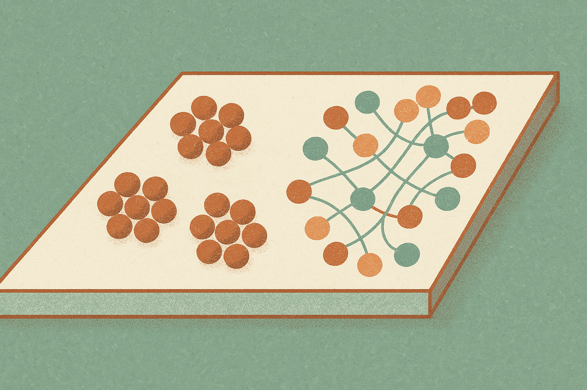

Neural collapse is a clean story from classification. Train a network long enough, and examples from the same class cluster tightly. Class centers arrange into a neat geometric pattern. Variance shrinks. Geometry gets simple.

Language models are not clean classifiers.

The authors of “Neural Collapse Is Forbidden: Information Floors in Language Models” argue that the leftover spread inside language-model representations is not just incomplete collapse. It is doing work. More specifically, it stores information that the model still needs for next-token prediction.

That sounds abstract, but the numbers are useful. Across 14 models and a 100x parameter range, the authors report that broad macro-category structure explains only 4 to 12 percent of representational variance. Within-token context explains 79 to 91 percent. In plain English: most of the action is not “this token belongs to this big category.” It is “this token, in this context, means this next thing might happen.”

## The tidy geometry story breaks first

One of the most interesting parts of the paper is a correction. The authors say a one-line centering identity voids a family of simplex equiangular-tight-frame claims, including their own earlier ones.

That matters because interpretability work often gets seduced by nice pictures. If embeddings form a pretty simplex, we want to believe the model has discovered a clean semantic map. Maybe it has. Or maybe the math of centering made the picture look cleaner than the underlying computation.

The paper’s stronger claim is not just “the old geometry was overstated.” It is that full neural collapse would be incompatible with what a language model must preserve. If all tokens in a category collapsed to the same point, the model would lose context-dependent information that still predicts the next token.

## Variance as storage, not sloppiness

The authors frame within-category dispersion as allocated information storage. They test this with “dimensionless variance shares,” then connect it to conditional mutual information: how much the token still tells you about the context after you already know the category.

The theory result is narrower than the headline, and that is good to keep straight. The paper proves a converse floor for binary categories, forcing within-category dispersion to be at least proportional to I(token; context | category). That does not automatically solve every multi-class, every-model case. But the empirical claim is broader: identity dispersion, not total variance, tracks this information across every tested model and partition. The authors also report cross-model predictiveness, where one model’s information estimate predicts another model’s dispersion.

That is a pretty useful lens. When a probe finds that representations do not compress neatly into your labels, the first question should not be “why is the model messy?” It should be “what information did my labels throw away?”

The weight decay result is also practical. The authors argue token-level weight decay penalizes a category in proportion to its type count, not its occurrence mass. That turns next-token prediction into a kind of imbalanced K-class problem, where category norms follow type count. If that holds up, some representation geometry may be shaped less by semantic frequency and more by vocabulary structure.

## Pretraining does not erase the missing bits

The pretraining story is a useful warning against snapshots. The authors report that category share overshoots, decays, then partially recovers. Their interpretation is simple: the information required by the task never left. Training can move it around, but cannot make it disappear.

This pushes against a common habit in model analysis: pick a layer, pick a checkpoint, project it, name the clusters. That can still be useful. But this paper says the non-clustered part is not residue. It may be the payload.

Practitioner’s take: if you are building probes, evals, or retrieval systems on top of embeddings, stop treating tight clustering as the default sign of quality. Try measuring what your category labels discard. Compare category variance against context-sensitive tasks, not just label purity. The catch is that prettier embeddings may be worse for language work if they collapse away the distinctions the model needs most.
