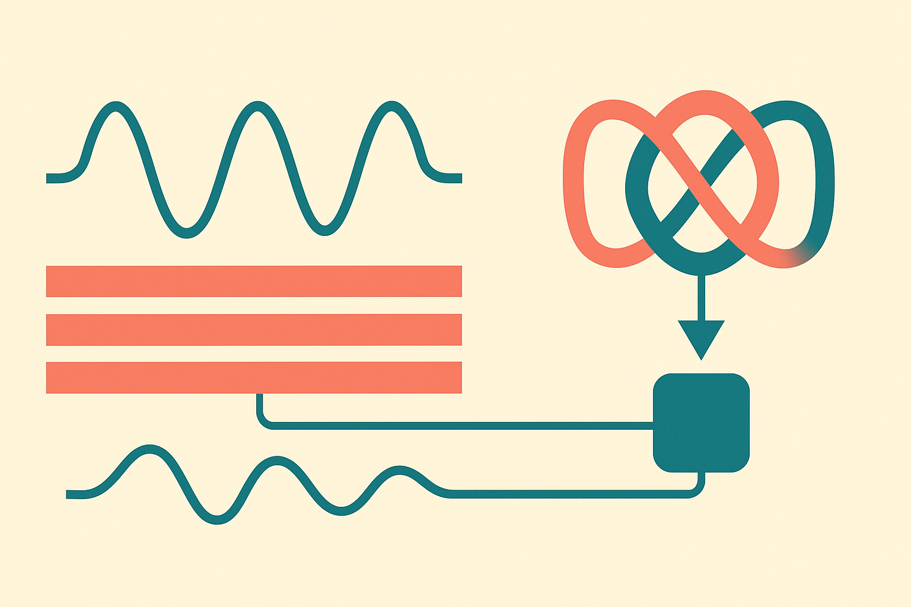

PHINN-EEG is the kind of AI paper that makes my operator brain split in two.

One half says: good, EEG needs better representations. Power spectral density features are blunt instruments. Dreams are rare, messy, state-dependent events. A model that looks at the geometry of a neural signal over time, not just its energy in frequency bands, is a reasonable bet.

The other half says: slow down. The PHINN-EEG paper does not report a measured AUC of 0.82 to 0.90. It says the method is “analytically projected” to hit that range on the open-access subset of the DREAM database. That is very different from a held-out benchmark result.

That distinction matters.

## The useful idea: EEG as shape, not just power

The baseline the PHINN-EEG authors point to is familiar: extract power spectral density and statistical features, then classify whether a person reported dream mentation after awakening. The paper says the current state of the art reaches about 0.70 AUC on DREAM, citing Wong et al. 2025 in Nature Communications.

PHINN-EEG proposes a different representation. It takes multichannel pre-awakening EEG, applies sliding-window Takens delay embeddings, builds Vietoris-Rips filtrations, then extracts Dynamic Betti Curves. In plain English: it turns short stretches of EEG into evolving geometric objects, then measures how connected components, loops, and higher-order holes appear and disappear over time.

That may sound abstract, because it is. But it has a concrete motivation. Spectral features ask, “How much energy is in this band?” Topological features ask, “What shape does the signal’s trajectory trace through state space?”

For dreams, that second question could matter. Dream mentation may not show up as a single clean frequency bump. It may appear as a changing pattern of coordination across channels, transitions, loops, recurrences, and instability before awakening.

## The claim is bigger than the evidence

The paper uses the DREAM database framing well: 3,191 total awakenings from 263 participants across 20 labs, with a 1,462-awakening open-access subset. That is the right kind of dataset for this question, because dream studies are often small and idiosyncratic.

But the main performance claim is still prospective. PHINN-EEG is presented as targeting 0.82 to 0.90 AUC, not as having already beaten PSD and catch22 baselines in a completed benchmark.

That should change how readers file it. This is not “topology solves dream detection.” It is “here is a plausible topological pipeline, with a strong hypothesis about expected gains.”

The synthesis piece is also interesting, but speculative. The authors propose a topology-conditioned rectified flow model for dream-state EEG generation, with a spectral-conditioned flow model as an ablation baseline. That is a sensible experimental design. If topology conditioning produces synthetic EEG that better preserves dream-relevant structure, while a spectral-only model does not, that would strengthen the case.

Still, synthetic EEG is a trap if evaluated lazily. A generator can match feature distributions and still be useless for science. The test is whether synthetic samples improve downstream classification, preserve subject and lab variability, and do not memorize rare patterns from a small open subset.

## The bigger lesson for time-series AI

What I like here is not the dream angle alone. It is the push toward richer representations for biological time series.

A lot of applied AI work still treats sensors like flattened tables. Calculate summary stats, feed a classifier, report AUC. That can work. It can also erase the thing you care about. Topological data analysis is one way to keep some of the dynamics intact without pretending raw sequence models will magically discover everything from limited data.

The catch is cost and validation. Persistent homology pipelines can be parameter-sensitive. Window size, embedding dimension, delay, filtration choice, channel handling, and denoising all matter. If those decisions are tuned too close to the test set, the apparent gain evaporates. And EEG is full of confounds: sleep stage, movement, awakening protocol, lab hardware, subject differences, and report bias.

If I were building from this, I would not start with flow synthesis. I would reproduce the boring baseline first: PSD, catch22, subject-level splits, lab-held-out splits, and the reported 0.70-ish AUC target. Then I would add Dynamic Betti Curves as a feature family and ask one narrow question: do they improve out-of-lab generalization? If yes, then try topology-conditioned generation. The catch most readers miss is that the real product value is not “dream reading.” It is better rare-state detection from noisy wearables, and only if the topology survives contact with new people, new devices, and ugly data.
