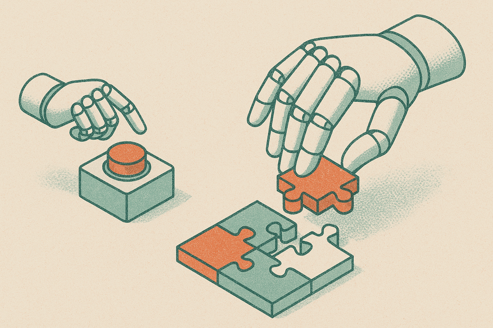

There is a quiet result buried in the QANTA 2026 shared challenge that deserves more attention than it will get. A team submitted a two-agent system to the ICML 2026 EMM-QA workshop and took the top overall score of 0.402. They did it without a retrieval pipeline. Without model ensembles. Without any of the heavy machinery that usually wins these things.

What they had instead was a clear idea about when their model should answer and when it should hold back. That is the whole story, and it is a better lesson for agent builders than most of the flashier papers this year.

## What QANTA actually tests

Quizbowl is a specific kind of hard. Questions get revealed incrementally, clue by clue, in what the community calls pyramid style. Early clues are obscure and hard. Later clues are obvious giveaways. The skill is buzzing in as early as you can while still being right. Buzz too early and you risk a wrong answer. Wait too long and someone else beats you.

QANTA 2026 adds images to that setup and puts everything under efficiency constraints, so you cannot just throw a giant model and a huge retrieval index at the problem. The challenge splits into two tasks that reward opposite instincts. Tossup questions are about deciding when to answer under uncertainty. Bonus questions are about picking the exact right answer and being useful enough that a human would actually adopt the response.

Those are genuinely different jobs. One is a timing and risk problem. The other is a precision problem.

## Two agents, two temperaments

The winning approach, described in the arXiv submission on both cs.AI and cs.CL, is a task-specific two-agent architecture. Instead of building one system that tries to be good at everything, they built two that are each good at one thing.

The Tossup agent runs on a GPT-4o-mini-class model, listed as GPT-4.1-mini in the competition logs. Small model, cheap to run, which fits the efficiency constraints. Its job is not raw knowledge. Its job is knowing how confident it should be. The team layered in confidence-calibrated answering plus a domain-specific numeric reasoning policy that specifically fights overconfidence when a clue is just an isolated number. That last detail is telling. Quizbowl questions love to drop a single stat, a year, a population, a molecular weight, and a naive model will latch onto it and buzz. The team apparently found that isolated quantitative clues were a reliable source of overconfident wrong answers, so they wrote a policy to distrust them.

The Bonus agent runs on the bigger GPT-4o-class model, GPT-4.1. Here the objective flips. No buzzing timing to worry about, so you spend the compute on getting the answer exactly right. It uses leadin-aware reasoning, structured relational reasoning, and multimodal evidence integration. In plainer terms: read the whole question setup, connect the entities, and use the image when the image matters.

The design choice worth noting is that they matched model size to task shape. Small and calibrated for the risk problem. Larger and thorough for the precision problem. That is not a headline-grabbing move but it is the correct one.

## Why skipping retrieval is the interesting part

The reflex in 2026 is to reach for RAG. Got a knowledge task? Bolt on a retriever, index a corpus, stuff the context. It works often enough that people stop asking whether it is necessary.

This team said no to that, and to ensembles, and stayed inside a hosted-only environment. Their framing is that efficient reasoning policies and confidence calibration can carry the load instead of infrastructure. The scores back it up: 0.238 on Tossup, 0.164 on Bonus Effect, 0.402 overall and first place.

I want to be honest about the numbers though. A 0.402 overall score is a win on this leaderboard, but it is not a system that feels solved. Tossup at 0.238 means the buzzing-under-uncertainty problem is still mostly unsolved by everyone, winners included. So the takeaway is not "calibration beats retrieval, case closed." The takeaway is narrower and more useful: on a resource-constrained benchmark, a well-shaped reasoning policy competed with and beat heavier approaches. When you cannot afford the infrastructure, the discipline of knowing your own uncertainty is worth more than you think.

The two arXiv postings are the same paper cross-listed, so this is a single team's result, not independent replication. Treat it as one strong data point, not a settled field.

## The part most builders skip

Here is what I keep coming back to. Almost every agent people ship right now answers with the same confidence whether it knows or is guessing. The model does not buzz early or wait. It just responds. Every time. At full volume.

The QANTA setup forces the opposite. The Tossup agent gets rewarded for restraint, and the team engineered restraint on purpose with a numeric-clue policy and calibration. That is a transferable idea. Any agent that takes an action in the world, files a ticket, sends an email, executes a trade, moves money, faces the exact tradeoff quizbowl formalizes: act early and risk being wrong, or wait for more evidence and risk being late.

Most agent frameworks give you tool calls and memory and planning. Very few give you a first-class notion of "should I act yet." This paper is a small argument that you should build that notion yourself, tuned to your domain, because it is where the real points are.

The practitioner's take: if you are building an agent that acts under uncertainty, steal the two-part structure. Split your problem into the timing decision and the accuracy decision, and do not assume one model or one prompt handles both. Put a cheap, calibrated model on the "should I act now" question and reserve the expensive model for "get this exactly right." Then find your version of the isolated-numeric-clue trap: the specific input pattern that makes your model overconfident, and write an explicit policy against it. The catch most people miss is that calibration is not a setting you turn on. It is domain work. This team clearly ran their system, watched where it buzzed wrong, and coded a rule for it. That loop, not the model choice, is what won.
