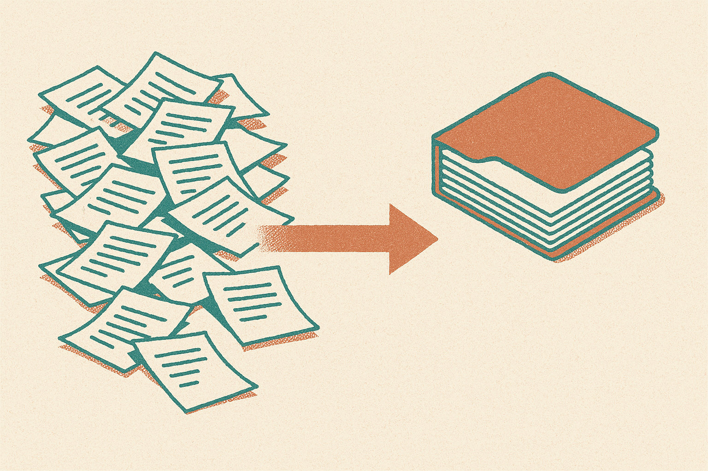
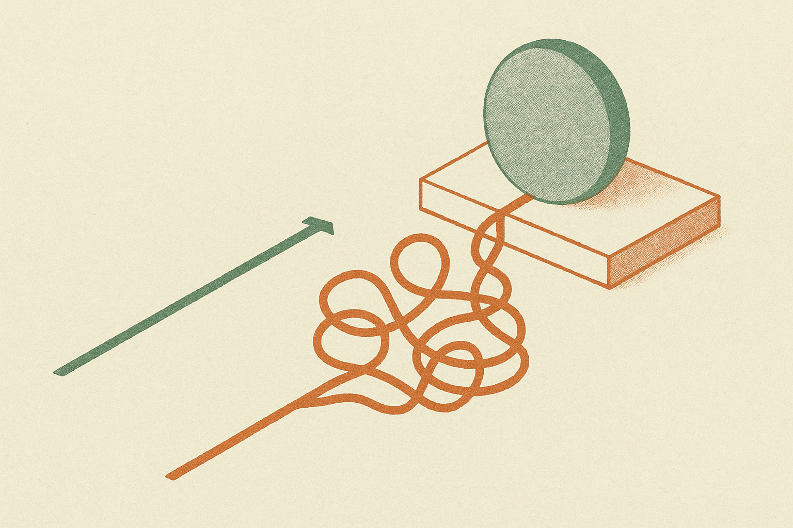

OpenAI put out two how-to posts this week, one for sales teams and one for data science teams, both showing how ChatGPT Work turns "real work inputs" into finished deliverables. On the surface they read like generic enablement content. Look closer and they tell you exactly how OpenAI wants this product to be understood, and it is not "a chatbot that knows your company."

The sales post lists five outputs: pipeline briefs, meeting prep packets, forecast reviews, account plans, and stalled-deal diagnoses. The data science post lists five more: root-cause briefs, impact readouts, KPI memos, scoped analyses, and dashboard specs. Notice what these have in common. Every single one is a named artifact that a person already produces by hand today. OpenAI is not selling intelligence. It is selling the compression of a specific, recurring document.

## The unit of value is the deliverable, not the answer

The standard consumer framing of ChatGPT is question in, answer out. You ask, it responds, you decide what to do with it. That framing is bad for enterprise because the answer is not the work. The work is the forecast review your VP reads on Monday, formatted the way your VP expects, pulling from the CRM export and last quarter's numbers.

By naming ten concrete deliverables, OpenAI is quietly moving the unit of value from "answer" to "artifact." That is a smarter enterprise pitch. A sales manager does not want a clever paragraph about a stalled deal. They want a stalled-deal diagnosis: what changed, when it went quiet, who went dark, what the next move is. Same underlying model, completely different product.

This is also why "from real work inputs" appears in both descriptions. The promise is not that the model knows things. It is that the model eats your CRM notes, your call transcripts, your query logs, your dashboards, and hands back the document you were going to write anyway. The intelligence is assumed. The plumbing is the product.

## Why sales and data science, and why now

The two teams OpenAI chose are not random. Sales runs on repetitive, high-volume writing where the inputs are messy and the outputs are formulaic. Every account plan looks structurally like every other account plan. Every meeting prep packet answers the same four questions about a different logo. That is close to an ideal shape for an LLM: high structure in the output, tedious variance in the input.

Data science is the more interesting pick. The five outputs there are heavier on judgment: a root-cause brief and a scoped analysis are not just formatting exercises, they involve deciding what actually happened and what to measure. OpenAI is betting that ChatGPT Work can draft the reasoning, not just the layout. That is a bigger claim, and it is the one I would want to see stress-tested before I trusted it.

Here is where I have to be honest about the limits of the sourcing. These are OpenAI's own marketing posts. They show what the product is meant to do, not how often it gets a root cause wrong or hallucinates a metric that was never in the dashboard. Neither post shows an example that failed. Take the capability claims as intent, not as an independent audit.

## The templated-output trap

If the real product is repeatable artifacts, the real risk is repeatable mistakes. A stalled-deal diagnosis that quietly misreads the CRM once is a bad Monday. A stalled-deal diagnosis that misreads it the same way across 200 accounts, formatted so cleanly that nobody double-checks, is a systemic problem you will not notice until forecast day.

This is the catch with any tool that turns judgment into a template. The output looks finished, which is exactly the property that makes people stop reading critically. A hand-written forecast review carries the analyst's uncertainty in its rough edges. A generated one arrives polished, and polish reads as confidence whether or not the confidence is earned.

Data science teams should feel this most sharply. A KPI memo that anchors the org on the wrong number is worse than no memo. The failure mode is not that the tool refuses to answer. It is that it answers fluently and wrong, and the fluency buys it trust it did not earn. That is the thing to watch when a model's job shifts from "help me think" to "produce the document we act on."

## What this signals about OpenAI's enterprise play

Zoom out and this is OpenAI trying to move up the value chain from model access to workflow ownership. Anyone can call the API. Not everyone can define the ten deliverables your sales and data teams actually ship and wire the inputs to produce them. By publishing these playbooks, OpenAI is teaching customers to think in terms of outputs it can own end to end, which is stickier than raw model access and much harder for a cheaper competitor to displace.

Whether it works depends on something these posts cannot show: does the artifact hold up when a real person with skin in the game reads it? A pipeline brief that a rep silently rewrites every time is not saving anyone time. A pipeline brief they forward untouched is a genuine product. The gap between those two outcomes is the whole game, and nothing in OpenAI's marketing tells you which side a given team lands on.

If you want to try this without getting burned, pick one of the ten deliverables, not all of them. Choose the most templated one you have, probably meeting prep or an impact readout, and run it in parallel with your existing process for two weeks. Compare the generated artifact against what your person would have produced, and specifically hunt for the confident-but-wrong cases, not the obviously broken ones. Keep a human owner on every artifact that drives a decision, and treat the polish as a warning sign rather than a finish line. The teams that win with ChatGPT Work will be the ones who trust it least at the start and earn that trust one deliverable at a time. The catch most readers miss: the tool's biggest strength, making output look done, is also the thing that will let a quiet error scale before anyone catches it.
