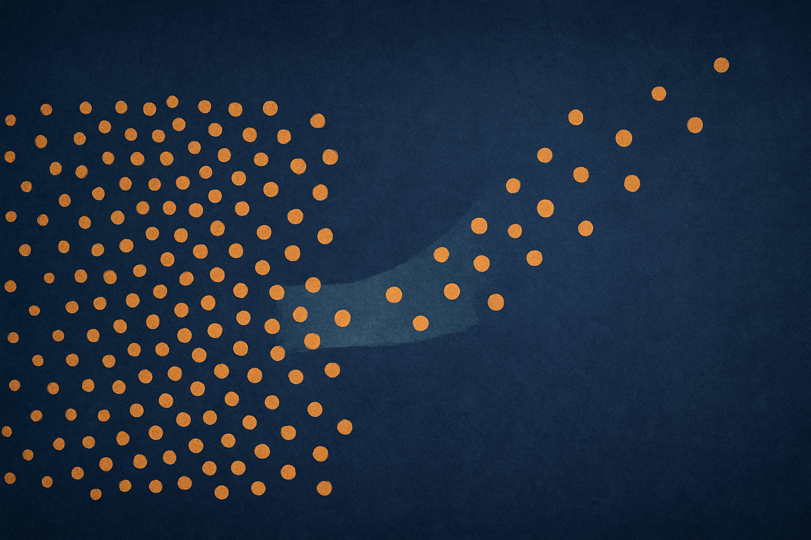
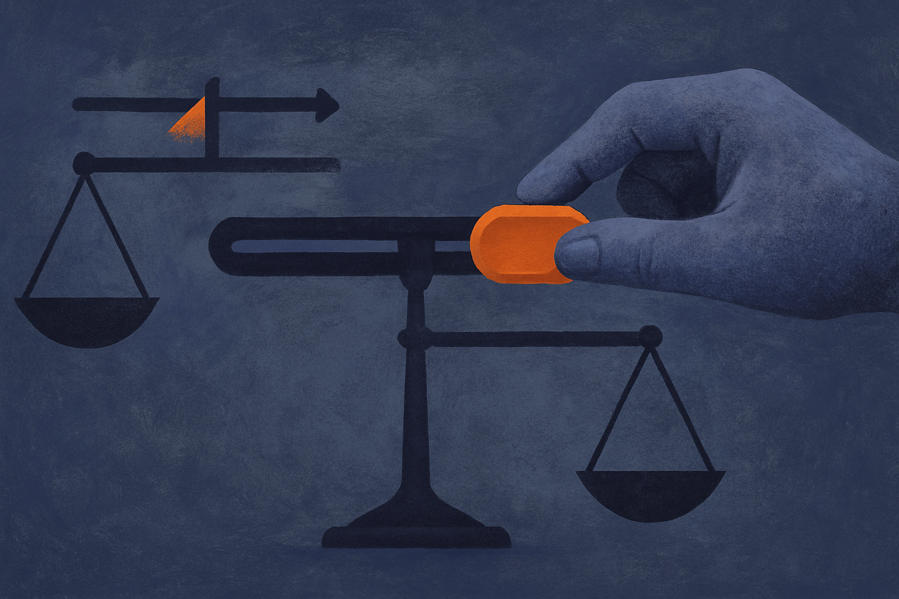
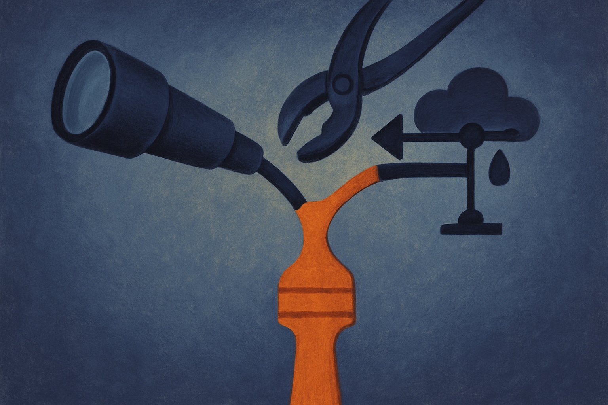

If you run any kind of automated eval, you already know LLM-as-judge is load-bearing. You use a model to score outputs because human labeling does not scale. And you already know it is biased: judges favor longer answers, prefer their own family's style, get swayed by a confident tone, reward the first option in a pairwise comparison. The usual response is to patch the prompt. Add "ignore length." Randomize position. Tell the judge to be objective. Then measure whether the score delta shrank.

A new paper, "Inside the Unfair Judge," argues that this whole input-output framing is the wrong altitude. The authors treat judge bias not as noise you nudge from outside but as a physical structure inside the model's hidden state. And they back it with three findings across seven judges, seven bias types, and nine benchmarks that hold together better than most single-lab interpretability work I have read this year.

## Bias has a shape

The first claim is geometric. When a judge processes a "clean" scoring input, its activations sit in a tight region, call it a manifold. When you feed it a biased input (one designed to trigger, say, verbosity preference or position bias), the activations get pushed off that manifold in a specific direction. Not randomly. Along a low-dimensional subspace that is particular to the bias type.

Two details make this more than a cute observation. First, the displacement sharpens with depth. Early layers barely separate biased from clean inputs; deeper layers pull them apart cleanly. That matches how you would expect a concept to form, from surface tokens toward abstract judgment. Second, three different families of estimators recover the same subspace. When you get the same answer from multiple methods that do not share assumptions, you start to trust the answer is about the model and not about your tool.

The practical translation: each type of bias is not a vague tendency smeared across the network. It is a direction. And directions are things you can measure and manipulate.

## You can steer it both ways

The second finding is the one that turns correlation into something closer to cause. The authors steer hidden states along the bias subspace and watch scores move predictably.

Push a clean input's activations in the bias direction, and the judge starts scoring as if the input were biased. It reproduces the biased behavior on inputs that never contained the trigger. Push a biased input's activations the opposite way, and the judge recovers its baseline score. The bias goes away without touching the prompt at all.

The control here is what sells it. They compare against random directions matched for magnitude, and those produce shifts an order of magnitude smaller. So it is not "any perturbation moves the score." It is this specific direction that moves it. That is the difference between finding a lever and finding a wall you can lean on.

This matters because input-output studies can never fully separate correlation from mechanism. If you add "ignore length" to a prompt and scores change, you learned that the phrase changed something, but not what. Steering says: the score responds to this internal axis, directly, in both directions. That is a mechanistic claim, and it is the kind interpretability research usually struggles to earn.

## The part builders can actually use

Here is where I stopped reading as a spectator. The third finding is operational. Take a simple linear projection onto the same bias-direction features and use it to predict, in advance, when a judge will fail. Not explain after the fact. Anticipate.

They test this on three entirely unseen benchmarks and report it substantially outperforming text-based alternatives. Read that carefully. The bias direction learned in one setting transfers to predict failures in settings it was never fit on. And it beats methods that look at the text of the input, which is what almost everyone building eval guardrails does today.

Think about what that buys you. Right now, if you want to know whether your judge is being fooled, you run ablations, you spot-check, you build adversarial test sets. All of that is expensive and reactive. A projection onto a known bias subspace is a cheap runtime signal. You could flag a specific judgment as "this scoring is likely riding the verbosity axis" before you trust the number. You get a confidence estimate that is grounded in the model's internals, not in a heuristic about word count.

The catch, and it is a real one, is access. This is white-box work. You need the hidden states, which means you need an open-weights judge or an API that exposes activations. Most people scoring with a closed frontier model as judge cannot do any of this today. The paper's method is a blueprint for what becomes possible if you run your own judge, not a plug-in for the OpenAI or Anthropic scoring calls most teams actually use.

## What I would watch for

I want to see this replicated by a second group, and I want to see it on the closed judges everyone deploys, which will require lab cooperation. Seven judges is a solid sweep, but "seven bias types" is a choice, and the messiest real-world biases (domain expertise, factual sycophancy, cultural framing) may not decompose into clean low-dimensional subspaces the way length and position do. The tidiness of the geometry could partly reflect which biases they chose to study.

I would also push on the "sharpens with depth" claim. If the bias only becomes legible in late layers, then any intervention has to happen late too, which limits how much upstream mitigation you can do. That is a constraint the operational story glosses over.

Still. This reframes a problem I thought was stuck. For two years the judge-bias conversation has been prompt engineering plus better rubrics, and it plateaued. Reading bias as activation geometry gives you three things at once: structure you can see, a lever you can pull, and a predictor you can deploy. That combination is rare.

Practitioner's take: if you own your eval judge and it is open-weights, this is worth a prototype now. Pick your two worst biases (length and position are the easy wins), collect clean and biased activation pairs, fit the bias direction with a simple linear probe, and use the projection as a per-judgment confidence flag rather than trying to steer in production. Steering is the flashy result but the fragile one; the projection-as-early-warning is the boring result that survives contact with real workloads. The catch most readers will miss: none of this helps if your judge is a closed API, so the deeper lesson is that running your own judge is starting to buy you real interpretability leverage, not just cost savings. That trade is getting more attractive, and papers like this are why.
