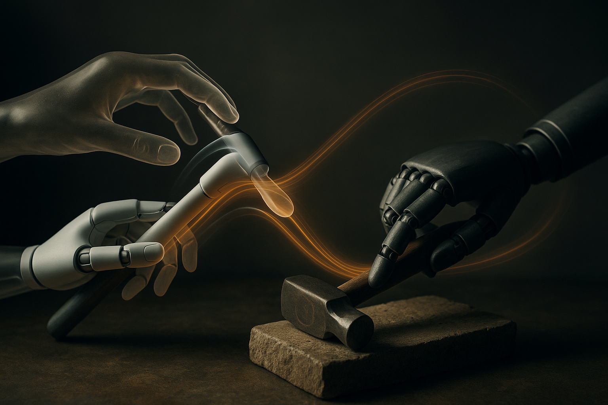

Robot hands are where clean demos go to die.

A humanoid can imitate a walking motion and look impressive, even if the policy is mostly tracking a kinematic reference. A hand using scissors is different. The contacts matter. The object slips. The force profile matters. The same motion with the wrong contact mode is not the same task.

That is why REGRIND is interesting. The authors take a recipe that has worked for humanoid whole-body control, retarget human motion to a robot reference, then train reinforcement learning to track it, and ask whether it survives dexterous manipulation. Their answer: yes, at least for some contact-heavy tool tasks, if you keep the right structure.

## One demo, but not magic

REGRIND starts with a single human demonstration. That sounds like the headline, but it is not the whole story.

The key move is the retargeting step. The authors do not just copy hand joint angles from a human to a robot hand. That would be brittle because human and robot hands are built differently. Instead, REGRIND preserves hand-object spatial and contact relationships. In plain English: it cares less about making the robot’s fingers look like the human’s fingers, and more about keeping the useful geometry between fingers, tool, and object.

Then the system trains a residual RL policy in simulation. The policy tracks object-centric keypoints along the retargeted reference, rather than blindly replaying a pose sequence. That matters because manipulation is not just motion. It is motion under contact, and contact is where simulation usually lies.

The authors report zero-shot transfer to hardware after careful system identification. They show policies on two different multi-fingered robot hands, including operating scissors and turning a screwdriver. Code and videos are available, which is good. Robot learning papers need receipts more than most fields, because polished clips can hide a lot.

## The boring part is the important part

The paper calls REGRIND minimalist. I buy that, but minimalist does not mean easy.

The pipeline still depends on high-quality retargeting, simulation training, object-centric tracking choices, and system identification tight enough to make hardware behave like the simulator. The authors explicitly frame their hardware experiments as an analysis of what governs sim-to-real transfer in dexterous manipulation. That is the useful part for builders.

A lot of robotics hype implies that scale will wash away the messy details. More demos. More compute. Bigger policies. Maybe. But REGRIND points in a different direction: if the representation is right, one demonstration can carry a lot of information.

The trick is choosing what to preserve. For tool use, preserving contacts and hand-object relationships is often more valuable than preserving the human motion itself. A screwdriver does not care whether the robot hand is anthropomorphic. It cares about grip, torque, alignment, and not dropping the thing.

This is also why I would not read REGRIND as “one-shot dexterity is solved.” The reported tasks are meaningful, but they are still specific tasks with careful setup. Zero-shot hardware transfer is impressive, but it follows a simulation and identification pipeline built for that transfer. The recipe may travel. The success will still depend on the hand, sensors, object variation, friction, latency, and how badly the real world disagrees with the model.

## Retargeting is becoming a serious interface

What I like here is the interface between human behavior and robot learning.

The human provides intent and structure. Retargeting converts that into a robot-usable reference. RL handles the residual messiness. System identification makes the final jump less ridiculous. None of those pieces is new in isolation. The value is the sequence.

That pattern keeps showing up across embodied AI: do not ask the policy to discover everything from scratch. Give it a scaffold. Let learning fill in the parts that are hard to specify by hand.

For dexterous manipulation, that scaffold may be object-centric rather than body-centric. The object is the anchor. The hand is just the mechanism.

If I were building with this, I would start by copying the discipline, not the whole stack. Pick one narrow tool task. Record one clean human demo. Define the contacts and object keypoints that actually matter. Train a residual policy against that reference in simulation. Then spend real time on system identification before celebrating. The catch most readers miss: “single demonstration” is not the shortcut. The shortcut is knowing which parts of the demonstration deserve to survive retargeting.
