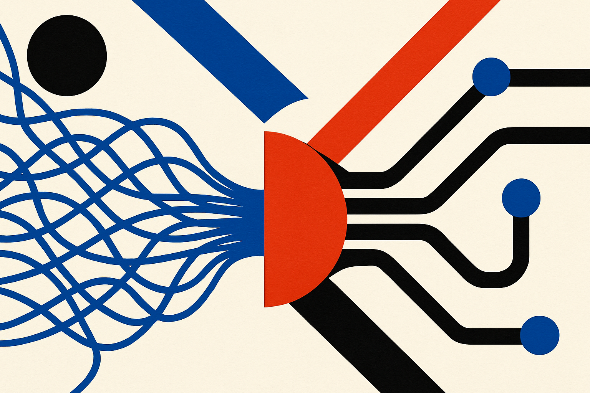

A lot of mechanistic interpretability work starts after the fact. Train a model, crack it open, hunt for circuits, then argue about whether the discovered mechanism is real or just a nice story.

The paper *Invariant Learning Dynamics of Transformers in Inductive Reasoning Tasks*, cross-listed on arXiv in cs.AI and cs.LG, tries to move that line earlier. The authors ask whether circuit formation can be predicted during training, at least for a class of synthetic inductive reasoning tasks.

That is the interesting part. Not “we understand Transformers now.” We do not. The claim is narrower and more useful: for tasks like in-context n-grams and multi-hop reasoning, attention model training can be described on a low-dimensional invariant manifold. Translation: instead of tracking millions of parameters directly, the authors say the relevant learning dynamics collapse into a handful of interpretable coordinates.

That is a big if. But it is the right kind of if.

## The useful claim is compression

The paper’s core move is to define a generalized family of inductive tasks, then prove that learning dynamics stay inside a structured, low-dimensional space. On that manifold, the model’s behavior can be described with coordinates that correspond to meaningful mechanisms.

This matters because “the model learned a circuit” is usually vague. Here, the authors cast circuit formation as a dynamical process. A circuit is not just something you find with probes after training. It is a path the model takes through training.

The authors also study the competition between in-context learning and in-weights learning. That split is practical. Sometimes a model solves a task by using examples in the prompt. Sometimes it bakes the pattern into parameters. Most builders see both behaviors in production, often in annoying ways. The same model can look adaptive in one setting and weirdly memorized in another.

According to the paper, data statistics help govern which behavior wins. Random initialization can also matter when multiple circuits could solve the task. That is a good reminder that “same architecture, same task” does not always mean “same mechanism.”

## The catch is scope

This is theory on synthetic inductive tasks. That is not a weakness by itself. It is how you get clean statements. But it does mean we should not jump straight from this result to GPT-scale behavior in messy real-world training.

The tasks named by the authors, including in-context n-grams and multi-hop reasoning, are useful toy worlds. They isolate behaviors people care about. Still, a frontier model trained on mixed web, code, math, tool traces, and synthetic data will have far more competing pressures than this framework captures.

So I read this less as “the Transformer mystery is solved” and more as “some circuit formation may be much more structured than it appears.” That is a meaningful shift. If the right coordinate frame can detect which circuits have been learned, as the authors report, interpretability starts to look less like archaeology and more like instrumentation.

That would be valuable. Today, teams often discover model behavior after deployment: prompt sensitivity, shortcut learning, brittle reasoning, memorized workflows. A training-time view of which mechanisms are emerging would make model evaluation less reactive.

It also fits a pattern in current AI research. The best interpretability work is getting less mystical. Less “neurons are concepts.” More geometry, dynamics, interventions, and falsifiable claims.

For a builder, I would not apply this paper by trying to compute invariant manifolds for your product model next week. I would apply the habit: separate prompt-time learning from parameter-time learning in your evals. Create task variants where the model must use context, then variants where context is misleading, then watch which behavior dominates across checkpoints or model versions. The catch most teams miss is that accuracy alone hides the mechanism. Two models can get the same score while one reads the prompt and the other memorizes the pattern.
