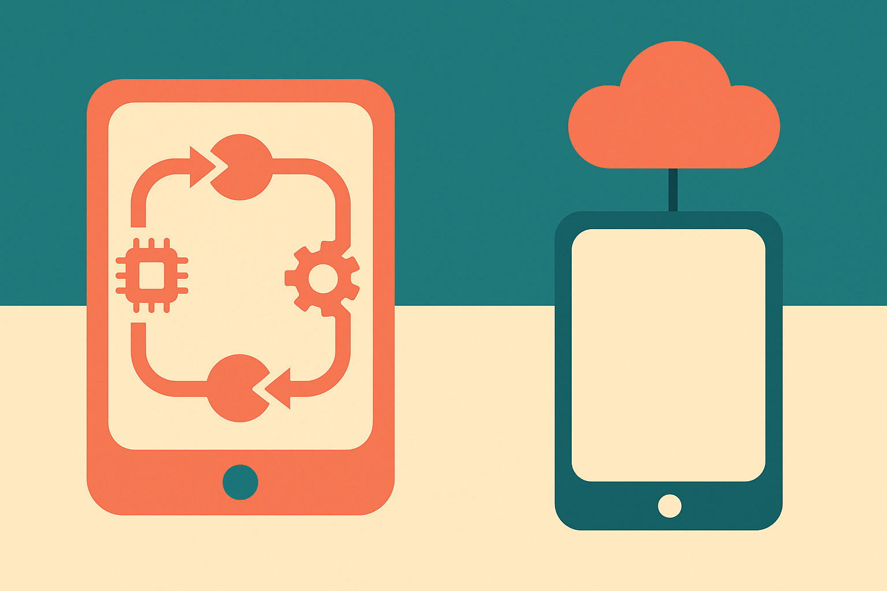

Most mobile agents today drive your phone the way a frustrated parent drives a rental car: tapping around the screen, squinting at the interface, guessing where the next button is. They read a screenshot, decide to tap coordinate (412, 890), wait, read another screenshot, tap again. It works, sometimes. It is also slow, brittle, and hard to reason about when it breaks.

PalmClaw, an open-source framework posted to arXiv this week, argues the whole approach is backwards. Instead of teaching an agent to operate the GUI, it hands the agent a set of explicit device tools and runs the entire agent loop on the phone itself. The headline numbers: an 11.5% relative bump in task success and a 94.9% reduction in completion time over the strongest baseline they tested. The time number is the one worth staring at.

## Why GUI-driving agents are the wrong default

The dominant pattern for phone agents is GUI automation. The agent perceives the screen, plans an action in interface terms (tap, swipe, type), executes, then re-perceives. This mirrors how a human uses a phone, which is exactly why it appeals to people building these things. It is also the source of most of the pain.

The PalmClaw authors name three problems, and all three are real. First, the action sequences get long and interface-dependent. Opening a settings toggle might take six taps, and if the OS shifts a menu in an update, the whole sequence rots. Second, the agent cannot directly touch device capabilities. It wants to know your location, so instead of asking the location service, it navigates to a maps app and reads pixels. Third, execution boundaries are fuzzy. When an action is "tap here and see what happens," it is genuinely hard to say what the agent is allowed to do or what it just did.

That third point is the one I keep coming back to. If you are going to give an agent access to a device full of your data, sensors, and daily-use apps, "we are not entirely sure what it can do" is not an acceptable answer.

## The tool-first alternative

PalmClaw's move is to expose device capabilities as tools with explicit arguments, structured results, and clearly defined execution boundaries. Instead of an agent tapping through a camera app, it calls something like a capture tool, gets a structured result back, and moves on. The action is named, its inputs are typed, its output is parseable, and its scope is bounded.

This is the same shift that made server-side agents workable. Function calling and structured tool interfaces beat screen-scraping on the desktop for the same reasons they should beat GUI-driving on mobile: they are faster, they are legible, and they fail in ways you can catch. The 94.9% time reduction is almost certainly this, not a smarter model. You are deleting the perceive-plan-tap-wait-reperceive loop and replacing it with direct calls. When you cut out screenshots and round trips, latency collapses. The modest 11.5% success gain, next to the enormous time gain, actually supports that reading. The framework is not dramatically more capable, it is dramatically less wasteful.

The second structural choice is running the whole thing on-device. Sessions, memory, skills, tools, and the agent loop all live on the phone. The paper frames this as reducing setup burden, and there is a bigger implication they undersell: the phone is where the sensitive data already is. An on-device loop with typed tools means the agent's actions never have to round-trip through a server to touch your data, and every action it takes is a named, logged call rather than an opaque tap.

## Where I would push back

The claims are single-source. Two arXiv listings, cs.AI and cs.CL, but the same paper. So treat the numbers as a first report, not a settled result, until someone reproduces them. The code is on GitHub, which is the right move and makes reproduction possible, but "authors reported" is not "the field verified."

I have specific questions the abstract does not answer. What is "the strongest baseline"? A 94.9% time reduction against a slow GUI agent is impressive but expected, because you are comparing a direct method against an inherently slow one. That is closer to measuring the tax of the old approach than proving the new one is good in absolute terms. What is the task suite, and how much of it happens to map cleanly onto the device tools they built? Tool-first frameworks look great exactly when tools exist for what you are testing, and they fall off a cliff the moment a task needs an app that only speaks GUI.

That cliff is the real limitation. GUI-driving agents have one genuine advantage: they work on anything with a screen, including the thousand third-party apps that will never expose a clean tool interface. A tool-first framework is only as capable as its tool coverage. The likely honest end state is a hybrid, tools for everything the OS and framework can expose directly, GUI-driving as the fallback for the long tail. The paper does not seem to claim it replaces GUI agents entirely, and it should not.

## What this means for the on-device agent race

The larger signal is that the mobile agent conversation is maturing past "can a model tap buttons" toward "what is the right execution substrate." Explicit tools, bounded actions, an on-device loop, and legible traces are the boring infrastructure that turns a demo into something you would let near your actual phone. That is the interesting part, more than any single benchmark.

An operator's take: if you are building phone automation today, the lesson is to define your action space before you touch a model. Enumerate the device capabilities you actually need as typed tools with clear boundaries, and only reach for GUI-driving as the fallback for apps you cannot reach any other way. That inversion is where PalmClaw's real speedup lives, and you can adopt the principle without adopting the framework. The catch most people will miss: the benchmark's giant time savings come from comparing against a slow baseline, so do not promise your stakeholders a 95% speedup. Promise them legible, auditable actions, then measure your own before-and-after. The auditability is the durable win. The speed is a nice side effect that depends entirely on what you were doing before.
