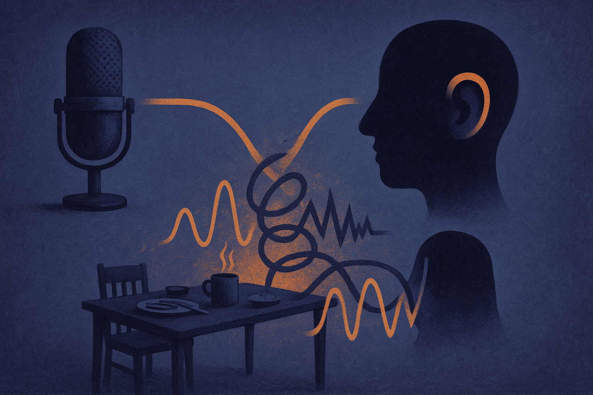

Voice AI demos have gotten very good at sounding impressive for 30 seconds.

A calm synthetic voice. A quick answer. Maybe a little laugh. The clip lands well on social feeds because it removes the awkward parts: background noise, bad microphones, accents, overlapping speech, hesitation, corrections, long pauses, and the moment a user realizes the agent did not understand the actual request.

That is why Hugging Face’s Real World VoiceEQ is directionally important. Hugging Face described it as a way to measure the human quality of voice AI. That phrase matters. Not “speech quality.” Not “audio quality.” Human quality.

The difference is the whole product.

## The benchmark target is shifting from sound to behavior

For years, voice evaluation could hide behind narrower metrics. Did speech-to-text transcribe the words correctly? Did text-to-speech produce clear audio? Was the model fast enough to avoid painful silence?

Those still matter. A beautiful agent that drops words is not useful. A clever model with a 4-second pause feels broken. But the next frontier is not only whether the pipeline works. It is whether the conversation works.

Human quality includes timing. Can the system handle a half-finished sentence? Can it recover when someone changes their mind mid-request? Can it distinguish “yeah” as agreement from “yeah?” as confusion? Can it be interrupted without sulking through the rest of its script?

That last point is not cosmetic. In real calls, people interrupt constantly. They correct, clarify, backtrack, mumble, and talk while doing other things. A voice agent that cannot survive that is not an agent. It is an IVR with better perfume.

## Voice has less room for fake intelligence

Text agents get a lot of forgiveness. You can reread. You can skim. You can copy an error into another tool. The cost of awkwardness is lower.

Voice is harsher. A tiny delay feels like uncertainty. A wrong tone feels personal. A repeated clarification feels incompetent. A confident mistake feels worse when it is spoken into your ear.

This is why a “human quality” measure needs to account for experience, not just outputs. A voice agent in a customer support workflow may need to be boring, precise, and interruptible. A tutoring agent may need warmth and patience. A clinical intake assistant needs restraint. A sales assistant needs to avoid sounding like it is trapping the user in a script.

One number probably will not capture that. I would be skeptical of any score that claims to rank all voice systems across all jobs. But a shared evaluation frame can still help if it makes the hidden failures visible.

The useful version of VoiceEQ, or any similar effort, would separate the pieces: naturalness, latency, turn-taking, instruction following, recovery from errors, accent and noise tolerance, and user trust. The score matters less than the failure profile.

## The real test is deployment mess

The mistake builders make is testing voice agents like media assets.

They listen to the voice. They judge whether it sounds friendly. They run a few scripted calls. Then they ship into a world where users are walking dogs, driving cars, sitting near televisions, speaking over children, and asking questions the script never covered.

Real evaluation needs ugly test sets. Bad audio. Mixed languages. Interruptions. Wrong assumptions. Emotional users. Long-tail names. Domain jargon. Silence. The model should be scored not only on the first answer, but on what it does after the first misunderstanding.

That is the practical promise in Hugging Face pointing attention at “real world” voice quality. Voice AI is moving from demo theater into workflows where failures cost money and trust. The winners will not just have the most pleasant voice. They will have the best repair behavior.

If I were building with voice AI this week, I would create a small internal VoiceEQ-style test before choosing a vendor or model. Record 50 messy calls that match the actual job. Include interruptions, corrections, background noise, and user frustration. Score the agent on task completion, latency feel, recovery, and whether a human would want to keep talking. The catch most teams miss: the transcript can look fine while the conversation still feels bad. Voice quality lives in the gaps.
