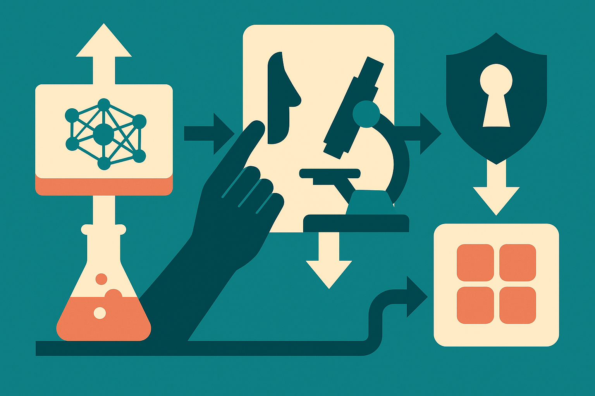

Google DeepMind and Isomorphic Labs are putting a useful word on a hard problem: bioresilience.

Not biosecurity alone. Not “don’t release dangerous models.” Bioresilience is broader. It asks whether the same AI systems that can accelerate biology can also make society better at detecting, understanding, and responding to biological risk.

That framing matters because biology AI is not a hypothetical category anymore. Google DeepMind has already shown how much model progress can change the workflow with AlphaFold. Isomorphic Labs exists to turn related methods into drug discovery output. So when those two groups publish a joint approach to bioresilience and AI models, the subtext is clear: this is not just a policy memo. It is product governance for tools that are moving toward real scientific use.

## Safety cannot just be a release checklist

A lot of AI safety discussion still sounds like a gate at the end of a pipeline. Train model. Evaluate model. Decide whether to ship.

That is too thin for biology.

Biology models sit inside messy workflows. A protein structure prediction system, a molecular design tool, a literature agent, and an automated lab protocol assistant have different risk profiles. The danger is not only in a single model answer. It can be in the combination: search, design, synthesis instructions, procurement, automation, and a human who knows enough to stitch the pieces together.

Google DeepMind and Isomorphic Labs appear to be treating bioresilience as an operating model, not a slogan. That is the right direction. The hard part is making it concrete: model evaluations, access controls, red-teaming, monitoring, partnerships with domain experts, and clear escalation paths when a system starts to show capabilities that change the risk picture.

The public summary does not give enough detail to judge how strong the controls are. That matters. “Responsible AI” language can hide weak process. But the joint nature of the statement is interesting because it ties a frontier AI lab to a company building applied biology products. That is where the real governance problem lives.

## The defensive side needs product love

The best part of “bioresilience” is that it does not treat safety as pure restriction.

A resilient system can spot outbreaks earlier. It can help scientists characterize pathogens faster. It can shorten vaccine or therapeutic discovery loops. It can improve the boring infrastructure too: literature triage, assay design, data cleaning, anomaly detection, and lab quality checks.

That last category gets less attention because it is not cinematic. But it is where builders can do useful work now. A model that helps a public health team summarize noisy signals from clinics, wastewater, and lab reports may matter more than a flashy molecule generator. A tool that reduces false starts in wet-lab validation can save weeks. A workflow that gives biologists better provenance, uncertainty, and audit trails can reduce both accidents and overconfidence.

The catch: the same product features that make a tool useful can also make it risky. Better planning. Better synthesis of literature. Better protocol generation. Better agentic execution. None of those are inherently bad. In biology, though, capability and misuse are tightly coupled.

So the practical question is not “open or closed?” It is: who gets which capabilities, under what verification, with what logging, with what refusal behavior, and with what human review?

## Expect a standards fight

I expect biology AI to become one of the main places where model labs, governments, cloud providers, scientific publishers, and contract research organizations collide.

DeepMind and Isomorphic Labs can set internal norms, but the ecosystem is larger than any one lab. Models will be fine-tuned. Open systems will improve. Agents will connect to databases and lab services. The weakest link may not be the flagship model. It may be a wrapper, a plug-in, a procurement workflow, or an underfunded lab’s homegrown automation stack.

That means the next useful artifacts are not just principles. We need evals that biology experts trust, incident reporting that does not punish good-faith disclosure, and access tiers that are annoying enough to matter but not so heavy that legitimate researchers route around them.

Practitioner's take: if you are building in bio-AI, start mapping the workflow, not just the model. Identify where your system changes user capability: search, design, protocol writing, ordering, automation, interpretation. Add human review and audit trails at those points first. The catch most teams miss is that “defensive” tools can still create offensive capability if they package expert reasoning too neatly.
