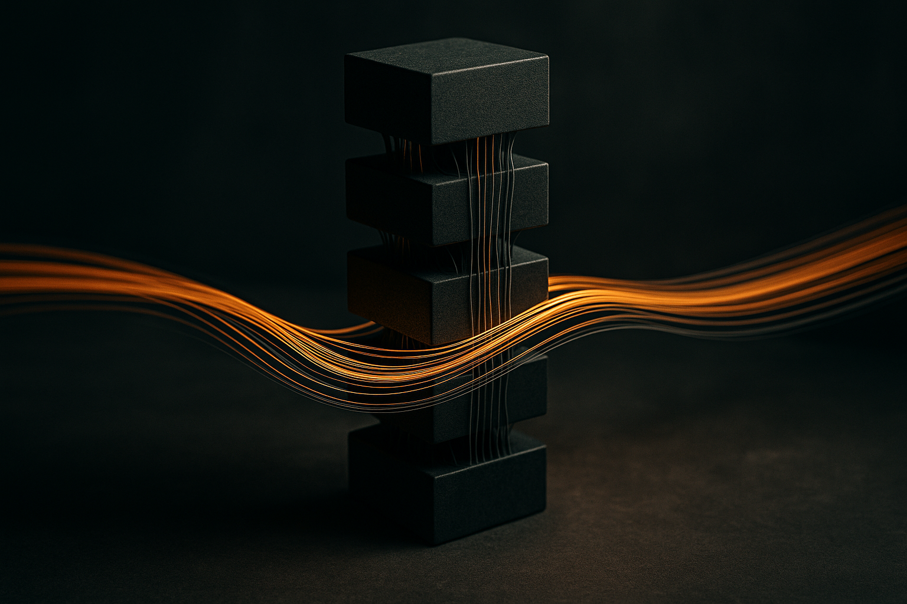

## Residuals are not just gradient plumbing

Transformer architecture usually gets explained through scale control. Residual connections keep updates from exploding or vanishing. Normalization keeps activations in a sane range. Feedforward blocks add capacity. That story is true, but incomplete.

`Transforming Rank: How Architecture Navigates the Spectral Pathologies of Depth` argues that these parts are also managing rank. Not parameter rank as a static property, but the number of independent directions that survive through the input-output Jacobian as depth increases. The claim is simple and uncomfortable: the same multiplications and nonlinearities that make a deep network expressive also tend to crush directions. Go deep enough without the right structure and the model may still pass numbers forward, while the gradient loses the variety it needs to train.

That reframes skip connections. They are not only a way to keep magnitudes stable. They also route gradients around the residual branch, where rank is being lost. Good news: more directions survive. Bad news: the network behaves more like an ensemble of shallow paths and less like one deeply composed function. That is a real tradeoff, not a free lunch.

The authors tie this to the relative scale of the branch and the skip. If the branch dominates, layers compose more strongly, but rank can collapse. If the skip dominates, rank is preserved, but composition weakens. This is the kind of detail that tends to get flattened into “residuals help training.” Yes. But how they help matters.

## Pre-Norm looks less like a hack

The strongest practical piece is the normalization placement story. The authors report that Post-Norm tends toward rank collapse, while Pre-Norm reaches a plateau. Their explanation is not just “Pre-Norm is more stable.” Normalization placement changes the branch-to-skip ratio across depth, which changes how much gradient travels through the rank-losing branch versus around it.

That helps explain why Pre-Norm became the safer default for very deep Transformers, even if Post-Norm can look cleaner on paper or work in smaller settings. Pre-Norm is not magic. It changes the geometry of training.

The feedforward block gets the same treatment. The familiar two-matrix shape, expand then contract, is doing more than adding parameters. According to the authors, the second matrix helps decorrelate a coherent mean spike that would otherwise grow across blocks with a single matrix and uncentered activation. Without that, the residual representation can collapse. The width expansion also gives the activation room to discard some directions while still leaving enough to span the original space. The authors connect that threshold to a Marchenko-Pastur law, which is a nice reminder that “4x MLP expansion” is not only folklore. There is math under the habit.

The receipt that matters: they report that initialization rank of the input-output Jacobian predicts which networks train on CIFAR-10. That is not proof that the same metric cleanly predicts frontier language model training. CIFAR-10 is small. Initialization is not the whole run. Optimizers, data, attention, scale, and loss geometry all complicate the picture. But as a diagnostic, it is useful. If a model is born with poor rank propagation, do not be surprised when training behaves like it is fighting the architecture.

For builders, I would treat this as a debugging lens. When a deeper model fails, do not only tune learning rate, warmup, or batch size. Check whether the architecture is preserving independent directions: residual scaling, Pre-Norm versus Post-Norm, MLP expansion ratio, activation choice, and whether branch paths are overpowering skips. The catch most readers miss is that preserving rank is not automatically better. Too much bypass and you may train a stack of weakly interacting shallow paths. The useful target is not maximum depth, or maximum rank, or maximum parameters. It is enough composition without killing the directions learning needs.
