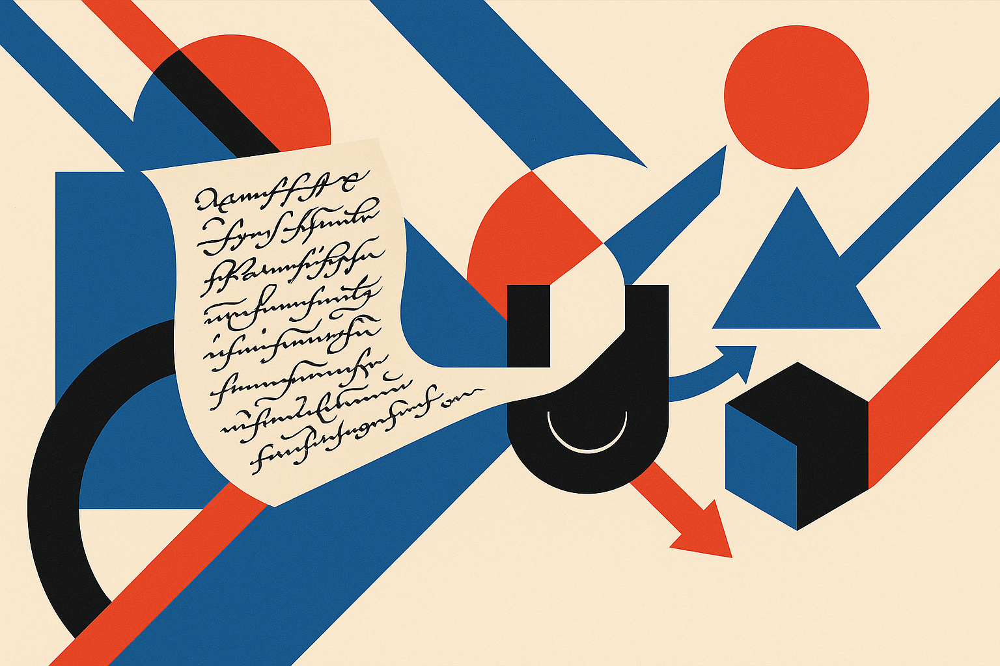

A new arXiv paper on Manchu OCR looks, at first, like a narrow document-processing result. Historical Manchu, a script most people have never seen, three writing styles, a handful of test pages. Easy to scroll past. But buried in the numbers is a finding that applies to anyone fine-tuning models on limited data: some of your best specialists already exist as discarded checkpoints, and you don't know it yet.

Here is the setup. Manchu documents come in visually distinct hands: regular script (clean, printed-looking), running script (faster, messier), and the semi-cursive chancery hand used in palace memorials. Labeled data is scarce. Instead of trying to train one model to handle all three styles well, the authors built a multi-expert system: a lightweight image classifier looks at a page, decides which style it is, and routes it to the specialist model best suited for that style.

## The headline numbers, and why they hold up

The routed system posts 0.30 percent character error rate on regular script, 1.57 percent on memorials, and 4.83 percent on running script. Running script is the hard one, which tracks with intuition: cursive is messier, harder to segment, harder to read even for humans.

The number I care most about is the router itself: 99.3 percent page-level domain accuracy. And critically, the routed system matches a domain-label oracle at two-decimal precision. The oracle is the cheat: it always sends each page to the correct specialist because it already knows the answer. Matching the oracle means the router's mistakes are so rare, or so well-absorbed, that they cost nothing measurable at that precision.

That is the clean part of the story. A page-level classifier that decides "which model" is a much easier problem than the OCR itself, so you get to spend your hard-earned specialist accuracy without paying a routing tax. This is the whole argument for routing in one result: separate the cheap decision from the expensive work, and the cheap decision doesn't have to be perfect, only good enough that its errors don't compound.

## The part everyone will skim past

Now the finding that made me stop. Two of the three selected specialists were not trained for the domain they ended up serving. Only the running-script expert was trained with running script as its target. The regular-script and memorial specialists were checkpoints pulled from an iterative fine-tuning process, chosen after the fact because they happened to be the best at those styles.

Read that again. The team ran an iterative fine-tuning pipeline, which produces a trail of checkpoints along the way. Most people keep the final one and throw the rest away, or keep them only as insurance against a bad run. Here, intermediate checkpoints turned out to be the strongest performers on specific styles. A model at fine-tuning step N was better at regular script than any model trained specifically to do regular script.

This is not a fluke unique to Manchu. It is a general property of fine-tuning that we mostly ignore. As a model adapts to a training distribution, it passes through states that are accidentally well-matched to sub-distributions. A checkpoint that has learned clean-script features but not yet overfit to cursive noise can be a better clean-script reader than the endpoint. We treat training as a march toward one final artifact. It is closer to a walk through a space where different points are good at different things.

## What "low-resource" actually forces you to do

The reason this shows up in a Manchu paper and not a benchmark chase on English text is constraint. When you have limited labeled data, you cannot afford to train a fresh, dedicated model for every domain. So the authors did the frugal thing: mine what they already had. Only when the checkpoint pool had no good candidate for a domain did they train a new expert. That was the case for exactly one of three styles.

That order of operations is the lesson. Search your existing checkpoints first. Train new only for the gaps. Most teams do this backwards, spinning up a new fine-tune for every new use case while a folder full of viable specialists sits unused on disk.

The catch is that this only works if you can measure it, and measurement here is not trivial. You need frozen test sets per domain so you can honestly ask "which checkpoint is best at style X." The paper reports its evaluation protocol, router design, and per-page predictions specifically so the comparison is reproducible. That transparency is doing real work: without per-domain held-out sets, "checkpoint N is the best regular-script reader" is a guess, not a measurement. The whole approach depends on having clean evaluation infrastructure, which is exactly the thing under-resourced projects tend to skimp on.

## Where this generalizes, and where it doesn't

Be careful about overclaiming. This is one language, three styles, small test sets, and the results are reported at two-decimal precision on frozen sets. Matching an oracle at that precision is impressive but also a statement about the measurement grain, not proof the router never errs in ways that would matter on a larger, messier corpus. Running script at 4.83 percent CER is still meaningfully worse than the other two, so the hard domain stays hard even with the right specialist.

But the structural idea travels. Anywhere you have visually or semantically distinct sub-domains, scarce labels, and an iterative training process, the same playbook applies: route with a cheap classifier, staff the routes with mined checkpoints, and only train new experts for genuine gaps. Document processing is the obvious home. So is any classification-then-specialist pipeline where the domains are separable at a glance.

If you fine-tune models regularly, start keeping and evaluating intermediate checkpoints as first-class artifacts, not disposable steps. Build a small per-domain eval harness, run your whole checkpoint history against it, and see which steps are secretly your best specialists for which slices. Then put a lightweight router in front. The two things that make or break this: your routing decision has to be much easier than the underlying task (page-level style classification is; token-level anything usually isn't), and your per-domain test sets have to be clean enough to trust the "which checkpoint wins" verdict. Get those right and you might find you already own experts you were about to pay to build.
