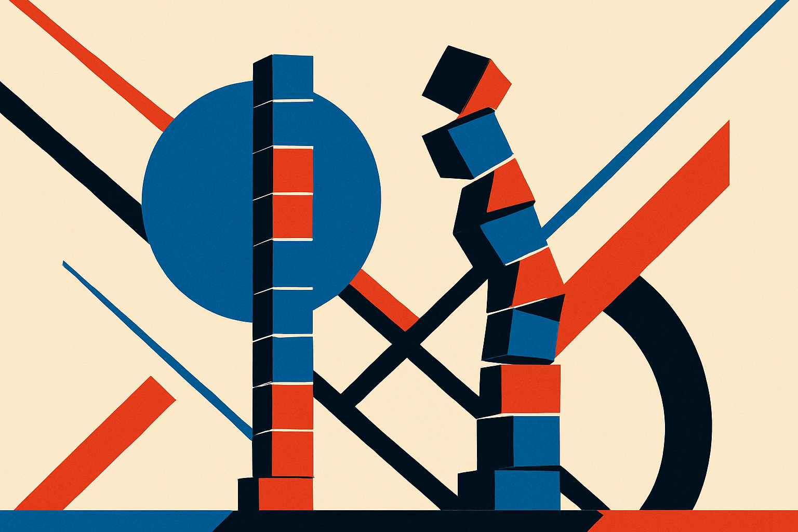

Here is a number that should make you suspicious of your own agent metrics: an optimizer that beat the baseline in a clean single-phase test transferred to *below* baseline once new tasks showed up. Same method. Same budget. Worse than doing nothing.

That is the finding from a new arXiv paper, "Do Agent Optimizers Compound? A Continual-Learning Evaluation on Terminal-Bench 2.0," posted across cs.AI, cs.CL, and cs.LG. The question in the title is the whole game. Most of us report agent gains the way you'd report a personal best: optimize against a fixed benchmark, note the improvement, move on. The paper argues that number is nearly meaningless for anything you actually deploy.

## Why one-shot numbers lie

The standard workflow for agent optimization is static. You take an agent, you run an optimizer against a benchmark, you measure the lift, you ship the result and quote the lift. GEPA, Meta Harness, RELAI-VCL: all three of the methods tested here clear the baseline in that setting. Every one of them looks like a win if you stop the clock after round one.

But deployed agents don't live in round one. New failures surface. New tasks arrive. You optimize again. The real question is not "did it improve" but "did the improvement survive contact with tasks it wasn't tuned on, and can you keep improving without wrecking what already worked." That is continual learning, and it is the setting almost nobody reports.

The authors built a two-phase evaluation from the hard tasks in Terminal-Bench 2.0 to force that distinction. Phase one: optimize and measure like normal. Phase two: introduce unseen tasks, then fold them into the objective and optimize again. Same budget for everyone. The clean single-phase ranking told you almost nothing about who won phase two.

## The divergence is the story

Once new tasks entered, the three methods split hard.

GEPA collapsed. Its optimized agent transferred *below* the unoptimized baseline. Read that again: the optimization actively made the agent worse on tasks outside its tuning set. This is the classic overfitting failure wearing an agent costume. The optimizer found shortcuts that scored well on the fixed benchmark and generalized like wet cardboard.

Meta Harness did better on transfer. It held up when the new tasks arrived. But when handed a second optimization budget to actually learn from those tasks, it stalled. It could carry its gains forward but couldn't add to them. Plateaued.

RELAI-VCL (Verifiable Continual Learning) was the only method that did both: transferred positively to unseen tasks *and* kept improving once those tasks joined the objective. It hit the top pass rate at every stage. Lifelong average pass rate came out at 76.4%, against 66.0% for GEPA, 64.6% for Meta Harness, and 58.7% for the baseline.

Notice what happens to the ranking. If you'd judged by single-phase numbers alone, GEPA looked competitive. Across the full lifecycle it barely edges the baseline on average and dips under it on transfer. The gap between "wins the demo" and "wins the deployment" is roughly ten points of pass rate here, and the sign can flip.

## What actually made gains compound

The authors' own explanation is the part worth internalizing. Gains compounded only when regression control was built into the optimization loop. That regression control acts as an inductive bias against shortcut solutions that fail to generalize.

Plain version: an optimizer that only rewards new wins will happily trade away old wins to get them. It has no reason not to. Every round of optimization is a fresh chance to find a cheap trick that scores on the current objective while quietly breaking something that used to work. Over multiple rounds, that is how you get an agent that looks like it's learning while its real competence erodes.

Regression control changes the incentive. By penalizing lost ground, it pushes the optimizer toward solutions that generalize instead of solutions that game. That is why RELAI-VCL compounds and the others don't. It is not a bigger budget or a smarter search. It is a constraint that says: don't break what already works.

This maps to something builders already know intuitively from software. A refactor that passes the new test but silently breaks three old ones isn't progress. It's debt. The paper is essentially importing the regression-test discipline into the agent optimization loop and showing it's the difference between a metric that compounds and one that decays.

## The honest caveats

A few things to keep in mind before you treat 76.4% as gospel.

This is one benchmark, Terminal-Bench 2.0, on its hard tasks, with a two-phase protocol the authors designed. It is a well-constructed test of exactly the thing they wanted to test, which is a strength, but two phases is still a short lifetime. Real deployments run for dozens of rounds over months. Whether RELAI-VCL's edge holds at phase ten, or whether even regression control eventually saturates, is not something two phases can answer.

We also only see the abstract-level results here, identical across all three arXiv listings. The exact optimization budgets, the task selection, and how transfer was scored all matter, and the headline numbers don't settle them. Treat the direction as the signal, not the decimals.

And "regression control" is a design principle, not a product. RELAI-VCL is one implementation of it. The transferable lesson is the principle, not the acronym.

## Practitioner's take

If you optimize agents and you report a single before-and-after number, you are measuring the wrong thing, and this paper is the receipt. Do one concrete thing this week: split your eval into a tuning set and a held-out set that the optimizer never sees, then optimize twice and check whether round two on new tasks *keeps* your round-one wins. If your pass rate on the old set drops after round two, your optimizer is trading away competence for shortcuts, and your shipped "improvement" is temporary. Build a regression gate into the loop, meaning the optimizer gets penalized for any previously-passing task it now fails, not just rewarded for new passes. The catch most people miss: the method that wins your clean benchmark is often not the one that wins your deployment, and you cannot tell them apart until you introduce tasks it was never tuned on. So introduce them on purpose, before your users do it for you.
