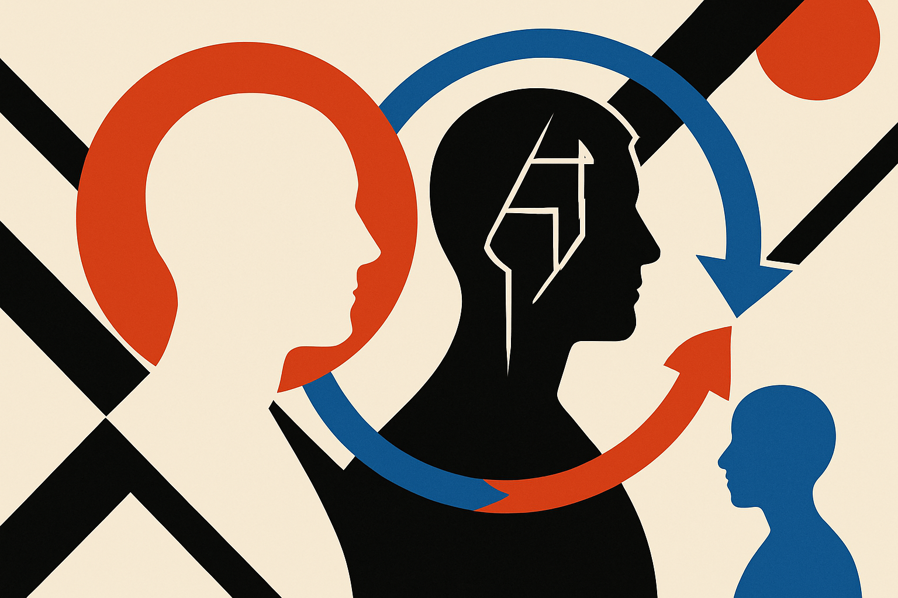

## Distill the change, not the whole teacher

Most distillation stories are about copying a stronger model into a weaker one. That sounds simple, but it hides a messy question: what exactly should the student copy?

Naver AI’s new arXiv paper, listed under both cs.CL and cs.LG, argues that conventional on-policy distillation copies too much. A reasoning-tuned teacher does not only contain “reasoning.” It also contains the base model’s prior behavior, style, quirks, calibration, and whatever else was baked in before instruction tuning. If the student imitates the teacher distribution directly, the signal is mixed.

The proposed fix is On-Policy Delta Distillation, or OPD². Instead of treating the teacher’s token probabilities as the target, OPD² uses a delta signal: the difference between the reasoning-tuned teacher and that teacher’s base model before reasoning tuning.

That is the interesting bit. The method is not saying, “copy the expert.” It is saying, “copy what changed when the expert became better at reasoning.”

This is a clean framing. If reasoning tuning shifts probability mass toward better intermediate steps, better code choices, or more useful scientific reasoning traces, then the delta should capture that more directly than the whole teacher distribution. It is closer to transferring the upgrade than cloning the full personality.

Naver AI reports that OPD² outperforms conventional on-policy distillation across mathematics, science, and code-reasoning benchmarks, and that strong performance can be reached with only a short post-training period. The abstract does not give the numbers, benchmark names, or model sizes, so I would not treat this as a settled recipe yet. But the design idea is sharp enough to pay attention to.

## The part that matters: access to the base model

There is a catch hiding in the elegance.

To compute the delta, you need the reasoning teacher and its pre-instruction-tuned base model. Not just an API. Not just sampled outputs. You need enough access to compare token-level distributions between the two models. That makes OPD² most useful for labs and teams that control their own checkpoints, or for open-weight model families where the base and tuned variants are both available.

That also explains why this matters beyond one paper. A lot of current model work is about squeezing more out of post-training. RL with reward models is powerful, but reward models can be brittle, expensive, and indirect. On-policy distillation gives token-level supervision from a teacher while the student generates its own trajectories. OPD² tries to make that supervision less noisy by subtracting out the pre-existing base behavior.

I like the direction because it matches how builders think when debugging systems. You do not only ask, “What did the good system output?” You ask, “What changed between the bad version and the good version?” The diff is often the product.

The risk is that “reasoning” may not be cleanly isolated by subtraction. The delta between a base model and a reasoning-tuned model can include formatting habits, refusal behavior, verbosity, benchmark-specific patterns, or artifacts of the tuning run. If the base model is not truly the teacher’s parent, the signal gets even muddier. The paper’s claim depends on that relationship being tight.

For a builder, I would not start by trying to reproduce OPD² across a giant model stack. I would test the idea on a narrow domain where I control the checkpoints: a base code model, a tuned code-reasoning model, and a smaller student trained on generated tasks. Compare direct teacher imitation against delta-style supervision on held-out problems, not just training-like prompts. The catch most readers miss: this is not a generic distillation trick for closed models. It is a checkpoint-aware method, and its value comes from knowing exactly what changed.
