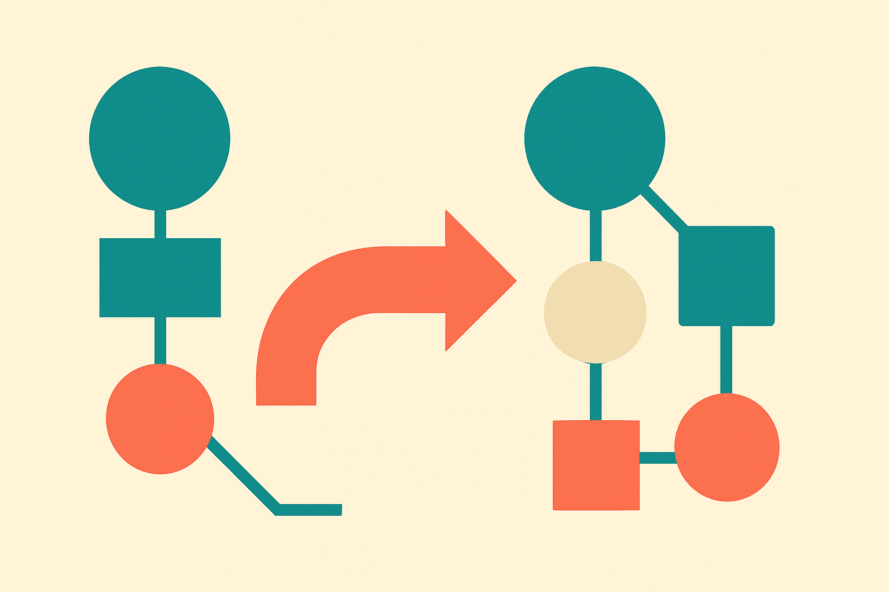
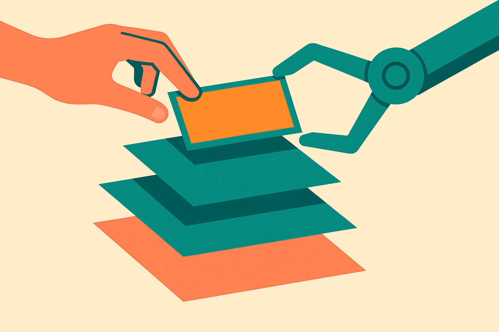

Editing figures is one of those research chores nobody writes about because everyone just does it. You relabel a component. You swap panel A and panel B. You restyle a schematic so it matches the three others in the paper. It eats hours and produces no citations. So of course someone tried to automate it, and the interesting part of SciDiagramEdit is not that it automates figure editing. It is where the training data comes from.

The paper, posted to both cs.AI and cs.CL, builds a benchmark by mining arXiv version histories. When authors upload v2 of a paper, they often changed the figures. That before/after pair is a labeled example: here is the old figure, here is the new one, and the revision itself encodes the intent. Multiply that across the arXiv corpus and you have a large, free, naturally occurring dataset for instruction-driven diagram editing. No annotators. No synthetic prompts. Just the record of what real researchers actually changed when they revised.

That is a clever move, and it is worth pulling apart why.

## The training signal is the story

Most attempts to teach a model an editing task run into the same wall: you need paired examples of "before, instruction, after," and instructions are expensive to collect. You either pay people to write them or you generate them synthetically, which tends to produce clean, artificial edits that don't look like the messy things people actually do.

arXiv version histories sidestep that. The edit happened for a real reason. An author relabeled a component because a reviewer was confused. They rearranged panels because the argument flowed better that way. The revision is grounded in what the authors call their own revision intent, and that intent is baked into the diff whether or not anyone wrote it down.

This is the same insight that made GitHub commit histories useful for training code models. The change itself is the label. You don't need to invent tasks because millions of people already performed the tasks and left a trace. SciDiagramEdit is applying that logic to a domain where the artifacts are visual rather than textual, which is harder, but the underlying bet is sound: naturally occurring revisions beat manufactured ones because they carry real intent.

The catch, and the authors are honest enough to gesture at it, is that a figure diff does not come with an explicit instruction. The v1 to v2 change tells you what happened, not what the author was asked to do. Reconstructing the natural-language instruction from the visual difference is itself a modeling problem, and the quality of that reconstruction sets a ceiling on everything downstream. If the inferred instruction is "make it clearer" when the real edit was six specific relabelings, the model learns a fuzzy mapping.

## Editing the vector source, not the pixels

The second decision I like: SciDiagramEdit operates on the figure's editable vector source, not a rasterized image. That means the agent manipulates the actual primitives, the shapes and text and arrows, rather than repainting pixels.

This matters more than it sounds. A scientific figure is what the authors call a dense infographic under a tight visual grammar. Schematics, plots, photos, captions, arrows, all composed to advance one argument. If you treat that as an image and ask a diffusion model to edit it, you get plausible-looking mush: warped text, arrows that point almost right, a legend that reads as gibberish at full zoom. Anyone who has asked an image model to "change the label on the third box" knows the failure mode.

Working on the vector source avoids that entire class of error. Text stays text. An arrow stays an object you can move. And critically, it enables the co-editing setup the paper describes, where a human can inspect and edit individual primitives alongside the agent. You are not stuck accepting or rejecting a whole regenerated image. You can grab one element the agent got wrong and fix it directly.

That human-in-the-loop framing is the right posture for research tooling. Nobody wants an agent silently rewriting their methods figure the night before a deadline. They want a fast first pass they can correct. The vector-source approach makes that correction cheap, which makes the whole thing usable rather than a demo.

## Skill evolution is doing a lot of quiet work

The mechanism SciDiagramEdit uses to actually improve is what the paper calls skill evolution. An agentic proposer refines the agent's skill specification from execution traces over multiple epochs. In plain terms: the system runs the editing agent, watches what it does, and rewrites the agent's own instructions to do better next time. Edit accuracy on a held-out set goes up across epochs.

I want to flag this because it is becoming a pattern and it deserves scrutiny. Instead of fine-tuning model weights, you iteratively refine a prompt or a "skill" description based on what worked. It is cheaper than training and it is legible, you can read the evolved skill. But it also inherits the weaknesses of the base model. If the underlying model can't reliably parse a dense figure, no amount of skill refinement fixes that. You are optimizing the instructions, not the capability.

The paper reports the skill "progressively lifts edit accuracy," which is the right thing to measure, but the abstract does not give absolute numbers, and that is the part I would want before getting excited. Progressive improvement on a validation set can mean going from 20 percent to 35 percent, which is real but not deployable, or from 60 to 85, which changes your workflow. Both are "progressive." Without the numbers, this is a promising method, not a proven tool. The synthesis here is limited because both source postings are the same abstract on two arXiv categories, so there is no independent read on the results yet.

## What this points at

Zoom out and SciDiagramEdit is a small instance of a bigger shift: researchers are treating the byproducts of scholarly work as training data. Version histories, revision diffs, review threads, all the exhaust of doing science becomes signal for automating parts of it. That is a healthier data source than scraping and synthesizing, because it is grounded in real decisions by real experts. The question is whether the intent survives the extraction.

For figures specifically, the combination of naturally-mined pairs, vector-level editing, and human co-editing is the most sensible recipe I have seen. It respects the fact that a figure is structured, argumentative, and precise, three things pixel-based editors ignore.

A builder who wants to use this idea today should not wait for SciDiagramEdit to ship a product. The reusable move is upstream. If you have a workflow where people repeatedly edit structured artifacts, diagrams, slides, config files, forms, your version history is a free instruction dataset, and you should start capturing before/after pairs now even if you have no model to feed them yet. Keep the edits on the structured source, not a flattened render, so a future agent can manipulate objects instead of hallucinating pixels. The catch most people will miss: the diff tells you what changed, not why, and the "why" is the expensive part. Budget real effort for reconstructing intent from your revisions, because that reconstruction, not the model doing the edit, is where this whole approach lives or dies.
