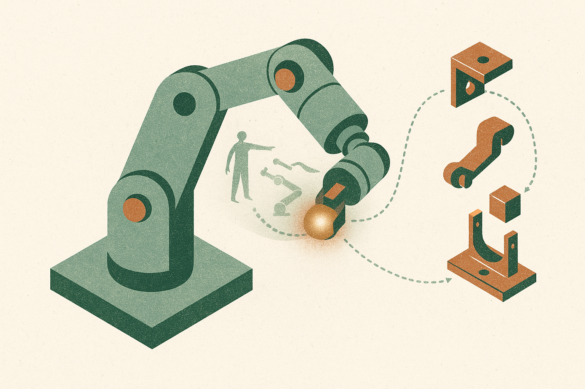

## Robot context is not chat context

Long context in language models is mostly about keeping more tokens available. Expensive, but conceptually simple. Stuff more into the window, retrieve what matters, hope attention does not get too sloppy.

Robots have a nastier version of the problem. A robot policy is not just reading a transcript. It is closing a loop with the world. Camera frames, proprioception, actions, corrections, slips, failed grasps, partial assemblies, human demonstrations. The history matters because the world has state the robot may not directly observe at the current moment.

Most recent robot foundation models still work with single-step or short-history visuomotor context. That is a huge constraint if the job is not “pick up the visible block” but “watch a human do this once, then assemble ten stages over five minutes while recovering from mistakes.”

RoboTTT is interesting because the team reports scaling that context to 8K timesteps, which they describe as three orders of magnitude beyond state-of-the-art policies, without growing inference latency. That last clause is the hook. Longer robot memory is useful only if it does not make control slow.

## Fast weights are the trick

RoboTTT uses Test-Time Training inside robot policies, including Vision-Language-Action style models. The recurrent state is not just an activation cache. It is “fast weights,” parameters updated by gradient descent during training and inference.

That sounds subtle, but it changes the shape of the system. Instead of carrying a giant explicit history through the model at every step, RoboTTT compresses history into weight space. The policy can then condition on long context without paying the usual inference-time cost of attending over every past frame and action.

The training recipe matters too. The team combines sequence action forcing with truncated backpropagation through time to make 8K-timestep training practical. This is not just “make the context window bigger.” It is a different memory mechanism for embodied control.

The reported results are strong. On challenging real-robot manipulation tasks, RoboTTT improves overall performance by 87% over a single-step context baseline. The team also says it fully completes a five-minute, ten-stage assembly task that no baseline completes. And the scaling result may be the bigger claim: the 8K-context model outperforms the same model pretrained with 1K timesteps by 62%.

That suggests context length could become a real scaling axis for robot policies, alongside model size, data scale, and action representation.

## The claim to watch is closed-loop scaling

The most important phrase in the paper is not “one-shot imitation,” though that is flashy. It is “steady gains in closed-loop performance as pretraining context length scales.”

Closed-loop is where robotics papers often get humbled. Offline metrics can look clean. Demos can be cherry-picked. Real robots introduce delay, calibration drift, lighting changes, object variation, and weird contact physics. If longer pretraining context reliably improves closed-loop behavior, that is a practical signal.

Still, I would keep the champagne in the fridge. This is an arXiv result with impressive numbers, but the abstract does not tell us how broad the task distribution is, how much teleoperation or human video data was used, how sensitive the method is to camera setup, or how it behaves outside the demonstrated manipulation domain. “No baseline ever does” is meaningful for that benchmark setup, not proof of general household robotics.

The useful takeaway is narrower and better: memory architecture matters. A robot that can adapt its internal state during inference may handle long tasks differently than a robot that only maps the latest observation to the next action.

For builders, I would not try to copy RoboTTT wholesale unless you have serious robot data and training infrastructure. I would test the underlying idea at smaller scale: add an adaptation loop, train on longer action histories, and evaluate on tasks where the current frame is insufficient. Think recovery after perturbation, multi-step tool use, or imitation from one fresh demo. The catch most readers miss: long context helps only if your evaluation forces memory to matter. If the task can be solved from the latest camera frame, you are benchmarking the wrong thing.
