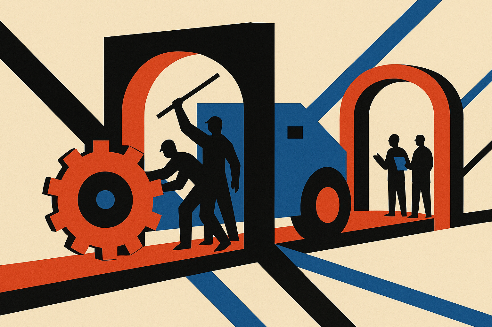

The FAA is reportedly letting Boeing sign off on airworthiness certificates for 737 MAX and 787 aircraft again. That is not an AI story on the surface. It is very much an AI governance story if you build, buy, or regulate systems that can hurt people.

The useful part is not the Boeing drama itself. The useful part is the pattern.

Regulators often do not inspect every artifact directly. They delegate some inspection back to the builder, because the builder has the staff, domain knowledge, and access. That can be practical. It can also become theater if the builder’s incentives, evidence, and audit trail are weak.

AI is walking into the same structure now.

## Self-certification is not the same as self-policing

There is a lazy version of the debate that says companies should never certify their own systems. That sounds clean. It also breaks quickly in practice.

For large model labs, enterprise AI vendors, medical AI teams, defense contractors, and internal platform groups, the people who understand the system best are usually inside the organization. They know the training data lineage, eval gaps, retrieval stack, tool permissions, model behavior under weird prompts, and operational failure modes. An outside auditor can test and review, but cannot magically reconstruct all of that from a PDF.

So the real question is not whether builders should sign off on things. They already do, formally or informally, every day. The question is what makes that signature meaningful.

A meaningful sign-off has conditions. There is a named accountable owner. There is evidence attached, not vibes. There are independent spot checks. There are incident reporting rules. There are consequences for hiding defects. There is a way to revoke the privilege if the process decays.

That last part matters. The reported FAA move is interesting precisely because sign-off authority can be removed and restored. Delegation is not a gift. It is a controlled permission.

## AI teams need release authority, not launch folklore

Most AI product teams still treat release readiness as a meeting.

Someone shows evals. Someone says the model feels better. Red-team notes sit in a doc. A product lead accepts known issues because launch timing is tight. Maybe legal reviews the terms. Maybe security checks the obvious stuff. Then the system ships.

That is not certification. That is launch folklore with dashboards.

For low-risk features, fine. A summarizer inside a notes app does not need an aviation-style process. But once an AI system can approve claims, change account states, recommend clinical action, route emergency work, execute code, or act across a user’s tools, the release process needs more spine.

I would start with a boring internal certificate. Not a public badge. Not a trust page. A release artifact that says: this system was tested against these tasks, these failure modes remain, these tools are allowed, these humans are on call, these rollback paths exist, and this person is signing for the risk.

Then make it painful to fake. Attach logs. Keep eval snapshots. Record prompt and model versions. Save red-team transcripts. Require a post-incident review when the system surprises you. If an external auditor ever shows up, they should see the living machinery, not a compliance scrapbook made the week before procurement.

## The catch: delegation only works when revocation is credible

The thin part of the current public signal is that the headline does not tell us the full conditions around the FAA’s reported decision. What changed inside Boeing’s process? What oversight remains? What triggers a reversal? Those details are the story.

Same for AI.

A model provider saying “we tested it” is not enough. A startup saying “human in the loop” is not enough. A government saying “we require certification” is not enough. The whole thing depends on whether the authority to self-certify can be narrowed, audited, suspended, or taken away.

That is the governance muscle AI is missing. We have lots of policy language and many benchmark screenshots. We have less practice with delegated authority that has teeth.

Builders should copy the boring part first. Pick one AI workflow with real user impact and create a release certificate for it this month. Keep it internal. Name the owner, attach the evidence, define the rollback, and write down what would cause the team to lose permission to ship changes without extra review. The catch most teams miss: the certificate is not the safety system. The revocation rule is.
