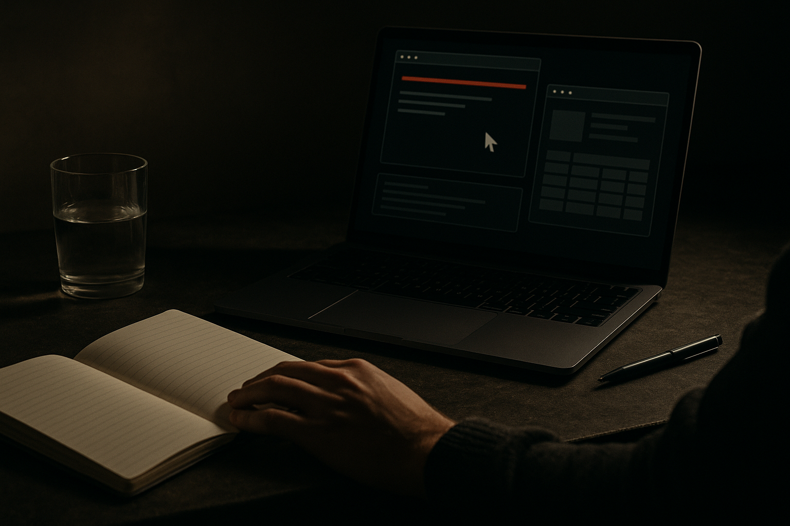

OpenAI is pushing ChatGPT closer to the place work actually happens: tabs, forms, forums, spreadsheets, expense tools, and desktop apps.

That sounds obvious. It is not.

Most AI products still ask the user to copy context into a box, wait for an answer, then manually move that answer somewhere useful. OpenAI’s new ChatGPT app changes the interface model. The assistant can use an in-app browser, inspect pages, annotate parts of a page, connect to existing Chrome tabs, open new tabs in the background, and control Windows or macOS apps through Computer Use.

The claim is not “ChatGPT can think harder.” The claim is “ChatGPT can operate closer to the messy surface area of work.”

That is a more important product shift than another benchmark win.

## The browser is becoming the agent runtime

OpenAI’s examples are deliberately boring, which is good. Scan a community forum and compile a report on user friction from the past month. File expense reports. Handle long data entry workflows. Use browser context that is already open instead of asking the user to describe everything from scratch.

These are not sci-fi tasks. They are the administrative sludge around actual work.

The in-app browser matters because it gives ChatGPT a contained place to act. The Chrome extension matters because people do not live in contained places. They have 19 tabs open, partial context, half-finished forms, and logged-in sessions. If ChatGPT can use those tabs or create new ones without constantly grabbing the user’s attention, it becomes less like a chatbot and more like a background clerk.

The annotation tool is also more important than it sounds. A lot of agent failures come from vague instructions: “look at this page and tell me what’s wrong.” If a user can point at a specific section and ask a question there, the instruction gets shorter and the context gets sharper.

## Desktop control is useful, and also where trust gets expensive

The bigger jump is Computer Use on Windows and macOS. OpenAI says ChatGPT can control any desktop app, and on macOS it has its own cursor so it can work in the background while the user keeps doing other things.

That is the right direction for real adoption. Many companies still run work through old desktop software, internal tools, and SaaS screens that were never designed for APIs. If an agent can click, type, read, and switch apps, it can touch far more workflows than an API-only assistant.

But this is also where the cost shifts from “Can it do the task?” to “Can I safely let it do the task?”

A background cursor filing expenses is helpful. A background cursor making irreversible changes is a different category. OpenAI’s short description does not answer the harder questions: approval checkpoints, audit trails, credential handling, session boundaries, mistake recovery, and what happens when a website changes its layout mid-task.

Those are not edge cases. They are the product.

## The win is delegation, not autonomy

The best framing here is not full autonomy. It is tighter delegation.

Give ChatGPT a bounded job with clear inputs, a known workspace, and a review step. “Scan this forum and draft a friction report” is a strong use case because the output can be inspected before anyone acts on it. “Fill this expense report from these receipts, stop before submitting” is another. The agent does the drudge work. The human keeps the judgment.

That is where I expect this class of tool to land first: work that is repetitive, screen-based, and annoying, but not so sensitive that every click requires a committee.

For builders, the practical move is to redesign workflows around checkpoints. Pick one painful browser or desktop process, record the exact steps, then test which parts ChatGPT can run while a human reviews the final state before submission. The catch most teams miss: the hard part is not connecting the agent to the app. It is making the task small enough, visible enough, and reversible enough that people will actually trust it.
