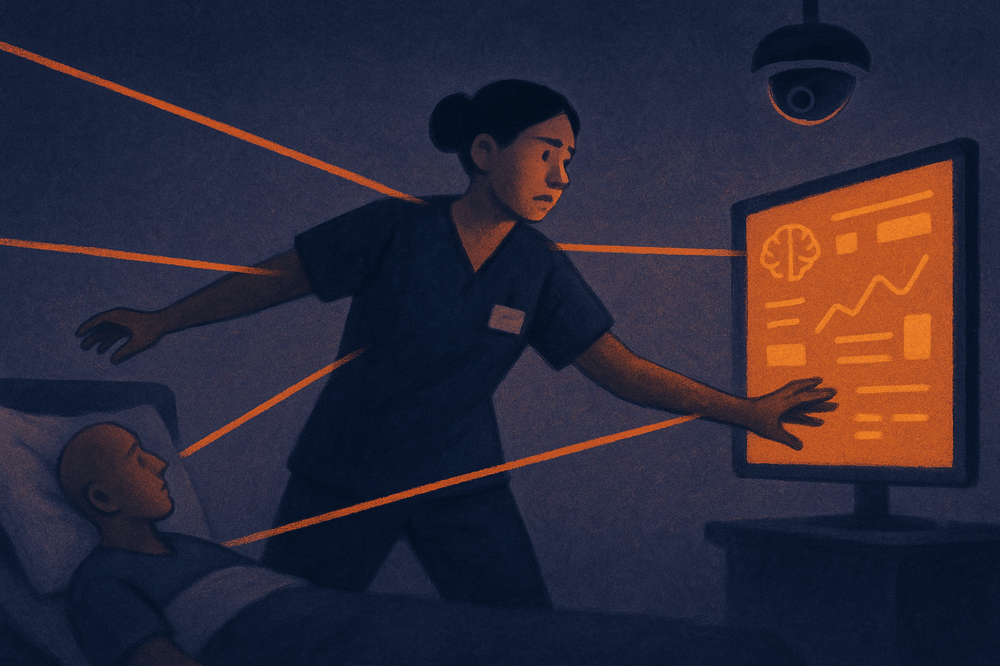

Kaiser nurses say AI and surveillance are making their jobs and patient care worse. That is a narrow claim, but it points at a much bigger fault line in applied AI.

Healthcare is one of the most obvious places to use machine learning. Triage, chart review, medication checks, scheduling, discharge planning, prior authorization, ambient documentation. There is real waste everywhere. There are tired clinicians everywhere. There are patients waiting.

But the same tools that can remove admin drag can also become a second boss. A silent one. Always watching. Always scoring. Always nudging work into a spreadsheet-shaped version of care.

## The distinction that matters: support or control

A clinical AI tool should make the nurse’s job easier at the point of care. Less duplicate entry. Better surfacing of patient history. Fewer missed handoffs. Faster escalation when something looks wrong.

A surveillance tool does something different. It converts work into events, timestamps, alerts, and compliance artifacts. That can be useful in limited cases, especially in safety-critical settings. But when it is tied to staffing pressure, productivity monitoring, or discipline, the tool stops feeling like help.

That distinction matters because healthcare work is not factory work. A nurse can spend two minutes on one patient and twenty on another for reasons that are obvious in the room and invisible in the dashboard. Family panic. A subtle change in breathing. A patient who needs translation. A doctor who has not called back. None of that fits cleanly into a metric unless the metric is designed with frontline reality in mind.

Kaiser nurses are making the practical argument here: if AI increases monitoring without increasing capacity, it can degrade care. Not because AI is magic or evil. Because bad operations become more brittle when automated.

## Hospitals want efficiency, nurses want slack

The hard part is that both sides can be right about the pressure.

Hospitals do need better systems. Healthcare has absurd paperwork load, fragmented software, and scheduling practices that burn people out. AI can help with that. I would rather have a model draft a discharge summary than make a clinician burn another hour after shift. I would rather have software flag a risky med interaction than rely on memory at 2 a.m.

But nurses are right to be suspicious when “AI” arrives as measurement before relief. If the first visible product is surveillance, the trust account starts negative.

This is a pattern outside healthcare too. Warehouses, call centers, delivery fleets, customer support teams. The pitch is quality and coordination. The lived experience is often speed-up, monitoring, and less discretion. AI makes that pattern cheaper to scale.

Healthcare adds a moral layer. The worker being squeezed is also the person catching clinical risk in real time. If the system optimizes away their judgment, patients pay for it.

## The evaluation cannot stop at model accuracy

Most AI evaluation is still too narrow. Does the model predict the thing? Does it reduce time on task in a demo? Does it meet privacy requirements? Those questions matter, but they are not enough.

For hospital AI, I’d want a before-and-after measure of interruption load, charting time, nurse discretion, escalation quality, staffing decisions, and patient outcomes. I’d also want to know who can override the system, who audits false alerts, and whether data from the tool is used in performance reviews.

That last one is the catch. A tool can be sold as clinical support and later become management evidence. Once the data exists, someone will want to use it.

A builder should treat Kaiser nurses’ complaint as a product warning, not a PR problem. Before shipping into healthcare, decide what your system will not measure, who it will not score, and where human judgment wins by default. Pilot with nurses in the loop, publish workflow effects, and separate care-support data from employee discipline. The missed catch is simple: the model may work, while the deployment still makes the workplace worse.
