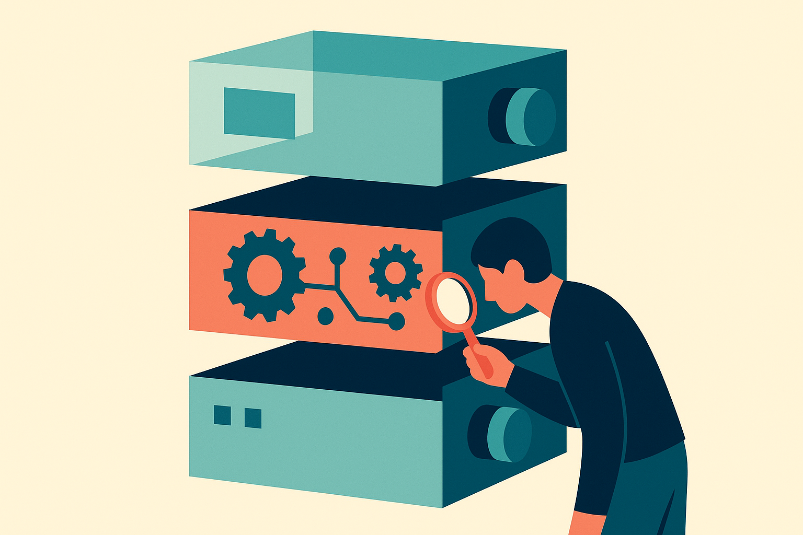

## “Open source AI” still means five different things

The Hacker News prompt, “the state of open source AI,” is useful mostly because it exposes the ambiguity. People use the phrase to mean open code. Or downloadable weights. Or permissive commercial use. Or reproducible training. Or a community process where outsiders can meaningfully inspect and improve the system.

Those are not the same thing.

A model can have public weights and still hide the training data, filtering process, reinforcement learning setup, safety tuning, eval harness, and post-training tricks. That is not useless. Far from it. Open-weight models have changed what small teams can build, test, and deploy without waiting on a closed API vendor. But calling all of that “open source” flattens the real tradeoffs.

The Open Source Initiative’s work on defining open source AI exists because software norms do not map cleanly onto models. With normal software, source code is the thing you modify. With AI, the “source” might include data, data selection, tokenization, architecture, optimizer settings, compute budget, human feedback, synthetic data generation, and a pile of undocumented taste.

The cleanest way to talk about this is as a stack, not a badge.

## The builder question: what can I actually control?

For a practitioner, openness is not moral decoration. It is an operational property.

Can you run the model locally or in your own cloud account? Can you fine-tune it? Can you ship it commercially? Can you inspect failure modes without a vendor changing the system under you? Can you keep customer data inside your boundary? Can you swap the model if quality drops or pricing changes?

Those questions matter more than whether a launch post uses the right adjective.

Closed models still often win on raw capability, tool integration, and low-friction deployment. That is real. If you need the best general model today for a high-stakes workflow, the answer may still be an API. No shame in that. Shipping beats ideology.

But open models win in different places: latency-sensitive apps, privacy-sensitive workflows, cost control at scale, domain tuning, offline use, regulated environments, and products where the model becomes part of the product’s core infrastructure. The value is not just “free.” It is control over the failure surface.

The catch is that open does not remove engineering work. It moves it onto your team. You inherit evals, serving, quantization, monitoring, prompt and context management, safety policy, fallback paths, and upgrade testing. A hosted API hides some of that mess. An open model hands you the toolbox and the mess together.

That is why I do not find the open-versus-closed debate very useful anymore. The better split is replaceable versus captive. If your system is designed around one provider’s hidden behavior, you are renting your product’s nervous system. If your system has clean abstraction layers, evals, and migration paths, you can use closed models where they are strongest and open models where control matters.

Practitioner’s take: pick one narrow workflow and test an open model against your current closed-model baseline with your own examples, not public vibes. Measure quality, latency, cost, privacy fit, and how painful it is to debug. The catch most teams miss: the model choice is only half the decision. The real asset is the eval set and the routing layer that let you change your mind later.
