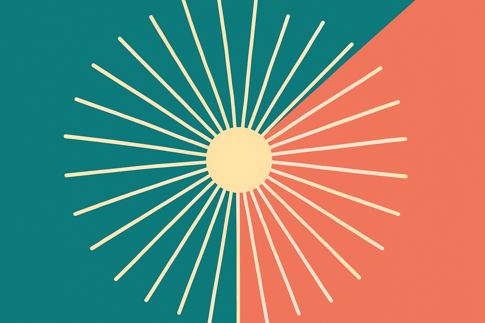
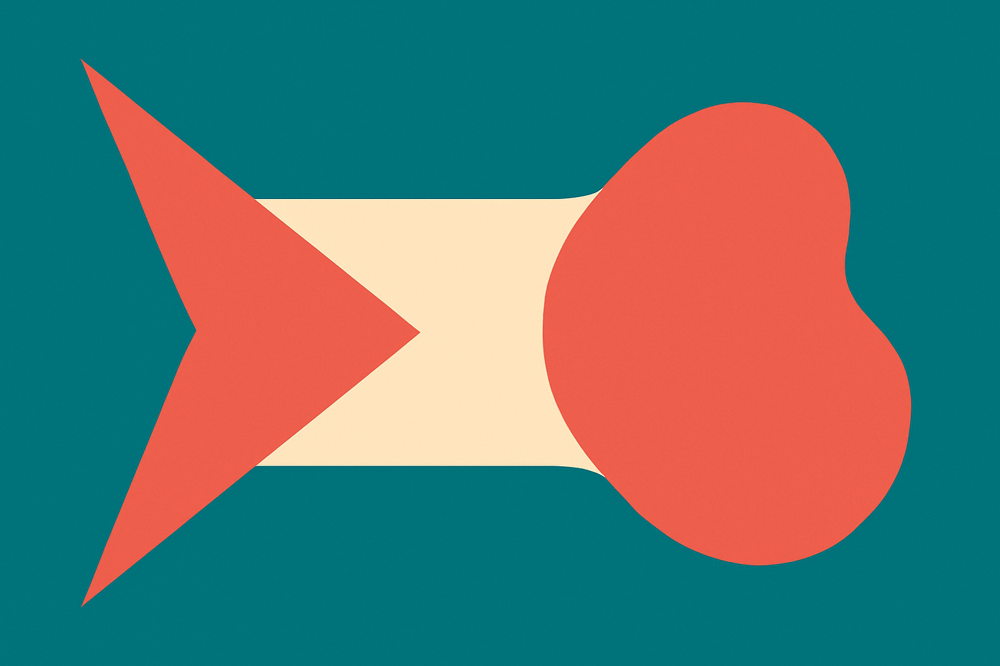

There's a running joke, sharpened again in a Hacker News thread this week, that every AI company logo looks like a butthole. Crude, yes. But the observation underneath it is real and worth taking seriously if you're building anything in this space. Open a tab of the twenty best-funded AI startups and you'll see the same thing over and over: a soft radial burst, petals or lobes arranged around a center point, gradient shading, rounded edges. OpenAI's flower knot. Anthropic's spark. Gemini's four-pointed star. The generic seed-stage startup with the swirl.

It's not a coincidence, and it's not just lazy designers. The sameness has causes. Let me walk through them, because understanding why the convergence happens tells you how to avoid it.

## The math wants to be a blob

A lot of these logos are trying to depict the same underlying thing: a neural network, an embedding space, attention radiating from a token, information flowing inward to a point. When you try to draw "many things connecting to one center," you get radial symmetry. Radial symmetry with soft nodes gives you petals. Petals around a hole give you, well, the thing the joke is about.

This is the honest part of the convergence. If your product is genuinely about a model that takes inputs from everywhere and produces one coherent output, a centered radial mark is a reasonable metaphor. The problem is that it's the *obvious* metaphor, so everyone reaches for it. The concept space for "abstract intelligence" is small. Nobody wants a literal robot (too cold, too 2010). Nobody wants a brain (too clip-art). So you get abstraction, and abstraction of "connection and emergence" keeps collapsing to the same shape.

Designers know this trap. It's the same reason every crypto logo was a coin with a letter in it, and every wellness brand is a sans-serif wordmark in sage green. When a whole industry shares one idea, the visual vocabulary compresses.

## Neutral is the actual goal, and neutral is boring

Here's the strategic reason nobody says out loud. AI companies are selling something people are nervous about. The product can write your code, replace a workflow, maybe touch your job. So the branding is doing defensive work: it needs to feel calm, soft, trustworthy, unthreatening. Rounded corners. Gentle gradients. No hard edges, no aggressive angles, no color that reads as alarming.

That brief, "make powerful technology feel safe and approachable," produces a narrow band of outputs. Warm gradients. Blobby geometry. Lowercase wordmarks. It's the same instinct that turned every fintech app into pastel and every DTC brand into Helvetica. Softness signals "we won't hurt you." And when everyone shares the same anxiety about how they're perceived, everyone lands on the same reassurance.

So the butthole joke is really a joke about defensiveness. These logos are apologizing for their own product before it does anything.

## Mimicry compounds it

The third force is plain herd behavior. Once OpenAI became the reference point, "look like a serious AI lab" started to mean "look adjacent to OpenAI." A founder raising a seed round wants investors to pattern-match them into the category instantly. A designer briefed to make an "AI-native" brand pulls up the current leaders as mood board, consciously or not. The result is that the category's visual center of gravity keeps pulling new entrants toward it.

There's also a tooling angle worth naming. A growing share of these marks are generated or heavily assisted by AI design tools, which are themselves trained on existing logos. When your logo generator has seen ten thousand radial-gradient AI marks, it produces the eleven-thousand-and-first. The convergence feeds itself. The models learn the cliché and then hand it back to the next founder as a fresh idea.

I don't think most of this is cynical. It's just what happens when a lot of people solve the same problem under the same constraints with overlapping tools. Convergent evolution. Sharks and dolphins ended up the same shape for the same reason: the water only allows so many good answers.

## What a founder should actually do about it

The instinct after reading all this is to run screaming from anything round. Don't overcorrect. The radial mark isn't bad, it's just crowded. Being contrarian on purpose ("we'll be the AI company with a hard industrial logo") can read as trying too hard, or worse, as untrustworthy in exactly the way the soft brief was avoiding.

The better move is to differentiate on the axis competitors ignore. Almost everyone is competing on the *mark*, the little symbol. Very few compete on the *wordmark*, the color relationship, the motion, or the texture. Stripe won a crowded fintech category with typography and restraint, not a clever glyph. Linear did it with a single gradient and obsessive spacing. You can be visually distinct in AI without inventing a new shape, just by treating the parts nobody else bothers with as the differentiator.

Practically: audit your top ten competitors' logos side by side before you brief anyone. If your mark could swap into that grid unnoticed, it fails. Then decide which single dimension you'll own. One strong color pairing is more memorable than a clever radial glyph nobody can describe from memory. Test recall the honest way: show someone your logo for two seconds, wait a day, ask them to sketch it. If they draw a generic blob, you have a generic blob.

And the catch most people miss: the logo matters far less than founders think in the seed stage and far more than they think at scale. Early on, distribution and product beat branding every time, so don't burn three months on a glyph. But the sameness compounds. The company that looks identical to fifty others at Series A has a much harder, more expensive job standing out at Series C, when the market is saturated and the soft radial blob has become visual wallpaper. Pick your one distinct axis now, cheaply, and let it harden as you grow. The joke about the logos is funny because it's true, and it's true because almost nobody made a deliberate choice.
