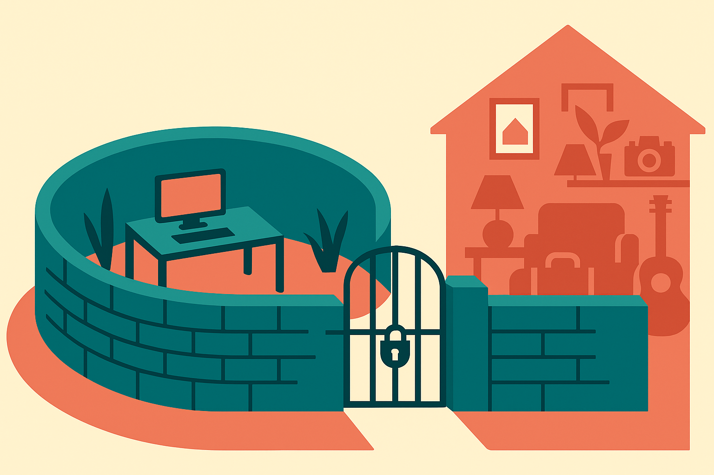

A guide going around Hacker News walks through setting up a spare Mac so Claude Code can control it. Not just write code in a terminal. Actually drive the machine: run commands, open apps, move files, do the things you'd do with a keyboard and mouse. The pitch is a dedicated box you hand to an agent and let it work.

I like this genre of experiment because it forces a question most people skip when they talk about agents: where does the agent live, and what can it touch? A lot of the agent discourse stays abstract. This is concrete. You take a real machine, you give an AI real control, and you find out fast what that means.

Let me separate what's genuinely useful here from what people will oversell.

## Why a dedicated machine at all

The core idea is isolation. If you let Claude Code run loose on your primary laptop, every command it runs lives next to your email, your SSH keys, your password manager, your work files. Most of the time that's fine. The failure mode is not "the model turns evil." It's "the model does something dumb with a shell command and now your home directory is different than it was five minutes ago."

A separate Mac is a blast-radius decision. Wrong command, deleted file, weird system state: it all stays contained on a machine you don't care about. You can wipe it and start over. That's the actual value, and it's a good instinct. The people who've run agents in loops for real work end up wanting this kind of separation whether they use a spare Mac, a VM, or a cloud container.

The Mac angle specifically matters because a chunk of desktop work isn't headless. If you want the agent to click through a GUI app, test a native build, or use software that only ships for macOS, you need macOS. A Linux container won't do it. So the spare Mac isn't just a cheaper VM. It's the thing that lets an agent touch the parts of your workflow that live in windows and menus, not in text.

## What "control" actually means, and where it gets sketchy

The guide covers the mechanics: SSH access, permissions, the settings that let Claude Code execute without stopping to ask every time. This is where I want people to slow down.

There's a spectrum of control, and the setup collapses it into one word. On one end, the agent runs shell commands you approve one by one. On the other end, it runs anything it decides to run, opens apps, and clicks around with no human in the loop. Those are wildly different risk profiles, and the convenience of the second one is exactly what makes it dangerous.

The moment you turn off confirmations so the agent can "just work," you've traded a safety rail for speed. That's a real trade and sometimes worth it. But be honest about what you did. An agent with auto-approve on a machine with credentials, network access, and the ability to open a browser can do a lot more than edit code. It can send email if you're logged in. It can hit any internal service that machine can reach. Prompt injection through a webpage or a file it reads becomes a live concern, not a thought experiment.

So the spare Mac buys you isolation, but only if you keep it actually isolated. A dedicated machine that's still logged into all your accounts and sitting on your home network is not isolated. It's your regular machine with extra steps.

## The setup is the easy 20 percent

Here's the thing the guide can't tell you, because no guide can. Wiring up Claude Code to a Mac takes an afternoon. Getting real, repeated value out of it is the other 90 percent, and it's mostly about the boring parts.

What does the agent do when it's stuck? How do you watch what it did while you were away? How do you give it enough context to not make the same mistake twice? A machine you can walk away from only helps if you trust the loop, and trust comes from logging, checkpoints, and narrow tasks, not from a well-configured SSH connection.

The people getting the most out of agent setups treat the machine as one piece of a system. They scope tasks tightly. They have a way to review the diff or the state change before it matters. They run the agent against work that's reversible: a branch, a scratch directory, a test environment. The spare Mac fits that philosophy. It does not replace it. If you hand an agent an unscoped goal and full control and walk away, the machine being disposable is small comfort when the output is garbage.

## Who this is actually for

Be honest with yourself about whether you need this. If your work is standard software dev, a container or a cloud sandbox is cheaper, easier to reset, and easier to run several of at once. The spare Mac wins when you specifically need macOS-native control: GUI automation, native app testing, Apple-only tooling, or a persistent environment you want to see and touch physically.

It's also a good learning rig. Watching an agent drive a real machine teaches you more about how these things actually behave than reading about it. You see the weird recovery attempts, the places it gets confident and wrong, the tasks it nails. That intuition is worth the old Mac in the closet.

The Practitioner's Take: try it, but start with confirmations on and a task you could do yourself in ten minutes, so you can judge the agent against a known answer. Log everything to a file you can read later. Before you flip to auto-approve, log the machine out of every account you'd hate to lose and consider putting it on a separate network segment, because "spare Mac" and "isolated Mac" are not the same thing and the gap between them is exactly where the expensive mistakes live. The setup is an afternoon. The judgment about what to let it run unattended is the actual skill, and no step-by-step guide will hand you that.
