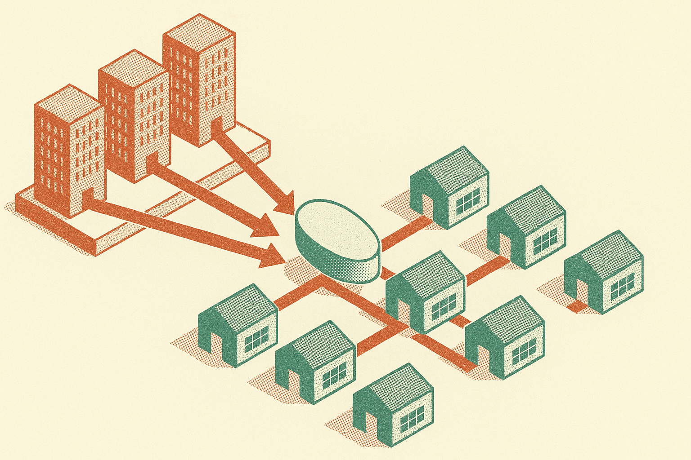

Dean W. Ball’s take on China’s Kimi model lands in a useful place: not “China is winning,” not “open source saves us,” and not “shut it all down.” His point, as circulated on r/LocalLLaMA, is that capable open-weight models change the economics of AI deployment. They can reduce the need for every serious user to rent intelligence from a small set of closed-model providers.

That matters more than another benchmark screenshot.

## Open weights are a pricing weapon

If Kimi is genuinely strong and genuinely open-weight, the strategic question is not only capability. It is distribution.

Closed frontier labs want the world to consume intelligence through hosted APIs and subscriptions. That supports giant training runs, giant inference clusters, and giant capital expenditure. Open-weight releases push the market another way. They let companies, governments, universities, and hobbyists run, tune, distill, quantize, and wrap models closer to their own systems.

That does not make compute free. It does not make deployment easy. But it changes bargaining power.

Ball reportedly argued that open-weight models can slow AI capex. I think the sharper version is this: open weights make it harder for one provider’s capex plan to become everyone else’s rent schedule. If a good-enough model can run on cheaper infrastructure, or be served by a regional cloud, or be adapted internally, the premium API tier has to justify itself every week.

That is healthy pressure. It is also why the policy conversation gets weird fast.

## China may be treating models like infrastructure

The most interesting part of Ball’s read is his surprise that the Chinese government would allow highly capable open-weight AI to circulate. If you see AI models as dangerous artifacts, that looks reckless. If you see them as industrial infrastructure, it looks more deliberate.

China has a long pattern of pushing strategic capacity through coordinated industrial policy. Solar. Batteries. EVs. Telecom. Not always clean, not always efficient, but very real. Open-weight AI fits that pattern if the goal is to raise the baseline capability of domestic firms and state-aligned institutions.

The public-infrastructure framing also explains why “open” does not automatically mean “liberal.” A state can support open weights while still controlling chips, clouds, data access, licensing, speech, procurement, and downstream deployment. The weights may circulate, but the ecosystem can still be steered.

That is the catch a lot of Western open-source rhetoric misses. Open-weight is a technical distribution choice. It is not a political system.

## The U.S. response may be friction, not imitation

Ball’s reported claim that the U.S. administration might respond with “strategic regulatory friction” is plausible, but thin from the source we have. I would not treat it as a prediction. I would treat it as the shape of the coming argument.

One side will say open weights spread capability, reduce monopoly power, help small builders, and give the U.S. a broader base of experimentation. The other side will say open weights make dangerous capabilities easier to copy, remove provider-level controls, and help rival states close the gap.

Both sides have a point. The lazy answer is to pretend one of them does not.

The more practical U.S. question is where to draw lines. Model weights are not all the same. A small coding model, a frontier bio-capable model, a multilingual persuasion engine, and a domain-tuned cyber model should not be treated as one category. “Open” is too blunt. So is “ban.”

For builders, the move is simple: treat open-weight models as strategic optionality, not ideology. Test Kimi-like releases against your real workflows, latency budget, data rules, and cost curve. Compare them to closed APIs on total system cost, not vibes. The catch most teams miss is maintenance. Owning the weights means owning evals, serving, security patches, regressions, and failure modes. Freedom from API rent is not freedom from operational work.
