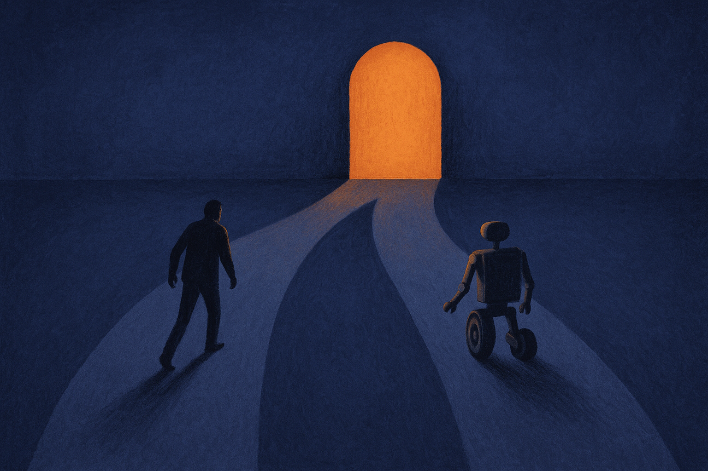

There's a claim making the rounds that AI mania is "eviscerating global decision-making." The phrasing is loud. The underlying worry is real, even if the framing is doing a lot of heavy lifting. So let me take it seriously without swallowing it whole.

The argument, stripped down: organizations are increasingly routing decisions through AI systems, and in doing so they're outsourcing the actual thinking. Not just the grunt work. The judgment. The weighing of tradeoffs, the sniff test, the "wait, does this even make sense" moment that used to happen before a decision went out the door.

I've watched enough teams adopt these tools to know the pattern is not imaginary. But "eviscerating" is a verdict, not an observation. Let me separate what's actually happening from the rhetoric.

## What the panic gets right

The strongest version of this concern is about deference, not accuracy.

When a model produces a confident, well-formatted answer, humans tend to accept it. Not because it's correct, but because it looks correct. Clean prose reads as authority. A bulleted list of "considerations" feels like analysis was done. This is a documented failure mode of human-computer interaction that predates the current AI wave by decades, and it's worse now because the output is fluent.

The real risk isn't that AI makes bad calls. It's that AI makes *plausible* calls, and plausible is enough to shut down the human review that would have caught the bad ones.

I've seen this concretely. A team asks a model for a market sizing estimate, gets a number with a tidy justification, and drops it into a board deck. Nobody asks where the number came from. The model didn't lie. It reasoned from thin assumptions and presented the result with the same confidence it would use for a fact. The failure was human: the estimate skipped the scrutiny it would have gotten from a junior analyst, precisely because it arrived looking finished.

That's the mechanism worth taking seriously. Fluency suppresses friction. Friction is where a lot of good decisions get made.

## Where the framing overreaches

"Global decision-making" is a phrase that hides more than it reveals.

Most decisions are not high-stakes, novel, or contested. They're routine: which invoices to flag, which support tickets to route, which candidates match a job description on paper. Automating those is not eviscerating anything. It's the same delegation we've always done, just faster. Nobody mourns the loss of manually sorting email.

The interesting decisions, the ones that actually shape an organization, are still made by people, and mostly still made badly for the same reasons they always were: politics, incentives, ego, incomplete information, and the pressure to decide before you're ready. AI didn't create those problems. In some cases it's a scapegoat for them. "The model recommended it" is a convenient shield for a call someone wanted to make anyway.

So I'd push back on the idea that a general erosion is underway. What's happening is more specific and more fixable: a category of medium-stakes decisions is drifting from "assisted by a tool" to "decided by a tool," and the drift happens quietly because nobody chose it on purpose.

That drift is the thing to watch. Not a collapse. A slow accumulation of unexamined defaults.

## The mechanism that actually rots judgment

Here's the part I think both the alarmists and the boosters miss.

Judgment is a muscle. You build it by making calls, getting outcomes, and updating. When you route a decision through a model and accept its output, you get the decision but not the reps. Over time, a team can ship a thousand AI-assisted decisions and be no better at deciding than they were on day one. Possibly worse, because they've lost the habit.

This is different from the deference problem. Deference is about a single bad call slipping through. Skill atrophy is about the whole team getting weaker at the thing they've delegated. It's the difference between using a calculator for arithmetic (fine) and never learning what the numbers mean (not fine).

The tell is when people can no longer explain *why* a decision was right, only that the tool suggested it. When you ask "what would have to be true for this to be wrong" and get a blank stare, the muscle is already going soft.

The catch: this rot is invisible in the short term. The decisions still ship. The metrics look fine. It only shows up when something novel happens, the model is confidently wrong, and nobody on the team has the reflexes to notice.

## What a builder should actually do

None of this argues for using less AI. It argues for using it with the friction deliberately re-inserted where it matters.

A few things that work in practice. Make the model show its assumptions, not just its answer, so the thin ones are visible. Treat any AI output that feeds a real decision as a draft from a smart intern: useful, fast, and never trusted without a check. For your highest-stakes calls, force a human to articulate the reasoning independently before seeing the model's take, so you're comparing judgments instead of anchoring on one.

And keep a small set of decisions that your team makes cold, without the tool, on purpose. Not because it's efficient. Because it's how you keep the muscle. A pilot who only flies on autopilot is not a pilot for very long.

Practitioner's take: the "evisceration" headline is overcooked, but the underlying failure mode is real and specific. Automate the routine calls without guilt. For the decisions that matter, use the model to widen your view, not to replace your call, and build in the friction that fluent output naturally removes. The trap most people miss is that atrophy is silent. Your decisions keep shipping and your dashboards stay green right up until the day the model is confidently wrong and nobody in the room has the reps to catch it. Schedule the unassisted decisions the way you'd schedule a fire drill: not because you expect the fire, but because you want to know you can still move when it comes.
