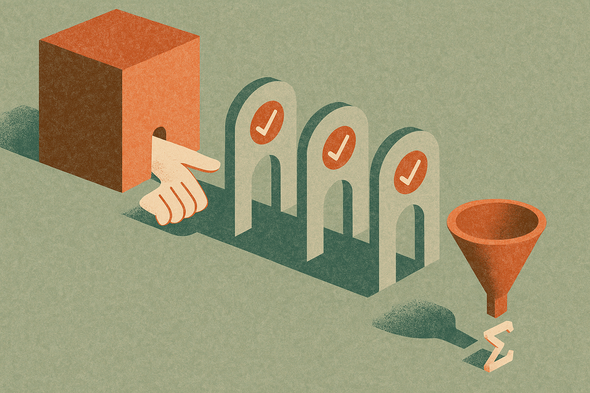

A Hacker News submission claims GPT-5.6 used a prompt to close a 30-year gap in convex optimization. That is the kind of sentence that makes everyone pick a side too fast.

One camp hears “prompt” and thinks parlor trick. Another hears “30-year gap” and starts writing the victory lap for AI science. I do not buy either reaction without receipts.

If the claim is real, the interesting part is not that a model saw a clever prompt and hallucinated a theorem-shaped answer. We have plenty of that. The interesting part is whether the output survived the hard parts: formal statement, proof scrutiny, comparison against known bounds, and independent reproduction by people who know the field.

## A big claim needs a bigger audit trail

Convex optimization is not a vibes domain. Progress usually means a sharper bound, a better algorithm, a cleaner impossibility result, or a proof that closes a known separation. A “30-year gap” should be identifiable. Which gap? In what problem class? Under what assumptions? Does the result improve the known rate, match a lower bound, or remove a condition?

The Hacker News headline gives none of that. That does not make it false. It makes it unpriced.

AI-generated research claims should come with a package, not just a story. The exact prompt. The model version. Sampling settings. Full transcript. Failed attempts. Human edits. The final proof. Machine-checkable artifacts if possible. A short note from domain experts explaining what was known before and what changed.

Without that, “GPT-5.6 closed a 30-year gap” is mostly a social object. It travels well. It compresses badly. It turns a technical result into a model capability claim before the technical result has earned it.

## Prompting may be a research interface, not the research

The useful frame is not “the prompt did math.” The prompt likely shaped a search process. That matters.

A good researcher prompt can encode taste: which lemmas look promising, which proof styles are plausible, which dead ends to avoid, what analogies to test. Models are increasingly good at producing candidate structures that a human can inspect. In math and theoretical computer science, that can be valuable even when the model is wrong most of the time.

But that is not the same as autonomous discovery. A prompt can ask for a bridge. It cannot guarantee the bridge holds weight.

The practical workflow looks more like assisted conjecture and proof search. Ask the model for variants. Force it to state assumptions. Make it produce counterexamples to its own claim. Translate pieces into a proof assistant where possible. Compare against the literature. Repeat. The model is not the referee. It is a generator of things worth refereeing.

That distinction matters because the hype version collapses discovery, proof, and validation into one screenshot. Real research separates them.

## The real win would be lowering the cost of tries

If GPT-5.6 helped close a real convex optimization gap, I care less about the heroic prompt and more about the throughput change. Did the model let researchers test 50 proof paths instead of five? Did it connect two known techniques that had not been combined? Did it make a tedious derivation cheap enough that a human could explore the edge cases?

That is the quieter AI science story. Not replacement. Compression.

Many hard problems are blocked not only by insight, but by the cost of checking many almost-good ideas. Models can help there. They can draft lemmas, search for analogies, restate proofs in different forms, and expose hidden assumptions. They can also fabricate citations, miss sign errors, and produce elegant nonsense. So the gain only counts when the verification loop is strong.

For builders, the move is to design AI research workflows around falsification, not persuasion. If you are using models on technical work, save every prompt and output, require the model to generate objections, run independent checks, and keep a clean line between model suggestion and validated result. The catch most people miss: the product is not the impressive answer. The product is the audit trail that lets someone else trust it.
