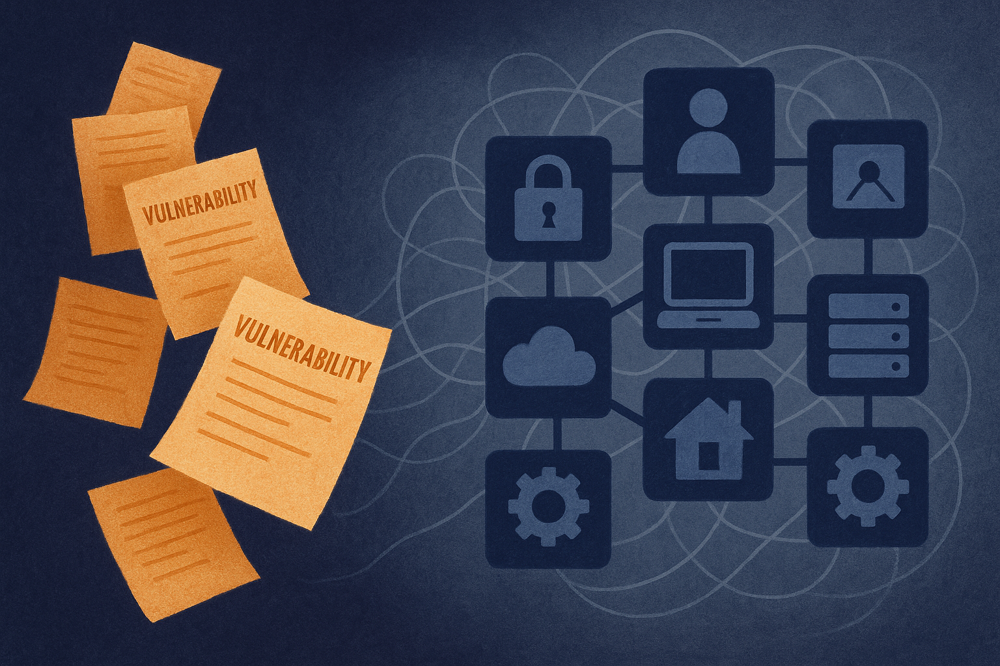

Connected and autonomous vehicles are a messy security target. Not because the risks are imaginary, but because the attack surface is spread across sensors, ECUs, infotainment, telematics, embedded software, and cloud-connected services. A CVE entry might describe the bug in plain text. A security team needs something more operational: what asset is affected, what weakness class it maps to, how an attacker might move, and what should be prioritized first.

That translation step is dull, expensive, and easy to under-resource. Which makes it a good fit for LLMs, if we are honest about where the models are reliable.

The CAV-STIXGen paper tests 11 open-weight models, ranging from 4B to 120B parameters, on turning CAV-related CVE descriptions into STIX objects, STIX relationships, CWE mappings, and MITRE ATT&CK technique mappings. The headline is not “AI secures autonomous vehicles.” The useful headline is narrower: models are getting good at converting vulnerability prose into structured threat-intel building blocks, but they still stumble when asked to reason across relationships and attack behavior.

## Extraction is working better than interpretation

The strongest result is on entity-style work. The CAV-STIXGen researchers report single-model F1 scores of 0.94 for STIX Domain Objects and 0.99 for CWE mapping. That is exactly the kind of task current LLMs tend to handle well: read a short technical description, identify the named thing or weakness category, emit a structured record.

That matters. A lot of security work starts with boring normalization. If a model can take a backlog of CAV CVEs and consistently produce affected assets, vulnerability categories, and candidate weakness mappings, it can make the human analyst’s first pass much faster.

It also matters that this was done with open-weight models. For vehicle security, supply chain, and regulated environments, sending every vulnerability detail to a hosted black box may be a non-starter. Open-weight does not automatically mean safe or cheap, but it gives teams more options for local deployment, evaluation, and audit.

## The hard part is the graph

The drop-off shows up when the task moves from “what is this?” to “how does this relate to that?” The paper reports single-model F1 of 0.63 for STIX Relationship Objects. In the multi-agent setup, Gemma-4-31B reached 0.91 for SDOs, while Codestral-22B reached 0.43 for SROs. Complete MITRE ATT&CK mapping remained challenging.

That gap is the important signal.

Structured threat intelligence is not just filling forms. STIX relationships encode causality, targeting, exploitation flow, and association between actors, tools, weaknesses, assets, and behaviors. ATT&CK mapping is even touchier because it asks the model to connect a specific vulnerability description to a technique taxonomy that may not be directly named in the CVE.

This is where many “LLM for security” demos overclaim. A model can sound confident while building the wrong graph. In an autonomous-vehicle context, that could mean prioritizing the wrong subsystem, missing a remote path, or creating noise that burns analyst time.

The multi-agent result is also a useful caution. Splitting work among agents did not magically fix the reasoning problem. That does not mean multi-agent workflows are useless. It means orchestration is not a substitute for better ground truth, constrained schemas, validators, and human review.

## This is a compiler for triage, not an analyst

The practical shape here is a pipeline, not a chatbot. Feed CVE text in. Generate candidate STIX objects, CWE labels, and relationship proposals. Validate the output against schema rules. Flag low-confidence relationships and ATT&CK mappings for review. Track recurring CWE and ATT&CK co-occurrences to find patterns across the CAV fleet or supplier base.

The paper’s co-occurrence analysis points in that direction. Once vulnerabilities are structured, teams can ask better portfolio questions: which weakness classes keep appearing, which vehicle components cluster around certain attack behaviors, which vendors or subsystems deserve deeper review. That is where structured output pays off.

I would not ship this as an autonomous security analyst. I would ship it as a threat-intel preprocessor with aggressive logging and review queues. Start with CWE and STIX Domain Objects, where the reported scores are strongest. Use relationships as suggestions, not facts. Keep ATT&CK mappings behind human approval until your own evals say otherwise. The catch most readers miss: the value is not replacing the analyst, it is making every CVE arrive already half-organized, so the analyst spends time judging risk instead of retyping taxonomy.
