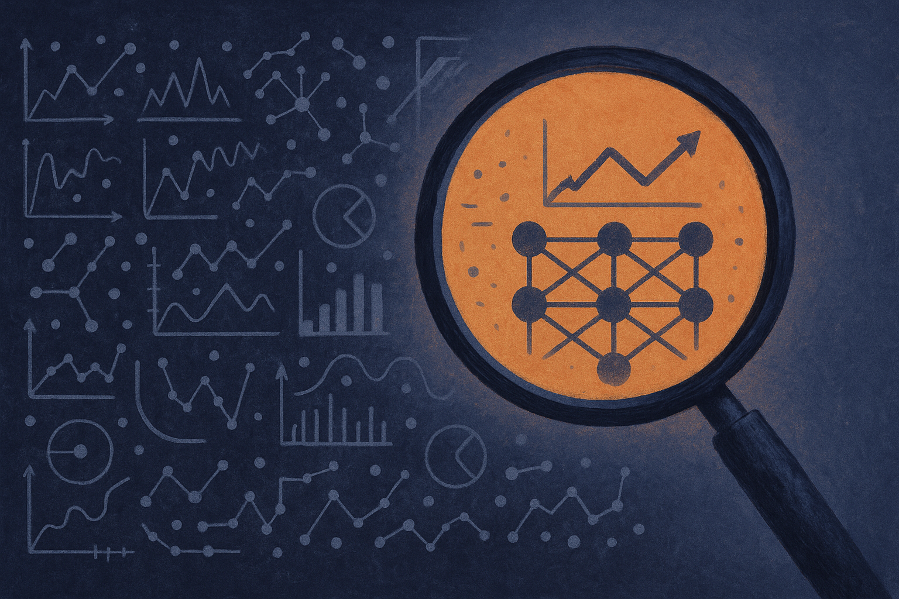

Ask a vision-language model whether a paper's figure supports a specific claim, and you hit a wall fast. The model can describe the chart. It can read the caption. But it often can't find the one bar, the one table cell, the one line crossing that actually settles the question. It hallucinates a reading, or it averages over the whole image and guesses.

That gap is the target of ToolSciVer, a framework posted to arXiv (cross-listed under cs.AI and cs.CL) that tackles what the authors call Multimodal Scientific Claim Verification, or MSCV. The task: given a scientific claim and the visual evidence from a paper, decide whether the evidence supports it. The interesting part isn't that they beat baselines. It's how they decided the problem was really three problems, and built for each one.

## The three failures they're actually fixing

The authors name the failure modes plainly. Models struggle to locate decisive visual evidence, they struggle to accurately read structured scientific visuals, and they struggle to integrate those observations into reliable reasoning. Those are distinct problems, and lumping them together is why generic prompting falls apart on dense figures.

So ToolSciVer gives the model three type-aware visual tools instead of one general "look harder" instruction. There's table row/column focus, for pulling a specific cell out of a grid. There's chart-to-structure parsing, which turns a chart into something machine-readable rather than pixels to eyeball. And there's high-resolution region zoom, for when the evidence is a small detail buried in a busy figure.

"Type-aware" is the phrase doing the work. A table is not a chart is not a photo. A tool that knows it's looking at a table can operate on rows and columns; a tool that knows it's a chart can extract the underlying structure. This is the opposite of the current fashion, which is to throw everything at one enormous model and hope scale sorts it out. ToolSciVer bets that the shape of the evidence should determine the shape of the tool.

## Reinforcement learning with a reward that punishes tool-flailing

The training method is Group Relative Policy Optimization, GRPO, the same family of RL that's been showing up across reasoning-model work. What caught my eye is the reward function. It isn't just "was the answer right." It's a composite of answer correctness, format validity, length control, tool-use efficiency, and tool-validity penalties.

Read that list again. Two of the five reward terms are about *how* the model uses tools, not whether it got the answer. Tool-use efficiency discourages the model from calling every tool on every problem just in case. Tool-validity penalties punish invalid calls, the kind of thing where an agent tries to zoom a table or parse a photo as a chart.

Anyone who has built an agent loop knows why this matters. The default behavior of a model handed tools is to overuse them, call them in the wrong order, or invoke them with garbage arguments. You either patch that with brittle prompt scaffolding or you bake it into the reward. ToolSciVer chose the reward. That's the more durable fix, and it's a signal of where agent training is heading: the objective isn't just the final answer, it's the whole trajectory of decisions that got there.

## What the benchmark actually shows, and what it doesn't

The claims are careful, which I appreciate. They test on two datasets, SciVer and MuSciClaims, across five VLMs from three model families: Qwen, InternVL, and Gemma. They compare against four baselines, including both prompting-based and RL-based tool-use methods. The result is superior performance over those baselines.

Here's where I hold back a little. "Superior performance compared to four competitive baselines" is the standard framing of every method paper, and the abstract doesn't give margins. A win that's consistent across five models and three families is more convincing than a single lucky number, and that breadth is genuinely the strongest evidence here. It suggests the approach isn't overfit to one model's quirks. But I want to see the actual deltas before I call it a big deal versus a solid, incremental one.

The other thing I can't verify from what's public: how much of the gain comes from the tools versus the RL versus the reward shaping. The abstract bundles them. A good ablation would tell you whether you could get most of the benefit from the type-aware tools with plain prompting, or whether the GRPO training is doing the heavy lifting. That answer changes what you'd actually build. I'd bet the reward shaping matters more than it looks, based on how often tool-flailing tanks agent systems in practice, but that's a hunch, not a finding.

## Why this pattern travels beyond science papers

Strip the "scientific" label off and MSCV is a general shape: verify a claim against structured visual evidence. That's invoice auditing. That's checking a marketing claim against a dashboard. That's reading a medical chart, a financial statement, a compliance table.

The transferable idea is the decomposition. Don't ask one model to "understand the image." Split the visual world by type, give each type a dedicated operation, and train the model to route to the right one and stop when it has enough. The scientific domain is a good proving ground because the visuals are dense and the ground truth is checkable, but the recipe isn't domain-locked.

Practitioner's Take: if you're building a system that reads charts, tables, or figures and makes a judgment, the lesson isn't "use ToolSciVer," which isn't a product you can pull off a shelf. It's the two design moves. First, build type-specific extraction tools rather than one vision prompt, because a model that knows it's looking at a table behaves better than one told to look harder. You can prototype this today with routing logic and specialized calls, no RL required. Second, if you do train, put tool discipline in your objective, not just answer accuracy, or your agent will call everything twice and invent readings when the real evidence is a single cell it never zoomed into. The catch most readers will miss: the abstract shows the method wins but not by how much or from which component, so treat this as a strong architectural pattern to steal, not a solved benchmark to cite. Run your own ablation before you trust any single piece to carry the load.
