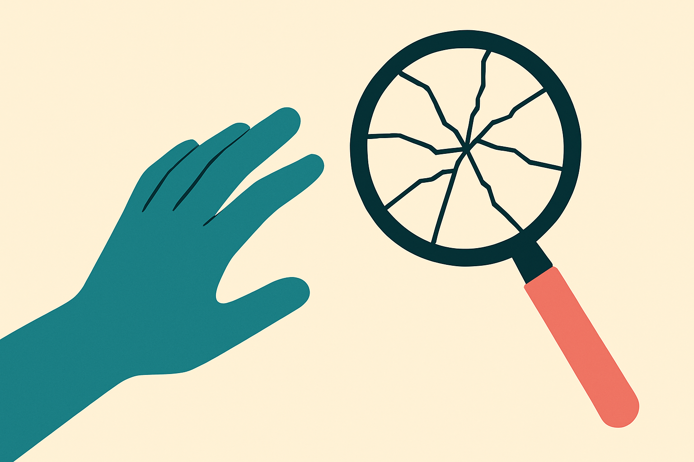

Here is a number that should stop you: three humans averaged 96.1 percent on a new vision benchmark. The best model tested, GPT-5.5 cranked to its highest reasoning-effort tier, got 10.6 percent. Claude Fable 5, which the authors note tops most reasoning and coding leaderboards, managed 3.5 percent.

That is not a rounding error. That is a category difference. And the benchmark, called ActiveVision, was built specifically to find it.

## What "active observation" actually means

The pitch from the ActiveVision authors starts with how human vision works. Your eyes are not a camera taking one snapshot. They are a closed loop. You form a hunch about what you are looking at, that hunch redirects your gaze, you look again, you update. Cognitive scientists have argued for decades that this back-and-forth is not decoration. It is how you solve real perception tasks. Counting objects in a cluttered scene, tracing a path, checking whether two things line up. You do not get those from one glance.

Current multimodal large language models do not work that way. They encode an image once, into a fixed set of tokens, and then reason over that frozen representation. If the answer needs a second look at a specific region, the model does not get a second look. It gets the same tokens it started with and has to reason its way around the gap.

ActiveVision is 17 tasks across 3 categories, and the design goal is stated plainly: force repeated visual perception rather than a single static description. That last phrase is the whole game. Most vision-language benchmarks reward description. Tell me what is in this photo. Models are genuinely good at that now. ActiveVision instead asks questions where describing the scene gets you nowhere, because the answer lives in a detail you can only resolve by looking again with a specific question in mind.

## Why the scores collapsed

The headline is the collapse, so let's be precise about it. GPT-5.5 at max reasoning effort scored zero on 11 of the 17 tasks. Not low. Zero. It solved a bit on the other six and that is where the 10.6 percent comes from.

This matters because it kills a comforting story. The comforting story is that these models are almost there and just need a little more scale or a little more thinking time. But max reasoning effort is exactly the "think harder" lever, and it did not close the gap. You cannot reason your way out of not looking. If the visual information you need was never extracted from the image in the first place, no amount of chain-of-thought recovers it. The model is reasoning over a description of the scene, and the description does not contain the answer.

The Claude Fable 5 result sharpens this. Here is a model that, per the authors, wins on reasoning and coding leaderboards, and it scored 3.5 percent, well below the weaker-on-paper GPT-5.5. So raw reasoning strength is not the bottleneck. Whatever makes a model good at code and logic puzzles does not transfer to this. That is a strong hint the deficit is architectural, not a matter of the model being "smart enough."

## The tool-use loophole that isn't

The obvious objection: fine, the model cannot look twice on its own, but modern models write and run code. Let it crop the image, run OpenCV, zoom into the region it cares about. Give it a magnifying glass it can operate itself.

The authors tested exactly this, and it mostly did not save them. Two reasons stand out. First, the vision code the models write is unreliable on realistic imagery. It works on clean textbook cases and falls apart on the messy real photos the benchmark uses. Second, and this is the sharper point, catching the code's failures requires the same active perception the model lacks. To notice that your crop grabbed the wrong region, or that your edge detector hallucinated a line, you have to actually look at the intermediate output and judge it. The model cannot do that reliably, so it trusts broken tool output and confidently reports the wrong answer.

That is a genuinely interesting failure mode. Tool use is supposed to be the escape hatch for perception gaps. Here the escape hatch has the same lock on it. You need active observation to supervise the tools that were supposed to substitute for active observation.

## What a builder should take from this

A few caveats first, because I want to be honest about the source. This is one benchmark from one paper, and I have not seen independent replication. Model names like "GPT-5.5" and "Claude Fable 5" are what the paper reports, and benchmark authors have every incentive to build tasks their target models fail. A benchmark designed to expose a weakness will expose that weakness. The 96 versus 10 gap is real inside ActiveVision. Whether it generalizes to your product is the question you have to answer for yourself.

So here is the practical read. If your application asks a vision model to describe, caption, tag, or classify, none of this should scare you. Those are single-glance tasks and models are strong at them. The danger zone is anything that requires the model to inspect a specific detail based on a question: reading a value off a cluttered dashboard, verifying that two elements align in a UI screenshot, counting items in a dense scene, tracing a wire or a path. Those are exactly the tasks ActiveVision is built from, and exactly where you should expect quiet, confident failure.

Do not trust "let the model use vision tools" as your fix. The paper's clearest finding is that self-written vision code fails on real images and the model cannot catch its own mistakes. If accuracy matters, build a verification step that does not depend on the model rechecking its own visual work: a second model, a deterministic check, a human in the loop for the hard fraction. The catch most people will miss is that these failures do not look like refusals or errors. They look like fluent, plausible answers that happen to be wrong, because the model reasoned beautifully over a picture it never really looked at twice.
