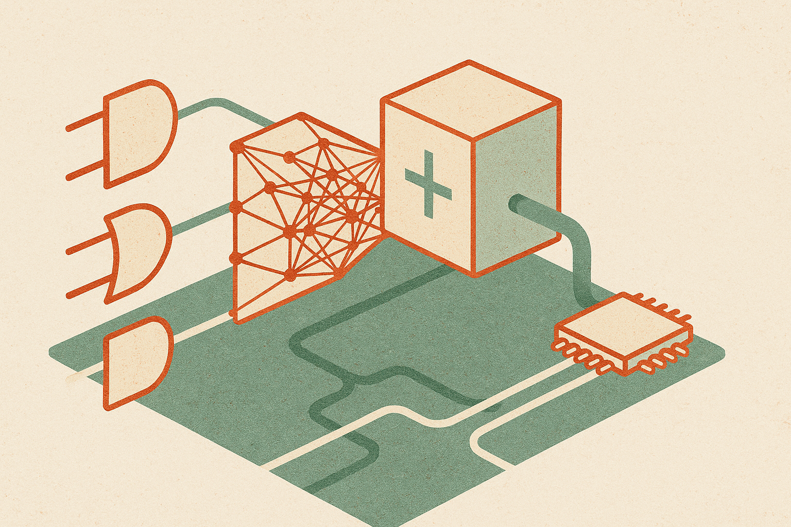

A cross-listed arXiv paper on EEG classification makes a simple bet: if the target device is tiny, stop pretending floating-point math is free.

The authors tested Differentiable Logic Gate Networks, or Diff-Logic, against matched-capacity MLP and Binarized Neural Network baselines on four EEG datasets. The tasks were binary dementia detection and 3-class emotion recognition. Model sizes ran from 50k to 500k parameters, which matters because many edge papers quietly compare a small efficient model against a bigger conventional one. Here, the comparison is cleaner.

The interesting part is not that Diff-Logic is “AI on the edge.” That phrase is tired. The interesting part is that the model compiles into pure Boolean circuits and runs through bitwise CPU operations. Different shape of compute. Different bottleneck.

## Boolean circuits are the product idea

Most AI efficiency work starts with a familiar neural network and then compresses it: quantization, pruning, distillation, sparsity, custom kernels. All useful. But the starting point is still usually a floating-point-heavy model that has to be squeezed into the box.

Diff-Logic starts closer to the box.

On the dementia screening task, the arXiv authors reported 80.2% Macro F1, 6.8 percentage points ahead of the matched MLP baseline. On emotion recognition, the MLP still had a moderate performance edge. That is the honest part. Diff-Logic did not sweep every task.

But the deployment numbers are the reason to care. On a 7W Nvidia Jetson Orin Nano CPU, single-core, the MLP had 2.3x higher latency and a 14x larger model size for the emotion task. At the largest complexity tier, Diff-Logic reached a 2.9x speedup over MLPs. More surprising, its inference time stayed nearly flat while model scale grew 10x.

That flat scaling is the signal. If it holds outside these datasets, this is not just a smaller model. It is a better match between algorithm and hardware.

## EEG is a good stress test

EEG is messy. Signals are noisy, users move, electrodes drift, and real-time systems have little room for latency spikes. A wearable brain-computer interface cannot hide behind a data center GPU.

That is why this study is more useful than another benchmark on image classification. It asks a product-shaped question: can a classifier run cheaply enough on a power-constrained device while staying accurate enough to matter?

For dementia screening, the answer looks promising. For emotion recognition, it is more mixed: the MLP performed better, but paid heavily in latency and size. That trade is familiar to anyone shipping on-device models. The “best” model in a notebook is often not the model you can afford to run every second on battery.

The BNN comparison also matters. Binarized Neural Networks are already aimed at cheap inference, so Diff-Logic is not only being compared with a naive dense network. I would still want to see more detail before calling this a general edge-AI win: per-dataset variance, subject-level splits, calibration, performance under sensor degradation, and tests beyond Jetson CPU execution.

## The catch is validation, not compilation

The dangerous read is that Boolean neural architectures are now ready for medical-grade brain interfaces. They are not. At least, this work does not prove that. Four datasets and two tasks are a strong research start, not clinical validation.

The better read is architectural. We have spent years asking how to make neural nets cheaper after training. Diff-Logic asks whether some edge workloads should be built from hardware-native primitives in the first place.

For builders, I would treat this as a pattern to test, not a replacement stack. If your workflow is real-time, sensor-heavy, and power-limited, take one existing MLP classifier and benchmark an architecture that compiles to the operations your device handles cheaply. Measure tail latency, memory, battery draw, and accuracy together. The catch most teams miss: a 2x faster model is not useful if preprocessing, wireless transfer, or bad electrodes are the real bottleneck.
