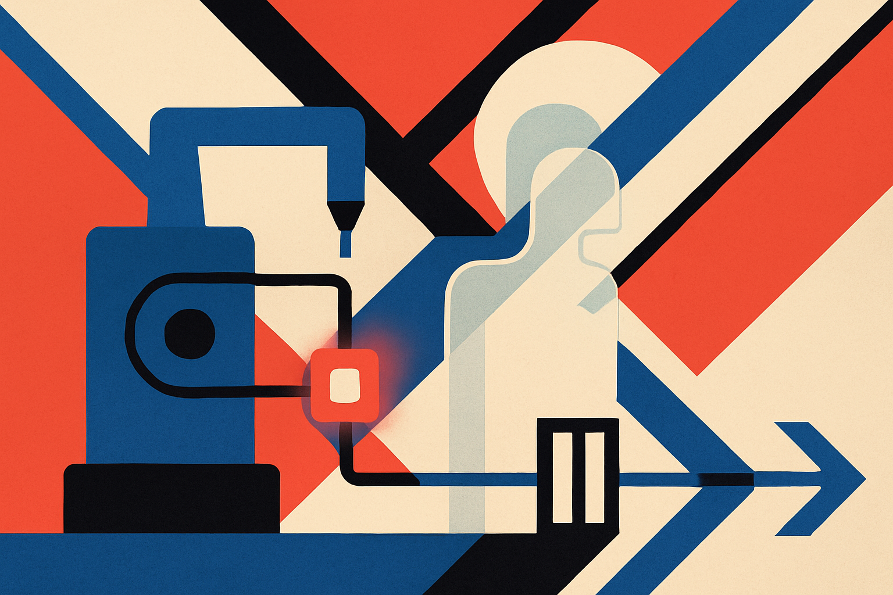

## The twin breaks quietly

Digital twins sound stable. The name implies a clean mirror of the physical system.

Reality is messier. Machines age. Materials vary. Operators change settings. Sensors drift. A surrogate model that matched the process last month can start lying this month, often without a clean failure signal.

That is the useful part of a new arXiv preprint on self-adaptive digital twins for additive manufacturing. The authors are not claiming a magic twin that learns forever. They propose a more believable loop: monitor when the surrogate is losing the plot, adapt it cheaply, then block deployment unless the update clears a statistical test.

The case study is directed energy deposition, an additive manufacturing process where control matters because the system is physical, stochastic, and expensive to get wrong. The authors also test the method on a stochastic linear system. That pairing is modest in the right way: one simpler sandbox, one industrially relevant process.

The core problem is concept drift. The surrogate model was trained under one distribution, then the operating conditions move. The tricky part is that the model also needs to represent aleatoric uncertainty, not just point predictions. In manufacturing, uncertainty is not a footnote. It is part of the control decision.

## A small update with a hard gate

The proposed framework has three moving parts.

First, it uses Fisher score vectors as a multivariate drift signal. Instead of waiting for bad outputs after the fact, the system monitors changes in model confidence and detects distributional shift. The authors report short detection delays for both abrupt and incremental drift.

Second, when drift is detected, the system does not retrain the whole surrogate. It uses Low-Rank Adaptation, better known as LoRA, to fine-tune fewer than 1% of the model parameters. Most people associate LoRA with language model adapters. This is a good reminder that the pattern is broader: freeze most of the model, update a compact set of parameters, and make adaptation feasible when data and compute are limited.

Third, and most important, the update is not trusted by default. The authors use a Mann-Whitney U test to statistically validate that the updated surrogate improves predictive performance before it is deployed. That sounds like a small detail. It is not. It turns continual learning from “the model changed” into “the model earned promotion.”

This is the part I think builders should steal. The interesting unit is not the model. It is the lifecycle. Drift detector, parameter-efficient patch, validation gate, then control.

## The lesson is bigger than additive manufacturing

This paper is framed around digital twins and model predictive control, but the pattern maps to a lot of production AI.

Customer support classifiers drift when the product changes. Fraud models drift when attackers adapt. Demand forecasting drifts when promotions, weather, or consumer behavior shift. Agent tools drift when APIs change. In each case, the dangerous move is to bolt on automatic retraining and call it adaptive.

The better move is staged adaptation. Detect the mismatch. Update as little as possible. Compare old and new behavior against a clear acceptance rule. Only then route live decisions through the updated model.

There are catches. Fisher score monitoring assumes the model’s internal signals are meaningful enough to detect drift. LoRA assumes the needed adaptation fits inside a low-rank patch. A Mann-Whitney U test can certify improvement only relative to the chosen metric and sample stream. None of this replaces domain constraints, safety limits, or human review when the cost of a bad action is high.

Still, this is a practical architecture. It treats model maintenance as an operational discipline, not a vibe.

For a builder, I would try this pattern before building a fully self-updating system. Pick one narrow model in production. Log drift signals. Create a small adapter update path. Add a promotion gate that compares the candidate against the current model on recent data. The catch most teams miss: the validation gate has to be designed before the incident, not after the model starts acting strange.
