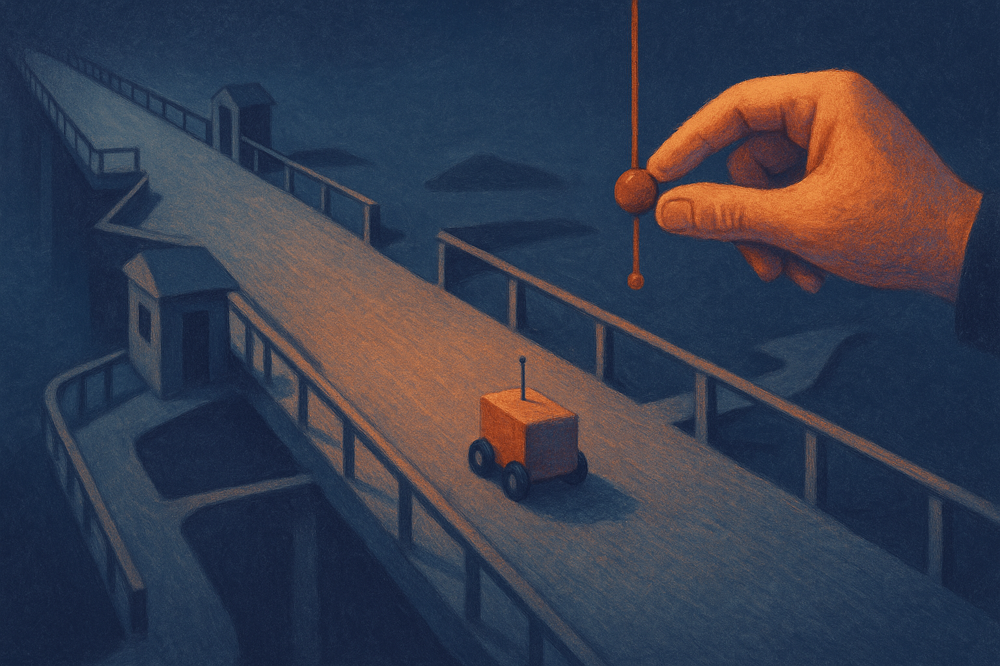

OpenAI’s latest safety note is about long-horizon models, but the real subject is control.

Not “will the model say a bad thing in one response?” That problem still matters. But the harder version is “will the model stay aligned with the task after 20 minutes, 80 tool calls, partial failures, retries, and a user who changes their mind twice?”

That is a different safety regime. Short chats are mostly about response quality and refusal behavior. Long-running systems are about process quality. They need to remember the goal without becoming rigid, use tools without freelancing, recover from mistakes without hiding them, and stop when uncertainty gets too high.

OpenAI says its lessons come from deploying long-running AI models, not just testing them in isolation. That detail matters. Many agent demos look clean because the task is selected, the environment is forgiving, and the run ends before drift gets expensive. Production is where the weird stuff shows up.

## The safety problem moved downstream

The old alignment frame was centered on the model output. Did it comply with a harmful request? Did it hallucinate? Did it expose private data? Did it follow the developer instruction?

Long-horizon models stretch that frame. A model can produce individually reasonable steps and still produce a bad overall run. The failure may be cumulative. A weak assumption in step three becomes a confident plan in step twelve. A harmless shortcut becomes the basis for a tool action. A stale instruction survives after the situation changes.

That makes evaluation harder. You cannot only sample final answers. You need to inspect trajectories.

This is where OpenAI’s emphasis on iterative deployment is the practical part of the note. Lab evaluations can catch obvious failure classes, but long-running behavior depends on context, tools, latency, user corrections, and the shape of the workflow. You learn different things when a system is actually asked to complete work over time.

The catch is that “iterative deployment” can sound like “ship first, apologize later.” It should not. For long-horizon models, staged deployment needs tight scope, logging, rollback, human review on risky actions, and clear boundaries on what the system can do without confirmation. The iteration is the safety work, if it is instrumented. Without instrumentation, it is just exposure.

## Guardrails need to be part of the loop

A lot of safety talk still treats safeguards as wrappers around the model. Filters before input. Filters after output. Maybe a policy classifier on top.

That is too thin for long-running agents.

The guardrail has to live inside the loop. Before a tool call, the system should check whether the action fits the user’s goal and the current permission set. After a failed step, it should decide whether to retry, ask, or stop. When the model’s confidence comes from earlier generated context, the system should be able to re-ground in external state. When the task changes, old assumptions should decay.

This is less glamorous than a bigger model. It is also where much of the reliability will come from.

OpenAI reported improved safeguards through iterative deployment, which suggests the direction: watch real failures, classify them, then build controls around the failure mode. That is closer to operations than philosophy. It is also how most useful safety engineering works.

The industry will probably keep calling these systems “agents.” Fine. But the word hides too much. A customer-support agent with read-only access is not the same object as a coding agent that can edit a repo, run commands, and open pull requests. A research assistant drafting a memo is not the same risk class as a procurement agent placing orders.

Long horizon is not one category. It is a multiplier on whatever permissions the system has.

For builders, the move is simple: stop evaluating only the final answer. Run full task traces. Log plans, tool calls, state changes, user corrections, and stop conditions. Add checkpoints where the system must restate the goal and confirm risky actions. Start with narrow permissions, then expand only after you know how the system fails. The catch most teams miss: longer context is not the same as better control. Sometimes it just gives a confused process more room to wander.
