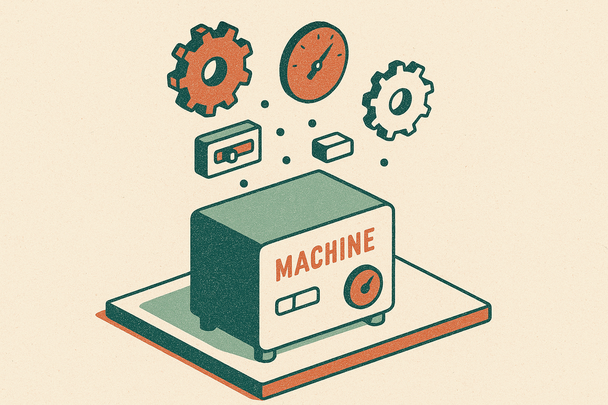
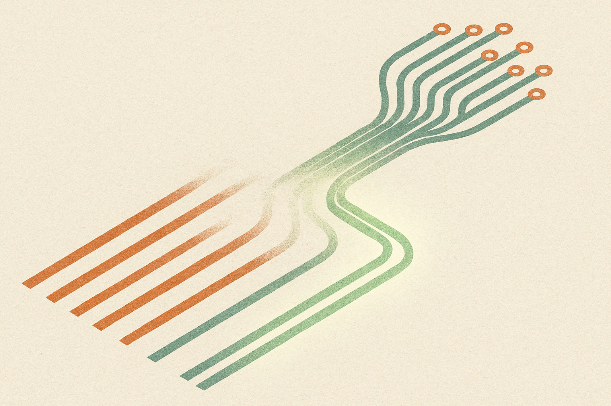

There is a quiet assumption behind most autonomous discovery work: that someone, somewhere, has found the right harness. Pick OpenEvolve or TTT-Discover, wire it to a capable model, point it at your problem, and let it run. The harness is the engine. You just supply fuel.

A new arXiv paper, "Automated Discovery Has No Universally Superior Harness," takes that assumption apart. Not with a hot take, with 3.1 million LLM rollouts. The finding is blunt: no fixed harness is reliably best across the model-problem pairs they tested. The recipe you trust is probably winning some of the time and losing the rest, and you may not have run enough trials to tell the difference.

## What a harness actually is

Start with vocabulary, because the paper's core move is a definitional one. When people say "OpenEvolve" or "TTT-Discover," they talk about it like a single method. The authors point out it is really a bundle of independent design choices glued into one recipe: how you store past attempts (the archive), how you pick which past attempt to build on (parent selection), how much you explore versus exploit, and how you spread a fixed compute budget across all of that.

Each of those is a knob. Bundle the knobs into a named system and you get the illusion of a method. Unbundle them and you get a search space. That reframing matters because it changes what "OpenEvolve beats X" even means. It might mean the archive design helped. It might mean the parent selection helped. It might mean nothing helped and you got lucky on the trials you happened to run.

The authors decompose the two popular harnesses into these constituent parts and then rebuild 30 different harnesses from the pieces, all matched on budget so the comparison is fair. That is the setup that lets them ask the real question. Not "which named system wins" but "which combination of choices wins, and does any combination win everywhere."

## The generalization problem

The answer is no. And two details make the "no" sharper than the usual "it depends."

First, they ran enough trials to separate signal from noise. This is the part most harness comparisons skip. Discovery runs are expensive and stochastic, so people compare methods on a handful of runs, see method A beat method B, and publish. The authors argue that gap is often just run-to-run variance. Their repeated-trial statistical analysis, complete with baseline null distributions for every model-problem pair, is meant to be the antidote. If you cannot beat the null with enough trials, you have not shown anything.

Second, the more complex option lost. Variants of OpenEvolve, the evolutionary-search style harness, generally underperformed simpler alternatives. That is worth sitting with. The field's instinct is that more machinery, richer archives, cleverer parent selection, should help. Across these 12 pairs, it mostly did not. Complexity bought variance, not reliability.

So the paper's headline reframing lands: harness choice is a hyperparameter, not a universal recipe. You would not ship one learning rate for every model and dataset. Treating the harness as fixed infrastructure is the same mistake at a higher level of the stack.

I want to be careful about scope here. This is 12 model-problem pairs. "No universally superior harness across these 12" is a strong empirical claim about this benchmark, not a proof that superiority is impossible in principle. But the pattern (complexity underperforming, gaps dissolving under proper statistics) is the kind of result that tends to hold up as the sample grows. It rhymes with what we already know about neural architecture search and AutoML, where the hunt for one dominant configuration mostly failed and the field moved to search and adaptation instead.

## The fix is to stop committing early

The most useful part of the paper is not the negative result. It is what they do with it.

They found that early discovery progress predicts final performance. A harness that is doing well in the first slice of its budget tends to keep doing well. That predictive signal is a lever. If you can tell early who is winning, you do not have to bet everything on one harness up front.

So they built a budget-matched adaptive scheme: start several harnesses at once, watch early progress, prune the weak partial runs, and reallocate that freed compute to the strong survivors. Same total budget. Better outcome. It beat two obvious baselines, committing to a randomly sampled fixed harness, and running a plain non-adaptive ensemble of all harnesses at once.

The logic is clean. If no harness wins everywhere, do not pick one. If early progress predicts final progress, let the runs audition, then back the winner. It is portfolio management applied to search, and it is the kind of idea that works precisely because the negative result forced it into existence.

## Why this generalizes past discovery

The framing extends well beyond OpenEvolve and TTT-Discover. Any composite AI system sold as a single "method" is hiding a bundle of choices, and any comparison run on too few trials is telling you a story about variance dressed as a story about quality. Agent scaffolds. RAG pipelines. Prompt-optimization loops. All the same shape: a named recipe that is actually a stack of knobs, evaluated on a handful of runs, and trusted as if the ranking were stable.

The authors also released their full run pools and null distributions as reusable statistical infrastructure. That is the underrated contribution. It means the next harness paper has a bar to clear that is not "we beat baseline on three runs." It is "we beat this null distribution with enough trials to matter." More fields should ship their variance, not just their means.

The practitioner's take: stop shopping for the one true harness, and stop trusting any leaderboard built on a few runs. If you are running expensive discovery or agent search, do the boring thing first, run your candidate configs enough times to see the spread, then compare against a shuffled or random baseline to make sure the gap is real. Then borrow the paper's move: launch several configurations, judge them on early progress, kill the laggards, and pour the saved compute into the leaders. The catch most people miss is that this only works if early performance actually predicts late performance for your problem, and the paper verified that on their pairs, not yours. Check that the correlation holds on a small pilot before you trust pruning to make your decisions. Otherwise you will confidently kill the run that would have won.
