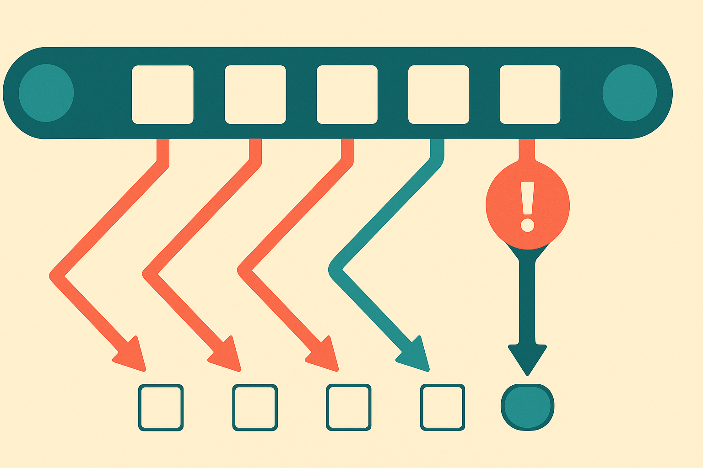

## The hard part is not seeing the frame

Industrial video anomaly detection sounds like a vision problem. In practice, it is often a sequence problem.

A factory clip may show parts moving, rotating, joining, deforming, heating, cooling, or being picked by a robot arm. The anomaly is not always visible as a single weird frame. It may be a state transition that should not happen. A part arrives too early. A tool touches the wrong object. A component keeps moving after it should stop. Physics and process rules matter.

That is the useful angle in O-VAD, a new arXiv paper on industrial video anomaly detection. The authors argue that general vision-language models can handle open-ended anomalies in broad settings, but degrade in industrial scenes because those scenes depend on object transformations, timing, and procedural constraints.

Their answer is not another domain-specific fine-tune. O-VAD is described as a training-free agentic framework. It detects objects, tracks them across time, builds object-wise temporal state trajectories, then reasons over those trajectories to identify abnormal objects in grounded frames.

That sounds dry. It is actually the key move.

Instead of asking, “Is this video normal?”, O-VAD asks, “What happened to each object, over time, and does that state history make sense?”

## Object histories beat clip vibes

The paper’s strongest claim is comparative: the O-VAD authors report that their method outperforms frontier VLMs, other agentic frameworks, and traditional video anomaly detection methods fine-tuned on the respective datasets, across three industrial IVAD datasets.

That is a big claim, especially because the system is training-free and does not require injected domain knowledge at inference time. I would still read it with the usual caution. “Training-free” does not mean “setup-free.” These systems still depend on object detection quality, tracking stability, frame sampling, camera angle, lighting, and the model’s ability to describe state changes in a way that does not drift.

But the design direction feels right.

Many current multimodal workflows still treat video as a stack of images plus a prompt. That works for simple QA. It breaks when the answer depends on continuity. Industrial inspection is full of continuity. So are medical procedures, warehouse safety checks, lab automation, food production, construction monitoring, and retail loss prevention.

The lesson is not “use agents for video.” That is too broad. The lesson is more specific: if the domain has objects whose states evolve under constraints, represent the states explicitly before you ask a model to judge them.

That gives the model something better than vibes. It gets a timeline.

## The useful artifact is the report, not just the flag

O-VAD also reports anomaly processes and types, not only abnormal frames. That matters for operations.

A plant manager does not just need “anomaly detected.” They need to know what object was involved, when it started going wrong, how the state changed, and what part of the process may have failed. Otherwise the alert becomes another dashboard light people learn to ignore.

This is where object-centric reasoning has a business case. It can turn video inspection from a black-box classifier into a traceable event record. The model can be wrong, but at least the operator can inspect the chain: detected object, tracked path, state transition, reasoning output, grounded frame.

That is closer to how human inspectors work. They do not stare at a whole video and emit a probability. They follow the part.

Practitioner’s take: if you are building video inspection, do not start by fine-tuning a model on “normal” and “abnormal” clips. First prototype the object ledger: detect the relevant objects, track them, store state changes, then ask a VLM to reason over those trajectories. The catch is that your bottleneck may move from model quality to boring pipeline quality, like stable IDs, missed detections, occlusions, and bad camera placement. That is still progress. Boring failures are the ones you can debug.
