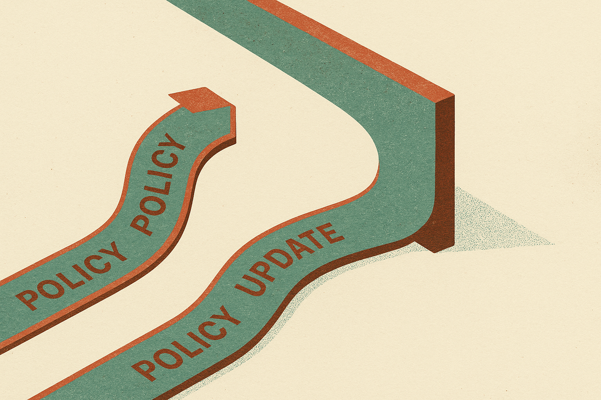

## The kink in PPO is the target

PPO clipping has always been a practical compromise. It keeps policy updates from running too far by flattening the objective once the new policy moves enough in the “good” direction. That flattening is useful. It is also abrupt. The derivative changes sharply at the clip boundary.

The OR Else paper asks a narrow but useful question: what happens if you replace that hard clipped saturation with a smooth one-sided rule?

Their method is called Output Reset, or OR. PPO-OR and GRPO-OR swap the clipped policy term for an OR squared-margin loss in token log-ratio space, measured relative to the rollout policy. The advantage sign decides which way a token should move. Once the token crosses the favorable margin, it contributes zero direct OR residual.

That sounds like a small implementation detail. It is not. In RLHF-style post-training, the shape of the objective is the training signal. Tiny changes in saturation can change which tokens keep getting pushed, which stop contributing, and how unstable the run feels.

## The results are mixed in the useful way

The authors test on Llama-3.2-1B-Instruct using Anthropic’s hh-rlhf dataset, one shared reward model, and three seeds per method. That setup matters. This is not a giant frontier-model alignment result. It is a controlled small-model comparison with limited seeds and reward-model scores, not held-out human preference judgments.

Under GAE, PPO-OR beats PPO-clip by a mean final training-time reward-model score of 0.305. That is the cleanest positive number in the paper. But it comes with a larger observed across-seed spread, so I would not read it as “OR is simply better PPO.” It improved the measured endpoint while also looking less consistent across runs.

The GRPO side is more interesting because the diagnostics improve without a reward win. With group-relative advantages at group size 2, GRPO-OR does not produce a higher mean reward-model score than GRPO. It does show a smaller observed spread, a near-zero terminal OR residual, and a declining overshoot fraction. In plain English: the OR version appears to behave more neatly by its own training diagnostics, but that neatness does not convert into higher measured reward.

That is a good reminder. Optimizer cleanliness is not the same thing as task progress. You can reduce a pathology and still not improve the thing you care about.

The paper also reports that both group-relative methods show much larger rollout-to-current log-ratio displacement than the GAE methods. OR does not consistently reduce that displacement. So if the hope was “smooth saturation equals tighter trust region,” this experiment does not fully support it.

## Smoothness is a knob, not a verdict

I like this kind of work because it attacks the boring part that often decides whether post-training runs behave: objective geometry. PPO became popular partly because it was simple enough to work under messy conditions. GRPO gained attention because it removes some machinery and fits reasoning-style training recipes. But both still depend on how we constrain updates when rewards are noisy and advantages are brittle.

OR is not a magic replacement based on these results. It is a candidate objective shape. The GAE result says it can improve reward-model score in a matched PPO comparison. The GRPO result says better-looking training traces are not enough, at least at group size 2. The authors leave open whether larger groups change the outcome, which is exactly the right caveat.

I would also be careful about the measurement target. Training-time reward-model score is a useful lab instrument, not the final product. Reward models can be gamed. Human preference can diverge. Real product behavior can move in ways a scalar score misses.

Practitioners should treat OR as something to A/B inside an existing post-training stack, not as a new default. Try PPO-OR if your PPO runs show sharp instability around clipping, and track seed variance, KL or log-ratio displacement, reward-model score, and a small held-out human or model-graded eval. For GRPO, I would test larger group sizes before drawing much from the G=2 result. The catch most readers miss: a smoother objective can make the run look healthier while leaving the actual preference outcome unchanged.
