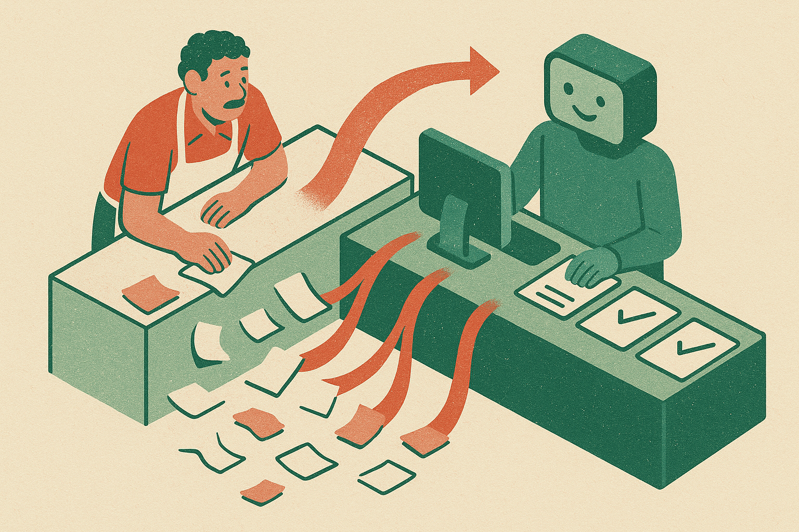

OpenAI is going after the least glamorous, most useful part of the AI market: small business admin.

OpenAI announced the ChatGPT for Small Businesses program, aimed at helping entrepreneurs build AI skills, automate work, and grow with ChatGPT Work. That is the public claim. The details are still thin, at least from the announcement language available here. No pricing, no curriculum outline, no adoption numbers, no case studies.

Still, the direction matters.

Small businesses do not need a “strategy deck about AI transformation.” They need invoices cleaned up, emails drafted, proposals rewritten, staff questions answered, customer notes summarized, and repetitive decisions made less painful. If OpenAI can make ChatGPT Work feel like a practical operating layer for those jobs, it has a path into a huge market that usually does not buy enterprise software like a Fortune 500 company does.

## The product is training, not just ChatGPT Work

The interesting word in OpenAI’s announcement is “skills.”

That suggests OpenAI knows the bottleneck is not only model capability. It is behavior change. A bakery owner, solo consultant, local contractor, medical office manager, or Shopify seller might have access to a capable model and still not know what to ask, what to trust, or where to plug it into the day.

This is the gap most AI product launches glide past. A better model does not automatically create a better workflow. Someone has to decide which task is repeatable, which data is safe to paste, what “good enough” means, and when a human needs to review the output.

For small businesses, that training layer may be the product. Not because training is sexy. Because it turns a blank chat box into a habit.

## OpenAI is selling time back to owners

The pitch lands because small businesses are structurally time-poor. The owner is often the sales team, finance department, HR desk, customer support lead, and operations manager. A tool that saves 30 minutes a day on routine work can matter more than a tool that demos like magic but needs a dedicated admin.

OpenAI’s framing around automation is the right one, but this is where the hype usually creeps in. “Automate work” can mean a real repeatable process, or it can mean copying text from one browser tab into another with a chatbot in the middle. Those are not the same.

The practical test is simple: can ChatGPT Work help a business owner create workflows that run the same way every week, with less supervision over time? Drafting a customer reply is useful. Turning common customer issues into a reusable intake, response, and follow-up flow is more useful. Summarizing notes is useful. Turning those notes into assigned next actions, reminders, and updated records is where it starts to feel operational.

OpenAI has the brand and distribution. The harder part is making the last mile boring enough to stick.

## The trust problem is local and specific

Small businesses will not adopt this the same way a software team adopts a coding assistant. Their risks are different. A bad customer email can cost a relationship. A mishandled refund can hurt cash flow. A wrong compliance answer can cause trouble. A private customer record pasted into the wrong place can create a mess.

That means OpenAI’s program needs more than cheerful examples. It needs clear guidance on what should and should not go into ChatGPT Work, how review should work, and where humans stay in the loop. The announcement points toward skills and automation, but the receipts will be in the guardrails, templates, and repeatable playbooks.

I would not judge this by whether it produces flashy AI agents for small business. I would judge it by whether it helps owners build five dependable workflows they actually use.

Start with one painful recurring task, not a company-wide AI rollout. Pick something visible and low-risk: quote drafts, meeting summaries, product descriptions, customer FAQ replies, weekly status updates. Write down the current steps, build the ChatGPT version, then compare time saved and error rate for two weeks. The catch most people miss: the win is not the first prompt. The win is turning that prompt into a standard operating procedure someone else on the team can run without you.
