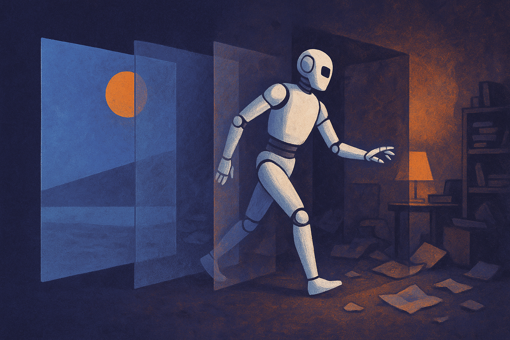

Hugging Face’s overview of simulation for physical AI lands on the right bottleneck: embodied AI does not get to live inside a chat box. It has to push, grasp, roll, slip, collide, balance, and recover. That changes the whole development loop.

For language models, a bad output is usually a bad answer. For physical AI, a bad output can be a broken gripper, a stuck rover, a dented warehouse shelf, or a safety incident. So simulation is not a side tool. It is becoming the build system.

## The simulator is now part of the model stack

The useful way to think about simulation is not “fake reality.” It is a controlled training and testing surface. A place where a team can run thousands of variations before paying the tax of motors, batteries, sensors, humans, space, and time.

That matters because physical AI has more moving parts than a model card captures. There is the policy or controller. There is perception. There is planning. There are sensors with noise, latency, and blind spots. There are materials that bend, slide, deform, and fail. Then there is the environment, which never reads the spec.

Hugging Face frames the field as “physical AI,” which is a useful umbrella because it includes more than humanoid robots. It covers arms, drones, vehicles, warehouse systems, industrial machines, and agents operating through bodies or tools. That breadth is important. A simulator that works for a rigid robot arm in a clean bin-picking task may not tell you much about a drone in wind or a mobile robot on wet concrete.

The catch: simulation is not one thing. It can mean physics engines, synthetic data, reinforcement learning environments, digital twins, procedural world generation, sensor simulation, or hardware-in-the-loop testing. Those are related, but they solve different problems.

## Sim-to-real is still where the bill comes due

The hard problem is not making a robot look good in sim. The hard problem is transfer.

Reality has edge cases that resist modeling. Friction changes. Lighting changes. Objects are not the shape the mesh says they are. Cables snag. Dust builds up. Humans move things for no reason. Cheap sensors lie in different ways than expensive sensors. The simulator can help you find a wider slice of the problem space, but it cannot certify that the real world will behave.

That is why I get skeptical when simulation is sold as a replacement for real-world testing. It is better understood as a filter. Use it to kill bad ideas early, generate variation, stress policies, and debug failure modes. Then use real hardware to find the gaps in the simulator. Then improve the simulator. Repeat.

This is also where open tooling matters. Hugging Face covering the topic is notable because the AI community has a habit of treating robotics as a separate island. It is not. If physical AI keeps moving toward foundation models, imitation learning, synthetic data, and shared datasets, then the tooling stack will look more like modern ML. Repos, datasets, benchmarks, model hubs, evaluation harnesses, and reproducible training runs. With more broken parts on the floor.

The risk is benchmark theater. Simulated environments can become games that agents learn to exploit. That has happened before in reinforcement learning. A clean leaderboard can hide brittle behavior. For physical AI, the question should always be: what real deployment decision does this simulation result support?

Practitioner's take: if you are building a physical AI workflow, do not start by asking for the most realistic simulator. Start by naming the failure you need to catch before hardware. Bad grasps, missed detections, unstable motion, rare collisions, sensor glare, operator interruptions. Build or choose simulation around that failure class, then compare sim results against small real-world tests every week. The miss most teams make is trying to model all of reality. Model the part that can save you time, money, or broken equipment.
