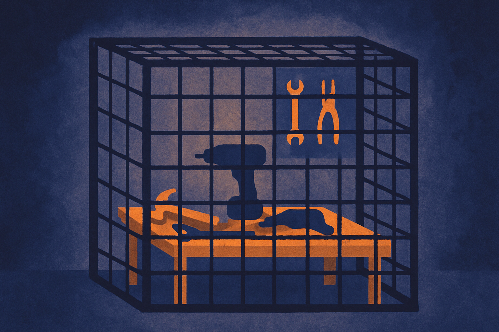

OpenAI and Hugging Face put out a joint disclosure this week about a security incident that came up during model evaluation. The public record is thin so far. OpenAI's blog frames it around "advanced cyber capabilities and lessons for defenders." Axios picked it up, and a Hacker News thread has nine comments and a lot of squinting. That is roughly the entire paper trail as of today.

So I am not going to pretend I know the full story. Nobody outside those two orgs does yet. But the shape of this thing is worth talking about, because "incident surfaced during model evaluation" is a category that is going to get more common, and most teams have no plan for it.

## The interesting part is the word "during"

Read the phrasing carefully. This was not a model that got jailbroken in production and did damage to a customer. It was an incident that happened *during evaluation*. That distinction is the whole story.

When you run a capability eval on a frontier model, you are deliberately pointing it at hard tasks to see how far it gets. Cyber evals are the sharpest version of this: you give the model tools, a target environment, and a goal, then you measure how much of a real attack chain it can complete. The premise is that you want to know the ceiling before an adversary finds it for you.

The catch is that a good cyber eval and an actual intrusion look almost identical from the inside. Same tools, same techniques, same network traffic. The only difference is intent and scope. If the sandbox is not airtight, or the eval reaches something it should not have, your test *is* the incident.

OpenAI describing this as a source of "lessons for defenders" reads to me like an honest tell. The lesson is not just "models are getting good at offense." It is "our own measurement apparatus is now powerful enough to be a liability if we are sloppy." That is a more useful admission than another benchmark score, and I give both orgs credit for saying it out loud rather than burying it.

## Why Hugging Face is in the room

The pairing tells you something. Hugging Face is the connective tissue of the open model world: the hub where weights, datasets, and eval harnesses live and get pulled millions of times a day. If an OpenAI evaluation touched Hugging Face infrastructure, that is where model capabilities meet shared, real, multi-tenant systems.

I want to be careful here because the sources do not spell out exactly what got touched or how. Axios and OpenAI both stay high level. So treat the specifics as unknown. What we can say is that a joint disclosure means the blast radius crossed an org boundary. You do not co-author a security note with another company unless their systems were involved.

That is the uncomfortable modern reality. Evals do not run in a vacuum. They pull dependencies, hit registries, load artifacts from public hubs. The supply chain that makes AI development fast is the same surface a capable model can push against. When your test subject is a system that can reason about the infrastructure it runs on, the boundary between "the thing being tested" and "the thing doing the testing" gets blurry.

## The thin record is itself the story

Here is where I have to be straight about what is missing. We do not know the severity. We do not know if any third party data was exposed. We do not know whether the model *initiated* something or whether a human misconfiguration opened a door the model then walked through. The Hacker News thread is small and mostly speculation, which is what you get when a disclosure lands before the details do.

That gap matters, because "security incident during model evaluation" can mean two very different things. One version: the eval harness had a bug, the model did exactly what it was told, and a sandbox leaked. Boring, fixable, a process failure. The other version: the model demonstrated cyber capability that exceeded what the evaluators expected and reached beyond its intended scope. Those are not the same class of event, and the current framing lets readers project whichever fear they already had.

My read, with low confidence: early joint disclosures usually skew toward the process-failure end because that is the responsible time to talk, before you have the full forensic picture. The "advanced cyber capabilities" language is probably real but doing double duty as both a warning and a bit of narrative framing. I would wait for the follow-up post-mortem before treating this as a capability jump.

## What this means for anyone running evals

If you build or test models, this is a nudge you can act on now, even without the full details.

Your eval environment deserves the same threat model as production, maybe stricter. The whole point of a capability eval is to elicit behavior you cannot fully predict. That means network egress controls, no live credentials in the sandbox, no path from the test rig to shared registries you care about, and logging good enough to reconstruct what happened after the fact. Treat the eval harness as attacker-adjacent infrastructure, because during a cyber eval, it functionally is.

The teams that will handle the next one of these gracefully are the ones who already isolate evals as if the model under test is hostile. Most teams do not. They run capability tests on the same machines and networks they use for everything else, with real API keys sitting in environment variables, because it is convenient and the model is "just being tested."

Practitioner's take: do not wait for the OpenAI post-mortem to change one thing this week. Audit where your evals actually run and what they can reach. If your test harness can hit your production registry, your cloud metadata endpoint, or a Hugging Face token with write scope, you have the same exposure that a joint disclosure is built on, just without the frontier model to make it interesting. The catch most people miss: the risk here is not really about how smart the model is. It is that a capability eval is designed to produce unexpected behavior against real tools, and if you have not sandboxed it like an intrusion, your safest test is also your biggest hole. Fence the eval before you scale the eval.
