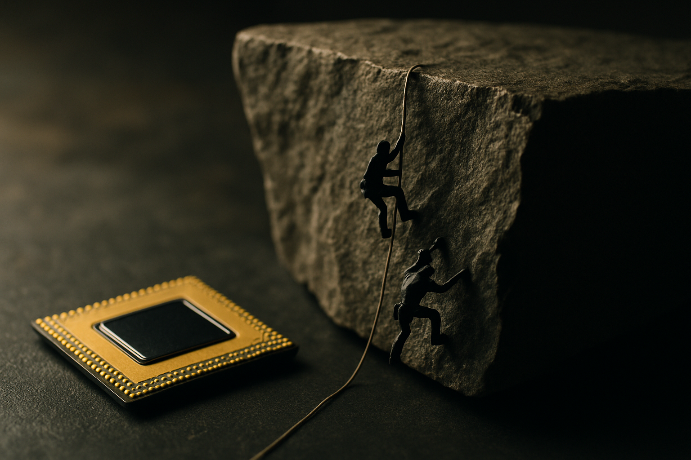

TL;DR: One small study says junior devs who leaned on an AI assistant scored worse on a follow-up quiz, and a separate interpretability result shows models inventing internal tools nobody designed, so the practical move is to treat AI as a tutor you interrogate, not a black box you copy from.

Two Minute Papers, hosted by Dr. Károly Zsolnai-Fehér, ran two episodes that on the surface have nothing to do with each other. One covers a 52-person study on junior software engineers using AI to code. The other covers an Anthropic interpretability finding about how a model tracks character counts. I want to read them together, because put side by side they tell you something neither says alone: these systems build genuine internal machinery, and the way you use that machinery decides whether you get smarter or duller.

## What did the coding study actually find?

The setup: 52 junior software engineers, split into an AI-assisted group and a no-AI group, one Python library, one short task, one quiz afterward.

Two questions, two answers. Did AI make them faster? The AI group finished about 8% faster, roughly two minutes. But Zsolnai-Fehér is honest here: that result was not statistically significant. So the speed win is a maybe, not a fact.

Did AI make them worse at understanding the work? That result did clear the bar. The AI group scored 50% on the quiz, the no-AI group scored 67%. That is a 17-point gap, statistically significant, and large for a study this size. The biggest gap showed up in debugging, which tracks with intuition. If the AI writes the code and you never wrestle with why it breaks, you never build the muscle to fix it.

I want to be careful about how much weight this carries. It is 52 mostly junior developers, one library, one task, one quiz. It used a chat-style assistant, not a full agentic coding system. That last detail matters and cuts against comfort: Zsolnai-Fehér argues an agentic setup, where the AI does even more of the work end to end, would likely widen the skill gap, not shrink it. So the study is a pointer, not a verdict. But the direction is worth taking seriously, especially if you manage or mentor junior engineers.

The honest read: AI probably did not make anyone faster in a way you can measure, and it probably did make them understand less. That is close to the worst-case tradeoff. You give up comprehension and do not clearly gain speed.

## Why does the character-counting result matter?

The other episode covers an Anthropic finding that sounds trivial and is not. Ask a model whether adding a word like "aluminum" will make a line overflow the page. The model gets no character counts, no page width, nothing visual. It sees tokens, which are chunks of text, not letters. Yet it often answers correctly.

To do that, it had to learn to count characters on its own, estimate page width, and subtract. Nobody programmed that. During training it effectively decided it needed a tool for measuring line lengths and built one from scratch. Interpretability work let researchers open the model and find that tool sitting inside.

The mechanism is stranger than "it learned to count." The model does not count characters directly. It counts tokens and multiplies by roughly four characters per token, the way you might count books on a shelf and assume each is about an inch thick. It is an estimate, a heuristic the model invented because it works well enough.

Then the part that got the most airtime. Neuroscientists once found "place cells" in mice, neurons that fire only when the animal stands in a specific spot, plus "boundary cells" that fire near a wall. That is a spatial map the brain builds on its own. The paper reports the model grew the same kind of structure: features that fire based on how far along a line you are, and features that fire near the end of the page. Anthropic's own phrasing, per the episode, is that character counts are represented on low-dimensional curved manifolds discretized by sparse feature families analogous to biological place cells. Strip the jargon and it means the model reinvented a spatial ruler, and it looks structurally like what a mammal brain does.

## What do these two findings have to do with each other?

Here is the connection I care about. The interpretability work shows these models are not lookup tables. They construct internal tools and representations to solve problems, including problems they were not explicitly trained on. There is real structure in there, real machinery.

The coding study shows what happens when a human treats that machinery as a vending machine. You put in a request, you get out working code, and the model's hard-won internal understanding never transfers to you. The model built a ruler. You just read the number off it. Over enough repetitions, you stop knowing how rulers work.

That is the tension worth sitting with. The models are getting genuinely more capable of building understanding. The default way we consume their output is designed to prevent us from building any. The tool is smart. The interface encourages you to be passive. Those two facts are on a collision course, and the coding study is an early crash report.

## How should a builder actually use this?

Zsolnai-Fehér's own advice is a good spine, and I would sharpen it. Use AI to automate and speed up things you already understand, because there the risk of atrophy is low and the time savings are real. For things you do not yet know, ask questions instead of asking for finished answers. And when something breaks, try to fix it yourself first, then have the model explain what you missed. His compressed version: use AI as a tutor and it sharpens you, use it as a crutch and it dulls you.

I would add one operator-level rule. Instrument the difference. If you lead a team, the quiz in this study is a template. Once a month, ask engineers to walk through code they shipped with AI help and explain why it works and where it would break. Not as a gotcha. As a check on whether comprehension is keeping pace with output. The study's debugging gap is your early warning light. If your juniors can ship features but cannot trace a failure, you are accumulating a debt that no velocity metric will show you until production breaks.

The catch most readers miss: the fix is not "use less AI." It is spending the time the AI gives you back on understanding rather than on more output. The 8% speed gain, if it is even real, is only worth having if you invest it in staying sharp. Cash it in for more tickets closed and you have traded your own competence for a rounding error. The model built itself a ruler from nothing. The least you can do is learn how yours works.
