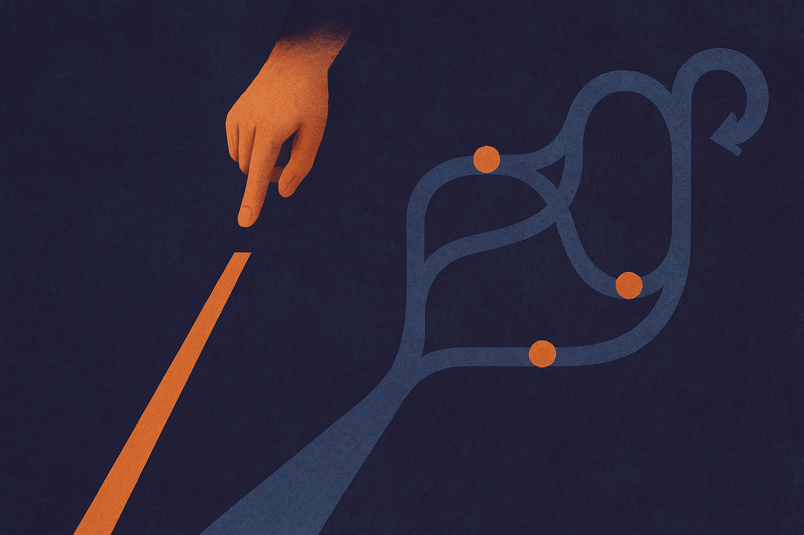

TL;DR: As AI systems run longer and take more actions, safety has to move from checking single outputs to managing workflows, permissions, monitoring, rollback, and human handoffs.

## What changes when models run longer?

OpenAI’s blog post, “Safety and alignment in an era of long-horizon models,” is really about a threshold change. A chatbot answer is one thing. A model that works across many steps, calls tools, stores context, retries after failure, and keeps pursuing a goal is a different kind of system.

That difference matters because risk compounds. Not in some sci-fi way. In the boring operator way.

A single bad answer can be caught, corrected, or ignored. A long-running model can make a small wrong assumption early, then build on it. It can take an action that changes the state of the world, then reason from that changed state. It can fail quietly. It can also succeed in ways that make people trust it too quickly.

OpenAI says deployment has surfaced new safety risks and observed failures, and that its safeguards improved through iterative deployment. That is the right frame. You do not learn enough about agent safety in a clean benchmark. You learn when the model meets messy tools, ambiguous instructions, flaky APIs, impatient users, and real incentives.

The safety question becomes less “Did the model say the right thing?” and more “What was it allowed to do, how far did it get, what did it assume, who checked it, and could we stop it?”

## Why does iterative deployment matter?

I read OpenAI’s post as a defense of staged exposure, not as a claim that long-horizon models are solved. That distinction matters.

Iterative deployment is not magic. Shipping a limited version, watching failures, and tightening controls only works if the operator is honest about what counts as a failure. If the metric is “users kept clicking,” you will miss the important stuff. If the metric includes bad tool calls, hidden retries, policy edge cases, task drift, escalation quality, and user confusion, you start to get signal.

This is where AI safety starts to look like production engineering. You need logs. You need evals that replay real incidents. You need canaries. You need permissions that degrade gracefully. You need a way to pause or revoke an agent’s access without breaking the whole product.

The hard part is that long-horizon failures are often not dramatic. They look like wasted spend, bad prioritization, duplicate work, stale assumptions, or a confident action taken one step too late. That is why post-deployment learning matters. Lab tests will catch some failures. Real workflows catch different ones.

## What should builders instrument first?

Start with action boundaries. If a model can only draft, the risk profile is different from a model that can send, purchase, delete, merge, deploy, or message customers. Treat each new verb as a safety review.

Then watch state. Long-running systems depend on memory, intermediate files, tool results, and assumptions. If you cannot inspect that state, you cannot debug the agent. If the agent cannot explain which evidence drove an action, you are flying blind.

Also separate autonomy from authority. A model can run for an hour and still require approval before irreversible steps. That is often the right product shape. Let it research, compare, prepare, and simulate. Put a human at the commit point.

The catch is product pressure. Users want fewer clicks. Teams want impressive demos. Investors want autonomy. But the useful version of long-horizon AI is not “the model does everything.” It is “the model does the boring multi-step work inside a system that makes mistakes visible and recoverable.”

Practitioner’s take: if you are building with agents this week, pick one workflow and map every tool call, permission, checkpoint, and rollback path before adding more autonomy. Run the model on real-ish tasks, keep transcripts, review failures, and tighten the boundary around actions that change money, data, access, or customer trust. The missed catch is not prompt quality. It is operational control.
