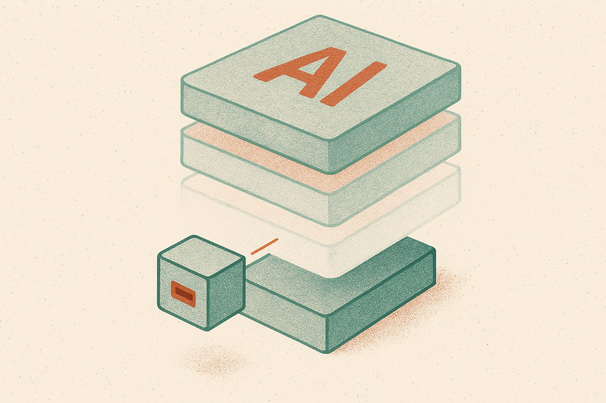

TL;DR: If this PortLLM result holds up in your domain, you may not need to re-fine-tune LoRA adapters every time the base model gets continually pretrained.

## What does temporal portability actually buy you?

The primary source here is **“The Blessing of Dimensionality: How Near-Orthogonality in High-Dimensional Spaces Explains Temporal Portability”**, posted to arXiv in both cs.CL and cs.LG. The claim is practical: LoRA patches can remain useful after the base LLM goes through multiple rounds of continual pretraining.

That matters because many teams now treat fine-tuning as a recurring tax. A base model gets updated with new data. The domain adapter might be stale. So the safe move is to collect or regenerate training data, run the fine-tune again, evaluate again, ship again. That cycle is annoying when the adapter encodes something narrow but important, like house style, compliance behavior, product ontology, or task format.

PortLLM is interesting because it is described as training-free and data-free. It tries to adapt an existing LoRA patch to a continually pretrained base model without rerunning the original fine-tuning job. The paper reports an empirical study across 10 continual pretraining steps using Mistral, Gemma, and Qwen as base models. The reported result: temporal portability persists over a longer period than earlier short-term PortLLM results had shown.

That does not mean every adapter becomes immortal. It means the default assumption, “new base checkpoint equals new LoRA training run,” may be too expensive and too conservative.

## Why would an old LoRA patch still work?

The paper’s theoretical explanation is near-orthogonality in high-dimensional spaces. In plain English: high-dimensional vectors often point in mostly different directions. That geometry can reduce interference between changes introduced by continual pretraining and the task-specific directions captured by a LoRA adapter.

This is the useful mental model. Continual pretraining moves the base model. The LoRA patch also represents a move, usually in a low-rank subspace. If those moves are close to orthogonal, the adapter’s effect can survive because the base update did not directly overwrite the same behavior. The paper also frames this through the geometry of the loss landscape, comparing adaptation options by how those update directions interact.

I like this explanation because it matches the operator intuition behind many adapter stacks. A formatting adapter, a domain vocabulary adapter, and a safety-style adapter can often coexist because they are not all pushing on the same model behavior. The blessing is not magic. It is separation.

The catch: the abstract does not provide the effect sizes, benchmark details, or failure cases. So the right reading is not “PortLLM works.” It is “there is enough signal here to test PortLLM before paying the full re-fine-tuning cost.”

## Where does this break in practice?

The obvious failure mode is overlap. If continual pretraining changes the exact capability your LoRA adapter depends on, near-orthogonality may not save you. A legal drafting adapter built on an older model may behave differently after the base model absorbs a large corpus of newer legal text. A medical coding adapter may drift if the base model’s representation of codes, abbreviations, or policy language changes. A customer-support tone adapter might survive longer because the base update is less likely to collide with it.

Another issue is evaluation. “Portable” is not a feeling. You need a regression set that captures the adapter’s job. Not just generic benchmarks. Real prompts, expected formats, refusal boundaries, edge cases, and examples where the old adapter used to fail.

I would also separate three questions that often get mashed together. Does the adapter still load? Does it still improve the target task? Does it still avoid new regressions caused by the updated base? PortLLM may help with the second question, but production teams have to answer all three.

Practitioner’s take: treat adapter portability as a release gate, not a belief. When you update a continually pretrained base model, first try the existing LoRA patch with PortLLM or a comparable no-retrain method, then run your task-specific evals against the old adapter, the ported adapter, and a freshly tuned adapter if budget allows. The catch most teams miss is that the savings are not just GPU time. They are review time, data handling time, and the risk of accidentally training away behavior that already worked.
