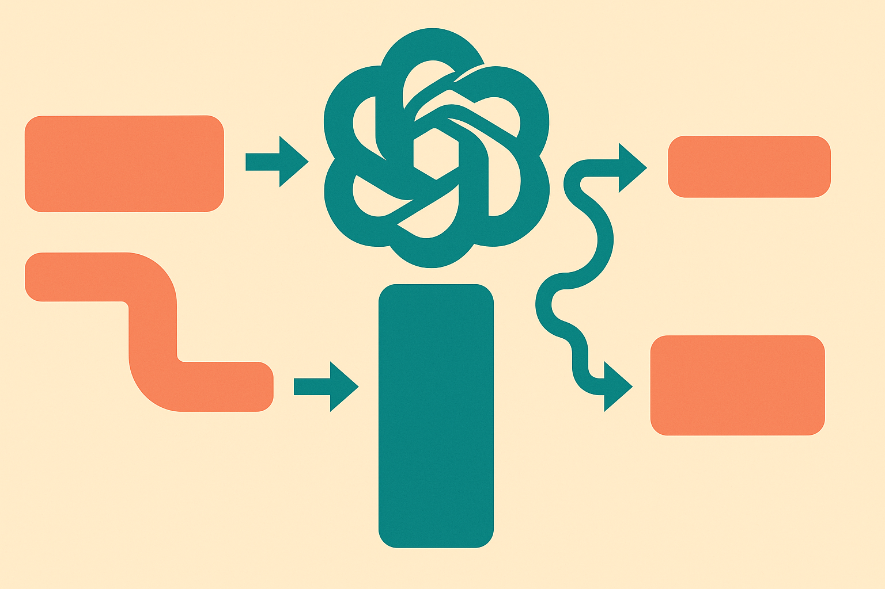

TL;DR: The Maskability Index is a small but useful idea: before you tune prompts, check whether the task naturally matches the model’s pretraining objective.

## What problem does the Maskability Index actually solve?

Most prompt work still has a whiff of folk magic.

Try a template. Change the wording. Add examples. Swap the order. If it works, ship it. If it does not, call the model brittle and move on.

The arXiv paper “The Maskability Index: Predicting Task-Objective Alignment in Pretrained Language Models” puts a cleaner frame on one piece of that mess. The claim is not that better prompts solve everything. It is narrower and more useful: some knowledge relations are naturally better suited to masked-style prompting, while others fit prefix-style prompting.

That matters because models do not arrive as blank reasoning engines. BERT was trained around masked token prediction. T5 was trained in a text-to-text setup. If your task asks the model to complete “PersonX wanted to [MASK]” you are leaning into a different learned habit than if you ask it to continue a prefix and generate the missing relation.

The paper focuses on structured knowledge generation, using relations from ATOMIC2020, a commonsense knowledge base completion benchmark. That is a good fit for this question because relations have shape. “PersonX does this because…” is not the same as “PersonX feels…” or “PersonY may want…”. Some relations are more naturally fill-in-the-blank. Some are more naturally continuation.

The useful shift is this: prompt choice becomes an alignment problem, not just a wording problem.

## What does MI measure?

The Maskability Index, or MI, estimates whether a knowledge relation is better matched to masked-style prompting or prefix-style prompting. The paper computes MI from differences in DepthRank scores between masked and unmasked templates.

The details matter less for most builders than the direction of the result. If a relation has a higher fit for masked templates, you should not waste all your time forcing a prefix-generation format. If it looks better as a continuation task, blank-filling may be the wrong interface.

The paper reports that MI is positively correlated with downstream generation performance on ATOMIC2020 relations. No giant claim is needed there. Correlation is enough to make the idea operational. If a cheap pre-check can predict which prompt family is likely to perform better, that is useful, especially in low-resource settings where you do not have enough labeled examples to brute-force every format.

This is also where I would keep the hype contained. The paper is about pretrained models like T5 and BERT and a structured commonsense benchmark. It does not prove that the same metric cleanly predicts behavior for every chat model, agent workflow, retrieval system, or tool-using setup. Modern instruction-tuned models have extra layers of behavior on top of pretraining. Alignment data, RL-style tuning, system prompts, tool schemas, and product wrappers can all change the surface behavior.

Still, the core idea travels well: the model’s training objective leaves fingerprints, and your prompt should respect them.

## Where would a builder use this?

The first use case is prompt routing. If you maintain a system that extracts relations, fills structured fields, or generates knowledge graph edges, you can test prompt families by relation type instead of using one global template for everything.

The second is evaluation design. Instead of asking “which prompt won overall,” ask “which relations failed under which prompt objective?” That gives you a better debugging map. A bad score may mean the model lacks the knowledge. It may also mean you asked in the wrong shape.

The third is adaptation strategy. If a relation is highly maskable, masked-style fine-tuning or template design may be the cheaper path. If it is not, prefix-style generation may be a better starting point. This is not glamorous, but it is the kind of decision that saves days.

Practitioner's take: if you are building structured extraction or commonsense completion, group your tasks by relation type and test masked versus prefix prompts before polishing wording. The catch most teams miss is that “prompt engineering” is not one skill. Sometimes the winning move is not a better sentence. It is matching the task to the objective the model already learned.
