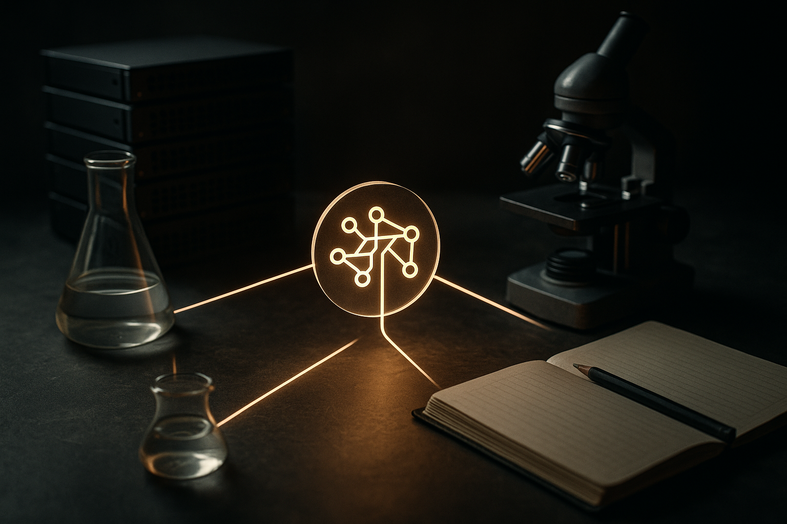

TL;DR: OpenAI’s work with the U.S. Department of Energy and national labs matters less as an “AI discovers science” headline and more as a test of whether frontier models can speed up real scientific workflows under expert supervision.

## What did OpenAI actually announce?

OpenAI’s blog post, “Advancing the next era of national science,” says the company is working with the U.S. Department of Energy and national labs to use frontier AI to accelerate scientific discovery.

That is the important sentence. Not because it proves some breakthrough already happened. It does not. The announcement is a commitment and a direction of travel, not a peer-reviewed result.

Still, the setting matters.

DOE labs are not casual enterprise customers. They sit close to some of the hardest applied science problems in the country: energy systems, materials, fusion, climate modeling, high-performance computing, national security, advanced manufacturing, and biology-adjacent work. They also have something most AI demos lack: dense expert review, expensive instruments, long-running simulation pipelines, and a culture where “looks plausible” is not good enough.

That makes this a better test bed than another chatbot wrapper.

The real question is not whether a model can write a convincing research plan. Many can. The question is whether it can help a lab team produce better candidate hypotheses, design fewer wasted experiments, interpret messy outputs faster, or connect results across fields without hallucinating critical details.

That is a narrower claim. It is also a much more useful one.

## Where can frontier AI help science first?

I’d look for gains in the boring middle of scientific work.

Not the cinematic “AI invents a new material overnight” version. The daily grind version.

A model can help triage literature, summarize competing findings, generate candidate experimental setups, write code for simulations, translate between specialist domains, and produce first-pass analysis of instrument output. In national lab settings, the value may come from reducing friction between teams that already know what they are doing.

For example, a materials scientist, a computational chemist, and an HPC engineer may all be working on the same problem from different angles. A strong model with access to the right context could act as connective tissue. It can restate assumptions, spot mismatched units, draft simulation scripts, or suggest follow-up checks. None of that replaces the scientist. It may save the scientist from spending two days wrestling with glue work.

This is where I think the “frontier” part matters. Smaller models can do plenty of useful lab admin and coding assistance. But the hardest scientific workflows often require long context, cross-domain reasoning, tool use, and an ability to keep track of uncertainty. That is where the top-tier systems may earn their cost, if they can stay grounded.

The catch is verification. Science punishes confident nonsense. A model that invents a citation, misreads a molecular structure, or suggests an invalid numerical method is not just annoying. It can waste expensive time.

So the winning pattern is likely not autonomous discovery. It is constrained collaboration: model proposes, tools compute, humans judge, experiments test, results feed back.

## What should we watch next?

OpenAI’s announcement is thin on measurable outcomes, so the receipts will matter.

I want to see named programs, concrete scientific domains, evaluation methods, and published results. Did a model reduce simulation setup time? Did it improve candidate selection for experiments? Did it help teams reproduce findings? Did it lower compute waste? Did it catch errors humans missed?

Those are the metrics that would separate useful infrastructure from prestige partnership branding.

There is also a governance angle here. DOE labs handle sensitive work. Putting frontier AI into those workflows raises questions about data access, model isolation, audit trails, export controls, and who gets to inspect failures. The announcement frames the effort around American science, but the operational details will decide whether this is safe enough and useful enough to scale.

I am optimistic, with caveats. National labs are exactly where AI should be tested against hard reality. But if the output is only keynote language about accelerating discovery, we learned little. If it turns into reproducible workflows that other labs can inspect and adapt, that is a different story.

For builders, the lesson is simple: don’t pitch “AI scientist.” Build for one painful loop inside a scientific or technical workflow. Literature to hypothesis. Hypothesis to simulation. Simulation to analysis. Analysis to next experiment. Put experts in the approval path, log every model action, and measure saved cycles, not vibes. The catch most teams miss: the model is rarely the product by itself. The product is the verified loop around it.
