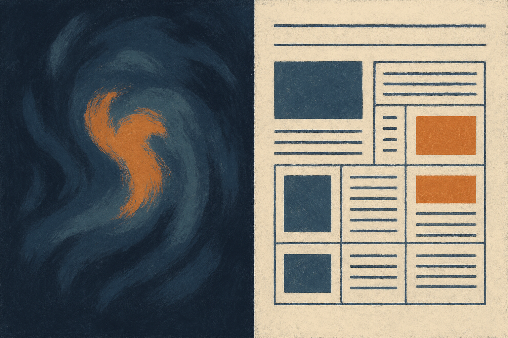

TL;DR: Alibaba’s Qwen Image 3.0 is interesting less because it makes nice images, and more because it claims to make readable, dense visual documents in one shot.

## What is Alibaba actually claiming with Qwen Image 3.0?

The primary source here is Decrypt’s report, “Alibaba's New Qwen Image 3 AI Wants to Be Useful, Not Just Pretty.” The key claim is narrow and practical: Qwen Image 3.0 can generate dense newspapers and infographic grids in one shot, with text rendered down to 10 pixels.

That matters because image generation has had a weird ceiling for real work. It can make moodboards, hero images, fantasy product shots, thumbnails, and concept art. But the moment you ask for a usable flyer, UI mock, ad variation, chart-heavy explainer, menu, instruction card, or anything with small text, the illusion usually breaks.

Text has been the tax.

If Qwen Image 3.0 can reliably place tiny readable text inside a coherent layout, that shifts the model from “make me something pretty” toward “make me a usable artifact.” Not final production in every case. But a stronger first draft. A better design comp. A visual spec that a human can edit instead of rebuild.

That is a different product category.

## Why does tiny text change the workflow?

Readable small text is not just a cosmetic feature. It is a proxy for control.

A model that can render text at 10 pixels has to do several things at once: preserve layout, maintain local detail, respect hierarchy, and avoid garbling symbols. Those are the same skills needed for useful business visuals. Think internal reports, product one-pagers, packaging drafts, event signage, app store screenshots, classroom handouts, and sales collateral.

The “one shot” part is also worth watching. Most serious visual work today still needs a chain: generate image, fix text elsewhere, composite in Figma or Photoshop, export, review, repeat. If a model can create the whole dense document in a single generation, the cycle gets shorter.

But I would not confuse shorter with solved.

A newspaper-like image can look convincing while failing every detail that matters. Names can be wrong. Dates can drift. Tables can imply fake data. Infographic icons can contradict the copy. The smaller the text, the easier it is for a demo screenshot to hide mistakes. Dense outputs raise the stakes because they contain more places to fail.

So the practical question is not “can it make a newspaper?” It is “can I trust the tenth small block in the lower corner after three edits?”

## What should make builders cautious?

Decrypt also notes the catch: no benchmarks and no open weights.

That is not a small footnote. It is the difference between an exciting demo and a tool a team can plan around.

No benchmarks means we do not yet know how Qwen Image 3.0 compares on text fidelity, layout consistency, editability, multilingual rendering, prompt following, or repeatability. No open weights means builders cannot inspect, host, fine-tune, or deeply integrate the model on their own terms. That may be fine for some API-first workflows, but it limits experimentation.

For Alibaba, the positioning is smart. “Useful, not just pretty” is where image models need to go. The market is crowded with aesthetic generators. The gap is document-grade visual generation that survives review.

For operators, I would test this like a production system, not a toy. Create a fixed prompt set with realistic assets: a product launch flyer, a two-column newsletter, a comparison grid, a safety instruction card, a dashboard-style infographic, and a multilingual poster. Then score the outputs manually for text accuracy, layout, brand fit, factual consistency, and edit cost.

The builder move is simple: treat Qwen Image 3.0 as a possible draft generator for dense visual artifacts, not a replacement for design QA. Try it where the value is speed to first layout. The catch most people will miss is that tiny readable text only helps if the words are correct, placed intentionally, and easy to revise.
