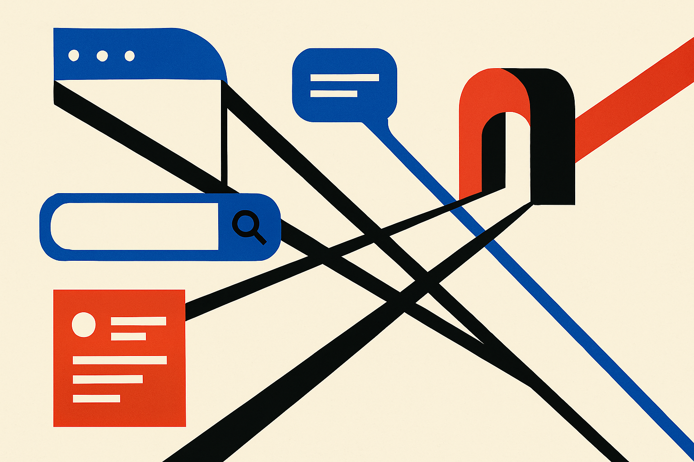

TL;DR: Runway AI’s acquisition of Runway.com looks like a distribution and trust move, not a technical milestone, and that is exactly why builders should pay attention.

## What did Runway AI actually buy?

DomainInvesting’s “Runway.com Acquired by Runway AI via ATM Holdings” reported that Runway.com has been acquired in a deal overseen by Andrew Miller of ATM Holdings. The domain recently transferred from Tucows to Namecheap under Whois privacy. DomainInvesting also reported that Runway.com had been listed for sale on the ATM Holdings website, then moved to the section showing completed deals.

That is the confirmed substance. No disclosed price. No public explanation from Runway AI in the material provided. No product announcement tied to the domain.

So the useful read is not, “Runway made a huge mystery move.” The useful read is simpler: an AI company with a memorable name appears to have secured the cleanest possible address for that name.

That matters because AI products are still weirdly fragile at the distribution layer. Users hear a name in a meeting, on X, in a prompt shared by a coworker, or from a YouTube demo. Then they guess the URL. They search. They click ads. They land on lookalikes. They mistype. Every extra step is a leak.

Runway.com is the front door version of the brand. Not runwayml.com. Not a product subdomain. Not a search result that depends on Google getting intent right. Just the word.

## Why does a .com still matter for an AI company?

Because trust is now part of the product surface.

AI companies ask users to upload sensitive prompts, scripts, images, videos, voice, code, customer records, and sometimes internal strategy. The more powerful the tool, the more a user has to believe they are in the right place. A clean domain does not prove safety, but it reduces ambiguity.

There is also an assistant-era angle here. As more traffic starts inside ChatGPT, Claude, Gemini, Perplexity, browser agents, and enterprise copilots, brand resolution gets more important, not less. A user may ask an assistant to “open Runway” or “find the Runway video tool.” The canonical domain helps agents, browsers, password managers, enterprise allowlists, and users all point to the same destination.

This is boring infrastructure. Boring infrastructure compounds.

The other piece is defensive. AI has a scam problem. Every popular model company, video tool, coding assistant, and image generator attracts copycat landing pages, fake apps, SEO squats, affiliate spam, and phishing. Owning the exact-match .com does not eliminate that mess, but it gives the company a stronger canonical anchor.

I would not overstate it. A domain does not fix retention. It does not make generations faster. It does not improve model quality. It does not create a workflow moat by itself. Plenty of great AI products live on imperfect domains.

But at a certain scale, the math changes. If a company already has demand, brand recall, press, enterprise conversations, and creator mindshare, a cleaner front door can be worth real operational attention. The domain becomes part of conversion, support, security, and procurement.

## What should builders copy, and what should they ignore?

Do not copy the headline move blindly.

Most early AI teams should not spend scarce cash chasing premium domains. They should ship the workflow, find repeated use, talk to users, and make the product good enough that people remember it despite an imperfect URL. A great domain on a weak product is just expensive packaging.

The lesson is sequencing. Runway AI appears to be buying clarity after the brand already means something. That is different from buying a name and hoping the market fills it with meaning.

For builders, the practical version is cheaper. Pick a name people can say out loud. Avoid names that collide with bigger companies. Buy the obvious defensive variants if they are reasonable. Set up clean redirects. Make the official domain obvious in the product, docs, emails, and social profiles. Monitor search results for impersonators. If you serve teams, make security and procurement pages easy to find.

And if the product starts working, revisit the domain question as a distribution decision, not an ego purchase. The catch most readers miss: the domain is not the moat. The moat is the habit users build around the product. The domain just makes that habit easier to find, safer to repeat, and harder for copycats to intercept.
