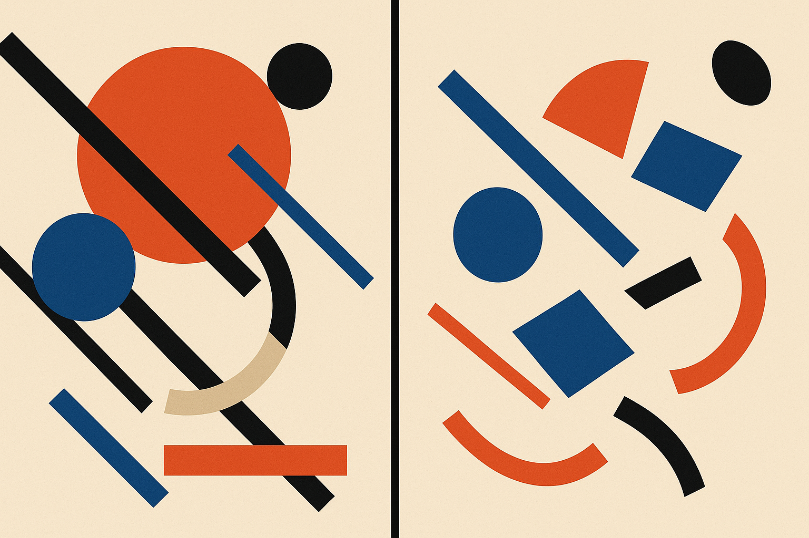

TL;DR: GS-Agent generates dynamic 4D worlds from a text prompt by orchestrating multiple agents that drive a real physics engine through code, which trades the "magic" of one-shot video generation for physical plausibility and actual control.

The interesting move in **GS-Agent: Creating 4D Physical Worlds With Generative Simulation** (from the UMass Embodied AGI group, project page at umass-embodied-agi.github.io/gs-agent) is what it refuses to do. It does not try to learn physics from a giant pile of video and hope the model internalizes gravity. It puts a physics engine in the loop and teaches agents to operate it. That is a different bet than most of the flashy "text to video" and "world model" work getting attention right now, and I think it is the more useful bet for people who actually need to build things.

## What is a 4D world and why does the "4D" matter?

3D is geometry: shapes in space. 4D adds time, so objects move, deform, collide, and flow. A cup that tips and spills. Cloth that settles. A rigid body that bounces off a floor and comes to rest. That fourth dimension is exactly where generative video models tend to fall apart. They produce frames that look plausible in isolation but drift when you watch motion over time. Water that doesn't conserve volume. Objects that morph or clip through each other. Shadows that don't track the light.

GS-Agent's whole framing is that physical plausibility over time is the hard part, and the way to get it is not more data but more structure. The paper reports interactions among liquids, deformable objects, and rigid bodies, which is a deliberately hard mix because those three obey very different rules and traditionally need different solvers.

## How does GS-Agent actually build a scene?

The design copies how a human 3D artist works, then automates each role. GS-Agent decomposes the job into two buckets: entity management and rendering configuration.

Entity management covers curating 3D assets, tuning materials, placing objects, and controlling motion. Rendering configuration handles camera and lighting. Instead of one model trying to hallucinate all of this at once, GS-Agent assigns specialized agents to these distinct jobs. Each agent has expertise in its slice, writes code that talks to the physics engine, and then looks at multimodal feedback (rendered output) to see whether its change did what it intended. The agents collaborate and iterate until the scene matches the prompt.

That "seek multimodal feedback and iterate" loop is the part worth sitting with. It is the same pattern that makes coding agents work: take an action, observe the result, correct. Here the "compiler" is a physics engine and a renderer. If the water clips through the glass, that shows up in the render, and an agent can adjust. This is closer to a pipeline of tool-using engineers than to a single oracle producing pixels.

## Why not just use a text-to-video model?

Because control and correctness are different problems, and video generators are good at the first impression and bad at both of the ones that matter for production.

If you are a filmmaker, a game studio, or a robotics team, you don't want a beautiful clip you cannot edit. You want to say "move the camera left, make the liquid more viscous, add a second light from the back" and have exactly that happen without the rest of the scene reshuffling. End-to-end generative models make that kind of surgical edit hard because everything is entangled in one forward pass. GS-Agent claims cinematic camera and lighting control precisely because those are separate, addressable agents operating explicit parameters, not emergent properties of a denoising process.

The honest tradeoff: an agentic, physics-in-the-loop system is almost certainly slower and more brittle to orchestrate than hitting "generate" on a video model. Multi-agent systems have well-known failure modes. Agents disagree, loops don't converge, and one bad tool call can stall the pipeline. The paper's abstract is confident about diversity and plausibility, but it is an abstract. I have not seen the render times, the failure rate on complex prompts, or how much prompt engineering it takes to get a clean result. Those numbers are the whole ballgame for anyone deciding to use this, and they are not in the material I have.

## Who should care right now?

Two groups, for different reasons.

Content and simulation people care because this points at controllable synthetic scenes you can direct with language and still edit like a real 3D project. That is a genuinely different workflow from prompting a video model and rerolling until you get lucky.

Robotics and "physical AI" people care more, and the paper flags this explicitly. Training robots needs enormous amounts of physically correct interaction data, and hand-authoring that in a simulator is expensive. If you can describe a scenario in text and get a physically plausible 4D world with correct contact, deformation, and fluid behavior, you have a data factory for embodied learning. The value there is not visual polish. It is whether the physics is right enough that a policy trained in it transfers to reality. GS-Agent using a real engine rather than a learned approximation of physics is exactly the property that makes that plausible, and exactly the property a pure video model cannot guarantee.

One caveat worth naming: two of the sources I was given are the identical abstract cross-listed on arXiv (cs.AI and cs.CL). So this is one paper, not independent corroboration. Treat the claims as the authors' claims until there's outside replication.

Practitioner's Take: If you build with this, the leverage is the pattern, not just the paper. Physics engine as the source of truth, specialized agents writing code against it, renders as feedback for self-correction. You can copy that structure today for any domain where you have a real simulator or checker: CAD, circuit design, even spreadsheet models. Let the agent propose changes as code, run the real tool, and feed the result back instead of asking a model to imagine the outcome. The catch most readers will miss is that this only works when your feedback signal is trustworthy and cheap to compute. GS-Agent gets away with it because a physics engine gives fast, correct verdicts. If your "checker" is another LLM guessing whether the output is right, you have rebuilt the hallucination problem with extra steps. Find the real ground truth first, then build the loop around it.
