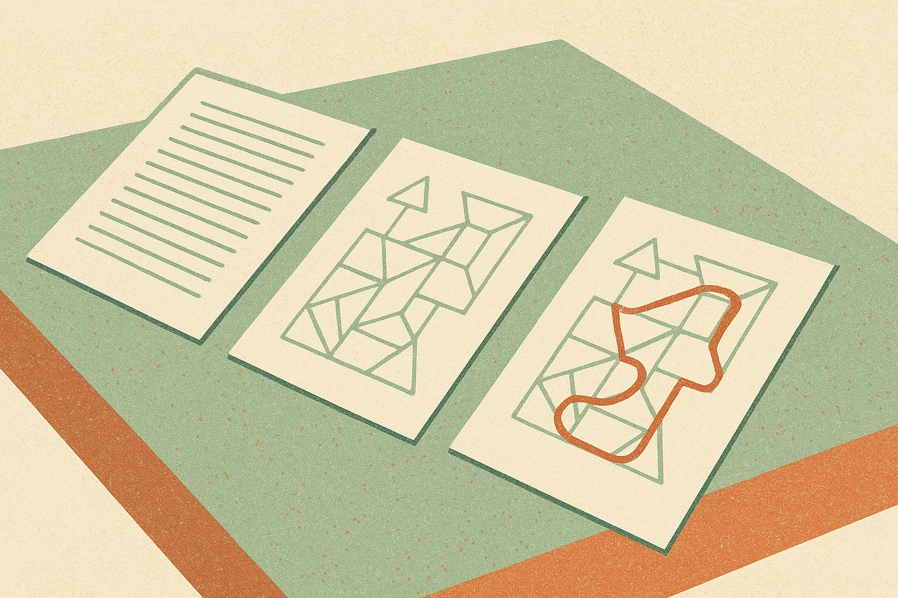

TL;DR: MIRROR’s useful takeaway is that multimodal models should not just learn from more image-text pairs, they should learn when one view of the same problem reasons better than another.

## Why does the same problem break differently across text and images?

The primary source here is the arXiv paper **“MIRROR: Learning from the Other View for Multi-Modal Reasoning”**, listed under both cs.AI and cs.LG. Its core claim is simple and important: vision-language models are inconsistent across views of the same reasoning task.

That sounds obvious until you make it concrete.

Take a geometry problem. It can appear as mostly text, mostly diagram, or a combination of both. In theory, those are equivalent presentations of the same underlying problem. In practice, a model may solve the text version and fail the diagram version. Or it may read the diagram correctly while getting lost in the written statement. The paper argues that these failures are not random noise. Different views expose different reasoning paths, and different failure modes.

That matters because a lot of multimodal training still treats the image-plus-text example as the thing to learn from. More paired data. More instruction tuning. More RL. But if a model has one internal route that works on text and another that works on diagrams, the training recipe should make those routes talk to each other.

This is the part I like. MIRROR is not selling “visual reasoning is solved.” It is pointing at a training mismatch. Models are being evaluated as if multimodal input is one blended channel, while their behavior suggests each modality can behave like a separate, uneven reasoner.

## What does MIRROR actually change?

MIRROR builds around ODA-Data, a paired multimodal geometry dataset. The dataset organizes the same problems into text-dominant, image-dominant, and combined image-plus-text views, with splits for training and evaluation. That structure is the key. Without paired views of the same problem, you cannot easily ask which modality helped and which one failed.

The method, Modality-Informed Reciprocal Reasoning Optimization, then does something practical. For each problem, MIRROR evaluates the model under all available views. It picks the best-performing view as the teacher. Then it trains the other views toward that teacher using a reverse-KL objective.

In plainer terms: if the model solves the text version but fails the diagram, the successful text-side behavior becomes supervision for the visual-side behavior. If the diagram view works better, it can teach the text or combined view. The teacher is not fixed. It is selected per problem.

That is more interesting than a generic “multimodal RL beats baseline RL” story. The paper reports that MIRROR improves over standard RL on geometry reasoning benchmarks and produces more accurate, more consistent behavior across modalities. The source material does not give the benchmark names or numbers here, so I would not overread the size of the win. But the mechanism is sensible.

The trick is self-supervision across equivalent views. Not human labels for every failure. Not assuming text is always the source of truth. Not assuming vision is always the weak side. Let the model reveal which view worked this time, then use that as a training signal.

## Where could this matter outside geometry?

Geometry is a clean testbed because diagrams and text can be tightly paired. That makes it easier to isolate modality failure. Real products are messier.

A customer support screenshot plus a ticket description. A medical image plus a radiology note. A warehouse photo plus an inventory record. A chart plus an analyst’s written summary. In each case, one view may contain the answer more cleanly, but the model may not know which view to trust.

MIRROR suggests a useful product pattern: evaluate the same task through multiple representations, compare outputs, then use the most reliable path to improve weaker paths. Today, a builder can approximate this without training a base model. Run a model on the image alone, the text alone, and the combined input. Ask for separate rationales. Check agreement. Escalate disagreement. Store cases where one view consistently wins.

The catch is that “best-performing view” is easy in benchmark geometry because there is a known answer. In production, you often do not have immediate ground truth. You need verifiers, tests, human review, or delayed outcome signals. Otherwise you may just make the wrong view more persuasive.

Practitioner’s take: if you are building with multimodal models, stop treating image-plus-text as one magic input blob. For important workflows, split the task into text-only, image-only, and combined runs, then compare. Look for cases where one view consistently saves the model from another. That pattern can guide prompt design now, evaluation design next, and fine-tuning later. The missed catch: consistency is not the same as correctness, so pair cross-view agreement with an external check before you trust it.
