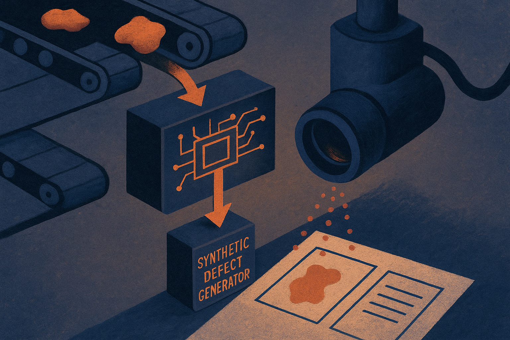

TL;DR: Synthetic data is most useful in industrial AI when it targets rare, well-defined failure modes and is judged against real production samples, not pretty generated examples.

## What problem does synthetic data actually solve here?

The primary source here is the arXiv paper titled “Synthetic data generation framework for quality control automation in gravure printing,” listed under cs.AI and cs.LG. It is about a very specific factory problem: quality control for rotogravure printing.

That specificity matters.

Printing defects like creases, streaks, and misregistration are not internet-scale data problems. You cannot scrape a million cleanly labeled examples of “bad gravure print with exactly this defect, this geometry, this lighting, and this substrate.” In real factories, failures are rare, inconsistent, and expensive to label. Manual inspection is also slow and subjective. Two inspectors may not mark the same defect the same way.

The paper’s move is straightforward: generate synthetic images of printing defects, and generate bounding boxes and annotations at the same time. Then train an object detector on those generated examples. The reported dataset size is 7,533 synthetic images, used to train RFDETR, with evaluation on real industrial testing samples.

That is the useful part. Not “synthetic data replaces reality.” More like: synthetic data fills the missing middle between a factory that has almost no defect examples and a detector that needs thousands of labeled cases to learn the pattern.

## How good is 80.9% mAP on real industrial samples?

The paper reports 80.9% mean average precision on real industrial testing samples after training on synthetic data. For an industrial defect-detection setup, that is interesting enough to test seriously.

But I would not read it as “ready to remove human inspection.” mAP is useful, but it is not the same as line-level economics. A factory cares about false negatives, false positives, throughput, camera placement, lighting drift, substrate changes, maintenance burden, and what happens when a new defect appears that the generator never modeled.

The strongest part of the result is that the test samples were real. That is the right standard. Synthetic-on-synthetic accuracy is mostly a demo. Synthetic-on-real accuracy is where the work starts to mean something.

The weaker part is the phrase “zero-cost, rapid-deployment solution.” I get the argument: no massive manual data collection. That is a real savings. But “zero-cost” is doing too much work. Someone still has to model defect types, tune generation, integrate cameras, calibrate the inspection environment, validate against production, and maintain the system when materials or process conditions change.

The better claim is narrower and more believable: for rare visual defects with known forms, synthetic generation can reduce the cold-start data problem enough to get an object detector into a pilot.

That is still valuable.

## What should operators copy from this?

The pattern to copy is not “use synthetic data everywhere.” It is: pick a bounded visual task where the defect taxonomy is known, generate defect variants with labels, train a detector, then measure only on real production samples.

This works best when the target is visually constrained. Factory surfaces. Packaging defects. PCB inspection. Textile flaws. Printed labels. Anything where the defect has a physical structure and the camera setup is controlled. It works less well when the world is open-ended, the failure modes are semantic, or the deployment environment changes constantly.

I would start smaller than the paper. Pick three defect classes that cost real money. Collect a small real validation set first, even if it is ugly and incomplete. Then generate synthetic images around those classes, train a detector, and compare against a simple baseline, including manual rules if they exist. The synthetic system only earns attention if it improves recall without burying operators in false alarms.

The catch most readers miss: synthetic data is not mainly a data substitute. It is a specification tool. If you cannot describe the defect well enough to generate it, you probably do not understand it well enough to automate inspection. A builder should use this approach to force that clarity, then let real production samples decide whether the model belongs on the line.
