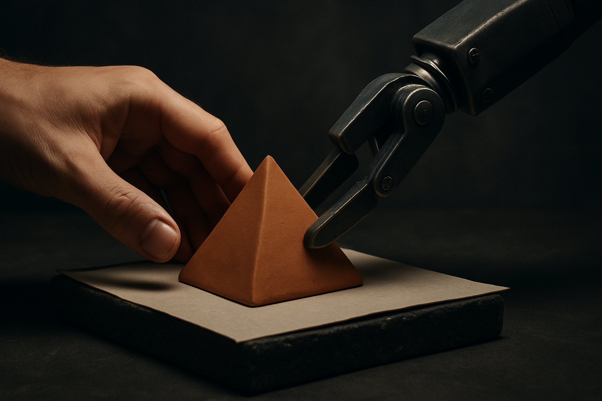

TL;DR: A new paper argues that some human participation in AI-assisted work is permanent, not a stopgap waiting on better models, and the most interesting case is work where the goal itself only becomes clear through the doing.

Most automation debates run on a single assumption: humans are in the loop because the model is not good enough yet. Better model, fewer humans. That framing treats every human touchpoint as a bug to be fixed on the next release.

"The Boundaries of Automation: A Theory of Persistent Human Participation," posted across arXiv's cs.AI, cs.CL, and cs.LG this week, argues the assumption is wrong. Not wrong about capability. Wrong about the shape of the problem. The paper's claim is that certain forms of human participation survive arbitrarily capable AI, and it names three reasons why. I think the third one is the one operators are systematically underpricing.

## Why would humans stay in the loop even with better AI?

The paper separates three grounds, and the distinctions matter because they imply different design responses.

The first is technical or complementarity grounds. Humans stay because they bring something the model does not have: tacit context, a physical presence, access to information that never made it into training data, or a perspective the system structurally cannot hold. This is the familiar one. It is also the weakest over time, because it is the case most likely to erode as models improve and as more context gets piped into them. Betting your workflow's human role entirely on complementarity is betting against the roadmap.

The second is normative or developmental grounds. Here participation is valuable in itself. A student learns by struggling through the problem, not by watching a model solve it. A junior analyst builds judgment by doing the work, not by approving the model's output. The value is in the doing, for the human, regardless of whether the machine could have produced a cleaner answer faster. This one does not erode with capability at all. If anything it gets sharper, because the temptation to skip the learning grows exactly as the model gets better at hiding that you skipped it.

The third is emergence grounds, and this is where the paper earns its keep.

## What does "target emergence" actually mean?

The paper's core move is the idea of target emergence: some activities have no fully specified goal in advance. The target forms through the interaction itself. In those cases, the authors argue, human participation is "constitutive of the target being produced." Not a means to a known end. Part of what defines the end.

Think about what that rules out. Automation, in the usual sense, is optimization toward a target you can state. You can automate invoice matching because "matched invoices" is a well-defined output. You can automate transcription because the target is fixed before you start. The task is separable from the act of specifying it.

Emergence work is not like that. When a founder figures out what the company actually is by talking to customers, the strategy is not sitting in someone's head waiting to be extracted. It gets built in the conversation. When a writer discovers the argument by writing it, the essay is not a pre-existing thing being transcribed faster. The writing is the thinking. Hand that entirely to a model and you do not get a faster version of the same output. You get a different output, because you removed the process that was producing the target.

This is the part I want to push on a little, because the paper is a theory piece and does not draw the operational line for you. The risk with "emergence" as a concept is that it becomes a comfort blanket. Every knowledge worker can convince themselves their job is irreducibly emergent and therefore automation-proof. Most of it is not. A lot of what feels like judgment is pattern matching that a good model will eat. The honest version of this framework forces you to ask, task by task: is the goal actually specified before I start, or am I discovering it as I go? For most tasks in most jobs, the goal is specified. Those are automatable. The emergence category is real but smaller than flattered egos want it to be.

## How should operators use this when designing systems?

The paper's payoff for builders is in how it reframes evaluation. If you evaluate an AI system only on how well it hits a fixed target, you have quietly assumed you are not in an emergence activity. That assumption is baked into most benchmarks and most product metrics. Accuracy, task completion, time saved: all presume the target was known.

For co-construction work, those metrics measure the wrong thing. A tool that lets a strategist explore twenty framings and abandon nineteen looks terrible on task completion and might be the most valuable tool they have. A writing assistant that produces publishable copy on the first try may be actively worse for the writer whose argument needed the friction to form.

So the design question splits. For separable, specified tasks, push automation hard and measure output. That is where the leverage is and where the paper implicitly agrees the ceiling is high. For emergence tasks, design for participation, not replacement. The model's job is to widen the space the human explores, surface options, and hold state across a messy process, not to jump to the answer. Different tool, different metric, different pitch to the buyer.

The paper frames this as human-AI co-construction being "a persistent feature," not a temporary response to imperfect AI. If that holds, then a whole class of products currently sold as "we automate X" is mispositioned. They are not automating X. They are changing how humans do X, and the value lives in the interaction quality, not the removal of the human.

One caveat worth stating plainly: this is a conceptual paper, not an empirical one. It gives you a vocabulary and an argument, not measurements of where the boundaries actually fall in practice. The three grounds are clean on paper. In a real workflow they blur, and the same task can be emergence work for a novice and rote execution for an expert. Do not treat the categories as fixed labels on jobs. Treat them as a question you re-ask per task, per user.

Practitioner's Take: Run your product's core task through one filter before your next roadmap meeting. Is the goal fully specified before the work starts? If yes, automate aggressively and measure completion, because your human-in-the-loop steps are temporary and the roadmap will erode them. If no, if the target forms during the work, stop trying to remove the human and start designing for a better joint process: more options surfaced, state held across a messy session, cheap reversibility so the human can explore and abandon. The catch most readers will miss is that this is not a feel-good "humans matter" argument. It is a positioning knife. Half of what gets sold as automation is really co-construction wearing an automation pitch, and the products that survive the next model release will be the ones that knew which half they were in.
