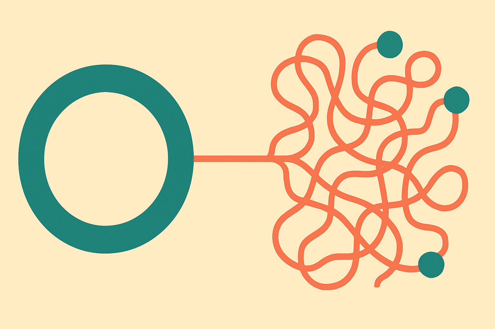

TL;DR: OpenForgeRL closes the gap between the toy environment you train an agent in and the messy harness you deploy it in, and in doing so it makes clear that RL fixes reliability but not error recovery.

Most open RL stacks assume a clean loop: model produces tokens, you score them, you update weights. Real agents do not live in that loop. They live inside harnesses like Claude Code, Codex, and OpenClaw that manage multi-turn state, spin up tool calls, read files, drive a browser, and juggle several processes at once. When you train an agent in a simplified stand-in and then drop it into one of those harnesses, you are optimizing for a world that does not match the one it ships to.

That mismatch is the problem the paper **OpenForgeRL: Train Harness-native Agents in Any Environment** takes on, posted to arXiv under both cs.AI and cs.CL. It is worth reading closely, because the trick it uses is simple and the findings it reports are more honest than most agent papers bother to be.

## What is a "harness" and why does it break open RL?

A harness is the scaffolding around the model that makes an agent an agent. It decides when to call a tool, how to feed results back, when to plan versus act, how to hold context across a dozen turns. Claude Code is a harness. Codex is a harness. The paper also names OpenClaw and ZeroClaw as harnesses in its experiments.

The reason these break standard SFT and RL codebases is structural. Those stacks expect to own inference. They want a single forward pass they can log, score, and backprop through. A harness does not hand you a single forward pass. It runs stateful, multi-process inference: several model calls interleaved with tool execution, file I/O, and remote state. Your RL codebase has no native way to express that, so people rebuild a fake version of the harness for training and hope the behavior transfers. It usually transfers badly.

## How does OpenForgeRL train inside the real harness?

The design decision that makes this work is decoupling training from inference. Instead of forcing the harness into the RL codebase, OpenForgeRL sits a lightweight proxy in between. The harness makes its model calls the way it always does. The proxy serves those calls and quietly records them as training data that a standard RL codebase, veRL in their setup, can consume.

The second piece is orchestration. Each rollout runs in its own remote container, managed by Kubernetes. So a single training run can spin up many independent copies of the full harness, each doing its real multi-step thing in its real environment, and the proxy harvests all of it into one training signal.

The payoff is that you train the agent in the exact harness and environment it will be deployed with. No stand-in, no transfer gap. That is the whole pitch, and it is a good one. The proxy pattern is the kind of idea that looks obvious in retrospect and saves everyone months of custom plumbing.

## Do the numbers hold up?

The results are solid without being extraordinary, which is the right register for this kind of infrastructure paper. Trained on only hundreds to a few thousand tasks, the tool-based variant they call OpenForgeClaw reaches 31.7 pass^3 and 55.9 pass@3 on ClawEval, and 33.7 on QwenClawBench. The GUI variant, OpenForgeGUI, reaches 37.7 on OSWorld-Verified, 63.0 on Online-Mind2Web, and 72.3 on WebVoyager.

Two things matter more than the raw scores. First, both variants beat open baselines of similar size on nearly every benchmark. Second, and this is the more interesting claim, in the GUI setting the trained agents match or surpass models several times larger. That is the argument for training in-harness at all: a smaller model that has actually learned the environment can outperform a bigger model that has not.

I would treat the cross-benchmark comparisons with the usual caution. ClawEval and QwenClawBench are named after the harnesses being tested, which tells you the ecosystem is young and the benchmarks are close to the training conditions. Beating open baselines of "similar size" is meaningful only if those baselines were tuned with comparable effort. The paper does not give us enough in the abstract to fully adjudicate that, so read the scores as directional, not definitive.

## What did RL actually fix, and what did it not?

This is the part I respect most. The team analyzed how harness choice and RL change agent behavior, and they did not hide the failures.

RL improved the reliability stuff you would hope for: self-verification, tool coverage, and finishing multi-step plans. Those are real, measurable gains in the kind of behavior that separates a demo agent from a usable one.

But error recovery stayed weak. When an agent goes off the rails midway through a task, RL in this setup did not teach it to notice and climb back out. That is the failure mode every operator running agents in production already knows. The agent does not fail loudly. It confidently walks down the wrong path and keeps going.

The paper also reports that some harnesses are substantially harder to learn than others. That is a practical warning. Your choice of harness is not just an ergonomics decision, it changes how trainable your agent is. That deserves more attention than it usually gets.

## Practitioner's take

If you are training or fine-tuning an agent that will ship inside a real harness, the reusable lesson here is the proxy pattern, not the specific benchmarks. You do not necessarily need OpenForgeRL itself. You need to stop training against a simplified reimplementation of your harness and start capturing the real one's model calls as your training data. The decoupling is the idea worth stealing: let the harness run as-is, log its calls through a shim, feed that to your RL loop.

Two things to try. Run a small in-harness training pass on a few hundred of your own tasks and compare it against a model trained in your usual stand-in environment on the same eval, in the real harness. If the in-harness version wins by more than benchmark noise, the transfer gap was costing you and this fixes it. Second, before you invest, test whether your harness is even learnable, because the paper says some are much harder than others.

The catch most readers will miss: this does not solve error recovery, and error recovery is what actually breaks agents in production. Train in-harness for reliability and tool coverage, but do not expect RL alone to teach your agent to notice it took a wrong turn. You still need guardrails, checkpoints, and a human or a verifier watching for the confident walk off the cliff.
